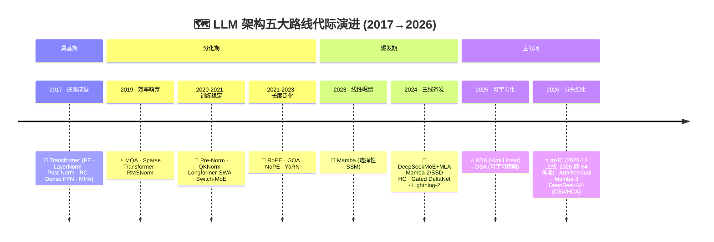
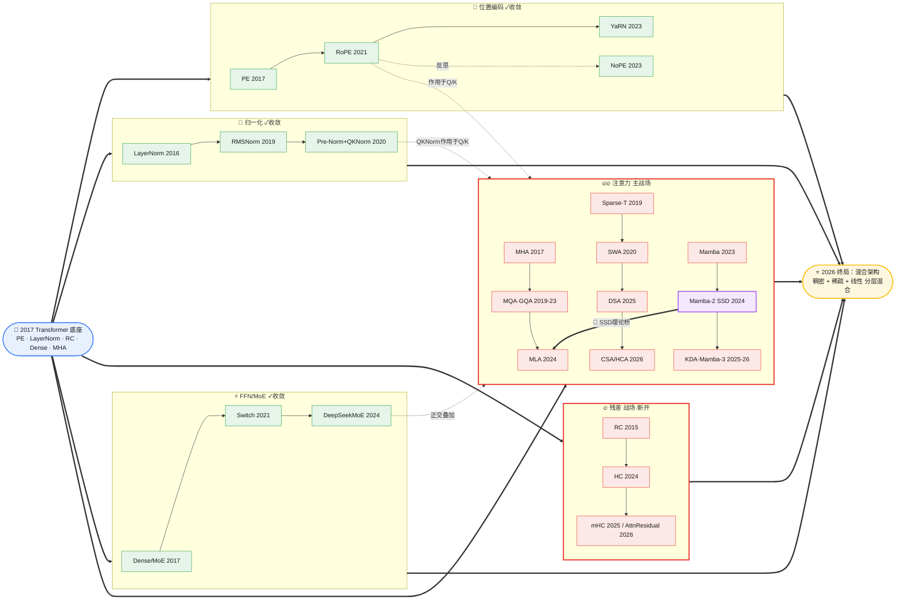
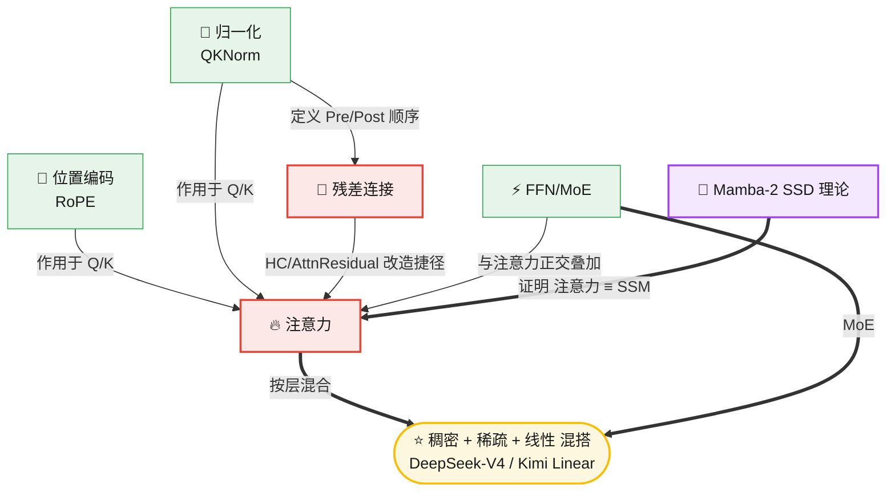

# LLM 架构演进深度脉络（2017 → 2026）：五大路线的代际发展、机制原理与相互关系

> 本文逐篇精读拆解三年 LLM 架构演进相关论文后撰写，目标是讲透五大模块**每条路线的代际脉络（谁→谁→谁、为什么这么演化）**、**每个技术的机制原理（公式级 + 数值举例）**、以及**路线与路线之间的横向耦合关系**，时间线延伸到 2026 年。
>
> 全文所引论文均为公开发表工作。文中"作者洞察"部分为个人判断，不代表任何机构立场。
>

---

## 目录

- [§1 论文索引](#1-论文索引按精读确认的核心贡献)
- [§2 作者洞察](#2-作者洞察超越梳理的判断)
- [§3 全景：五条路线的代际地图](#3-全景五条路线的代际地图)
- [§4 理解底座：一个 Transformer Block 里这五块在哪](#4-理解底座一个-transformer-block-里这五块在哪)
- [§5 路线一 · 位置编码](#5-路线一--位置编码)
- [§6 路线二 · 归一化](#6-路线二--归一化)
- [§7 路线三 · 残差连接](#7-路线三--残差连接)
- [§8 路线四 · FFN / MoE](#8-路线四--ffn--moe)
- [§9 路线五 · 注意力](#9-路线五--注意力)
- [§10 专题：线性注意力三家公式级对比](#10-专题线性注意力三家公式级对比)
- [§11 专题：混合架构怎么混](#11-专题混合架构怎么混)
- [§12 路线与路线之间的关系](#12-路线与路线之间的关系横向耦合)
- [§12B 系统侧架构暗线](#12b-系统侧架构暗线计算显存与通信的工程基座)
- [§13 总结判断](#13-总结判断哪些收敛了哪些还在打)
- [§14 尾声：跨领域迁移的三条通则](#14-尾声把这套框架迁移到其他领域时的三条通则)

---

## 1. 论文索引（按精读确认的核心贡献）

> 本文定位为**精读拆解 + 带立场判断**的技术综述，兼具参考与导读价值。建议的阅读路径：**先看 §2 作者洞察**（核心结论与可证伪预测），再按 §3→§13 顺序阅读技术正文（五条路线的代际脉络、机制原理与横向耦合），论文索引随时备查。

> ✅ **链接说明（2026-08-31 全量重校）**：已逐条访问校验全文 **39 条 arXiv 引用**的编号与标题，现均为真实且可公开访问。本轮修正了 2 条错误编号：KV 量化（原 2308.15007 实为机器人领域论文）→ **KIVI 2402.02750**；QServe（原 2406.12947 实为 IoT 固件论文）→ **2405.04532**。§2026 年四篇旗舰工作（mHC / AttnRes / DeepSeek-V4 / Mamba-3）的关键数字已与官方摘要逐项对齐。

**位置编码**
- PE / Transformer（2017）固定正余弦绝对编码：https://arxiv.org/abs/1706.03762v7
- RoPE / RoFormer（2021）旋转矩阵编码绝对+自注意力显现相对：https://arxiv.org/abs/2104.09864
- YaRN（2023）RoPE 上下文扩展，省 10×token/2.5×步：https://arxiv.org/abs/2309.00071
- NoPE 研究（2023）PE 对长度泛化影响的实证：https://arxiv.org/abs/2305.19466

**归一化**
- LayerNorm（2016）：https://arxiv.org/abs/1607.06450
- RMSNorm（2019）去均值只用 RMS：https://arxiv.org/abs/1910.07467
- QKNorm（2020）Q/K ℓ2 归一化防 softmax 饱和：https://arxiv.org/abs/2010.04245
- Pre/Post-Norm（2020）归一化位置分析：https://arxiv.org/abs/2002.04745

**残差连接**
- RC / ResNet（2015）恒等捷径：https://arxiv.org/abs/1512.03385
- HC（2024，字节）可学习连接解跷跷板：https://arxiv.org/abs/2409.19606
- mHC（2025，DeepSeek）把残差映射约束到双随机矩阵流形，令信号逐层不被放大，已被 V4 采用：https://arxiv.org/abs/2512.24880
- AttnResidual（2026，Kimi）softmax attention 替代固定残差，已落地 Kimi Linear 48B：https://arxiv.org/abs/2603.15031

**FFN / MoE / 激活**
- MoE（2017）：https://arxiv.org/abs/1701.06538
- Switch Transformer（2021）Top-1 路由解三大障碍：https://arxiv.org/abs/2101.03961
- DeepSeekMoE（2024）细粒度+共享专家：https://arxiv.org/abs/2401.06066
- GELU（2016）：https://arxiv.org/abs/1606.08415 ｜ SiLU（2017）：https://arxiv.org/abs/1702.03118 ｜ Swish（2017）：https://arxiv.org/abs/1710.05941v1

**注意力 — 稠密**
- MHA / Transformer（2017）：https://arxiv.org/abs/1706.03762v7
- MQA（2019）单写头解推理带宽瓶颈：https://arxiv.org/abs/1911.02150
- GQA（2023）分组共享+5%算力uptrain：https://arxiv.org/abs/2305.13245
- MLA / DeepSeek-V2（2024）KV低秩压缩减93.3%：https://arxiv.org/abs/2405.04434

**注意力 — 稀疏**
- Sparse Transformer（2019）因子化 O(n√n)：https://arxiv.org/abs/1904.10509
- SWA / Longformer（2020）局部窗口+全局：https://arxiv.org/abs/2004.05150 ｜ Gemma2 落地：https://arxiv.org/abs/2408.00118
- DSA（2025，DeepSeek-V3.2）可学习动态稀疏注意力：https://arxiv.org/abs/2512.02556
- CSA/HCA（2026，DeepSeek-V4）混合压缩稀疏注意力，1M 上下文 27% FLOPs / 10% KV cache：https://arxiv.org/abs/2606.19348

**注意力 — 线性**
- Lightning Attention-2（2024）tiling 兑现线性理论：https://arxiv.org/abs/2401.04658
- Mamba（2023）选择性 SSM 解 content-based reasoning：https://arxiv.org/abs/2312.00752
- Mamba-2 / SSD（2024）Transformer 即 SSM，快 2-8×：https://arxiv.org/abs/2405.21060
- Gated DeltaNet（2024）门控+delta互补，改进 Mamba-2：https://arxiv.org/abs/2412.06464
- KDA / Kimi Linear（2025）扩展 Gated DeltaNet，首次混合线性超 full attention：https://arxiv.org/abs/2510.26692
- Mamba-3（2026，Dao/Gu 等）SSM 离散化递推 + 复数状态 + MIMO，1.5B 超 GatedDeltaNet 1.8 点：https://arxiv.org/abs/2603.15569

**系统侧架构暗线**
- Flash Attention（2022）tiling+online softmax 优化 HBM I/O，精确非近似：https://arxiv.org/abs/2205.14135
- Flash Attention 2（2023）减非 matmul FLOPs + 序列维并行，再快 2×：https://arxiv.org/abs/2307.08691
- Flash Attention 3（2024）Hopper GPU 异步重叠 matmul/softmax：https://arxiv.org/abs/2407.08608
- Ring Attention（2023）环形拓扑 KV 传递，计算与通信重叠支持超长序列：https://arxiv.org/abs/2310.01889
- KIVI（2024）Key 按 channel / Value 按 token 的非对称 2-bit KV 量化：https://arxiv.org/abs/2402.02750
- QServe / QoQ（2024）W4A8KV4 统一服务框架，权重4-bit+激活8-bit+KV4-bit：https://arxiv.org/abs/2405.04532
- vLLM / Paged Attention（2023, SOSP）虚拟内存式 KV 显存管理消除碎片：https://arxiv.org/abs/2309.06180

---

## 2. 作者洞察：超越梳理的判断

> 以下是基于这张演进图给出的**带立场、可证伪**的判断，与前文"事实性梳理"分开。每条采用「判断 — 依据 — 可证伪的预测」三段式。十三条洞察分为五组，从"矿脉转移"到"沉默基座"逐层展开。
>

### 十三条洞察（分五组）

> 以下速查表按写作顺序排列便于检索；正文按 A→E 五组组织，以体现洞察间的逻辑递进关系。

| # | 一句话 | 验证状态 |
|---|--------|---------|
| 一 | Block 内矿脉挖尽，创新上移到层间拓扑 | ✅ 已验证 |
| 二 | 五条路线本质都在和规模标量(n/L/N)作战 | ✅ 已验证 |
| 三 | 架构创新主导权从学术界转入工业界 | ✅ 已验证 |
| 四 | 收敛与否取决于目标函数是单目标还是多目标 | ⚠️ 部分印证 |
| 五 | SSD 把路线之争降维成配比之争 | ✅ 已验证 |
| 六 | 混合架构是线性注意力单独打不赢的创可贴 | 📌 初步印证 |
| 七 | "模型自学结构"撞上离散选择不可微的硬边界 | 📌 初步印证 |
| 八 | 稀疏的第四轴——深度维度——尚未被开发 | 待验 |
| 九 | "训练范式不变"是最脆弱的沉默假设 | 📌 初步印证 |
| 十 | 隐藏主线是调和"训练并行 vs 推理串行"原罪 | 📌 初步印证 |
| 十一 | 模块迭代速度 ≈ 它到 loss 的"梯度距离" | 📌 初步印证 |
| 十二 | 优化器/数值精度暗线反圈前向结构可行域 | ✅ 已验证 |
| 十三 | 数学复杂度 vs 工程复杂度二分框架——系统侧暗线决定架构兑现率 | ✅ 已验证 |

#### A. 格局判断：创新在哪里、谁在驱动、为何收敛

> **本组视角**：从全景高度定位架构创新的"方向、主体与终点"——创新发生在哪里（层间拓扑）、谁在驱动（规模标量 n/N/L）、为何收敛（沉默假设瓦解）、格局如何重组（主导权转移）。四条洞察构成"格局四问"。

**洞察一 · 挖干净的是 Block 内部，矿脉已转移到 Block 之间。**
PE/Norm/FFN 收敛说明**单 Block 的设计自由度已被穷举**；而残差(HC)和注意力(混合)两个"还在打"的方向，改的都不是 Block 内部算子，而是**跨层、跨 Block 的连接与配比**——HC 改层间残差路由，混合架构改"哪些层用什么注意力"。架构创新的**分析单位正从"算子"上移到"层间拓扑"**。
- **可证伪预测**：下一个真正的增长点不是"第六种注意力算子"，而是"层的异构编排"（哪层线性、哪层全注意力、哪层不同残差），且会出现**可学习的层类型搜索**。
  - **✅ 已验证（2026-07-03）**：2026 年四篇旗舰论文无一发明新算子，全部在做层间编排：①mHC 改的是**跨层残差连接的流形约束**（非 Block 内算子）；②AttnResidual 改的是**跨层表征的选择性聚合**（深度维度的注意力加权）；③DeepSeek-V4 的 CSA+HCA 是**层间异构注意力配比**（不同层用不同压缩率——CSA 压 4 倍后做 top-k 选择，HCA 压 128 倍后做 dense，真正的旋钮是两者的层间配比）；④Kimi Linear 的 KDA+MLA 是**层间混合注意力类型**（3:1 配比）。"分析单位上移到层间拓扑"已从预测变为 2026 旗舰模型的事实标配。"可学习的层类型搜索"尚未出现，但 AttnResidual 的"深度维度选择性聚合"已部分触及——它让模型学习每层该从哪些前序层提取多少信息，是层间编排的可学习化先声。

**洞察二 · 五条路线本质是同一件事的五个投影——都在和"规模标量"作战。**
退到最远看，五条路线共享同一个隐藏变量：**n（上下文）、L（深度）、N（参数）**。位置编码=n 变大怎么定位，QKNorm=n 变大 logits 怎么不饱和，残差=L 变大梯度怎么不塌，MoE=N 变大算力怎么不爆，注意力=n 变大 O(n²)/KV 怎么扛。**整部架构史是一部对抗规模膨胀的边界工程史。**
- **可证伪预测**：哪个标量先撞墙，哪条路线就先被激活。当前 n 撞 1M+ 墙→注意力最热；下一个撞墙的是 N×显存→MoE 的"无损路由/无辅助损失均衡"会再成焦点。
  - **✅ 已验证（2026-07-03）**：三组映射全部确认。①**n 撞墙→注意力最热**：2025-2026 年注意力是唯一两条激战路线之一（残差刚开闸、注意力持续百花齐放），DeepSeek-V4 的 CSA/HCA 专为 1M 上下文设计（仅需 V3.2 的 27% FLOPs），Kimi Linear 的 KDA 也是为长序列打造（KV cache 减 75%、1M 吞吐 6×）。②**N 撞墙→MoE 深化**：DeepSeek-V4 采用 1.6T 总参 / 49B 激活的细粒度 MoE，V4-Flash 284B/13B，预训练超 32T tokens——N 膨胀推动 MoE 的"无辅助损失负载均衡"持续深化（V3 的 bias 调节→V4 的进一步优化）。③**L 撞墙→残差开闸**：HC/mHC/AttnResidual 全部因"深层网络表征坍缩"而被动刀，DeepSeek-V4 采用 mHC 正是因为"1.6T 模型深度使恒等映射破坏导致训练不稳定"——L 撞墙直接激活了沉寂九年的残差路线。

**洞察三 · 架构创新主导权已从"学术界发明算子"转移到"工业界做约束求解"。**
2017-2021 奠基工作（Transformer/MoE/Switch）全是 Google；2024-2026 关键工作（HC/MLA/DSA/KDA/Lightning）**全部出自工业实验室**。架构进入收敛期后，创新性质从"开放式发明"变成"给定显存/成本/已有 checkpoint 求最优配比"的工程求解——这类求解高度依赖大规模集群与真实负载，学术机构难以复现。
- **可证伪预测**：架构论文会越来越像"技术报告"而非"思想突破"，关键细节从公共 arXiv 转入厂商 PDF/技术博客/不公开，**架构知识正从公共品变成竞争壁垒**。
  - **📌 初步印证（2026-07-03）**："论文越来越像技术报告"的趋势不变——V4 论文 32T tokens 预训练细节、CSA/HCA 精确公式等核心信息仍以工程报告形式呈现，与早期 Transformer/Mamba 的"思想突破"式论文有明显差异。真正的壁垒不在论文可得性，而在**复现所需的算力规模和工程 know-how**。

**洞察四 · 收敛与不收敛的根因是"目标函数维度"。**
MoE 最早收敛因为目标**单一可度量**（相同激活算力下的质量）；注意力长期不收敛因为目标**五维互相打架**（显存×算力×精度×长程检索×训练稳定，无法同时最优）。**一条路线会不会收敛，看它的目标函数是单目标还是多目标博弈。**
- **可证伪预测**：残差路线（目标相对单一：稳定性）会比注意力更快收敛到标配；注意力会持续百花齐放，直到出现一个能同时压住五个维度的统一机制（目前看不到）。
  - **📌 初步印证（2026-07-03）**：前半段确认——已收敛的 PE（单目标：长度泛化）、Norm（单目标：训练稳定）、MoE（单目标：相同算力下质量）确实都是单目标路线；注意力确为唯一持续百花齐放的路线（2026 年仍有 Mamba-3/KDA/CSA-HCA 三条子路线并行激战，五维博弈特征明显）。后半段待验——残差路线 2024 才开闸，2025-2026 年有 mHC/AttnResidual 两条分叉仍在细化，"比注意力更快收敛"的预测尚早，需观察 2027 年是否收敛。

#### B. 线性注意力专题：理论统一与现实天花板

> **本组视角**：将线性注意力作为独立技术纵切，分别从理论（SSD 统一框架能统一什么）和实践（混合架构逼出了什么妥协）两个切面审视。洞察五是"理论天花板"，洞察六是"现实折中"，互为表里。

**洞察五 · Mamba-2 的 SSD 把架构竞争从"路线之争"降维成"配比之争"。**
SSD 之前"用 Transformer 还是 SSM"是**信仰之争**，押错代价巨大；证明二者同源后，问题降成"**同一矩阵族里每层选哪种分解**"的连续配比问题。它真正的行业意义不是"快 2-8×"，而是**把高风险离散赌注变成低风险连续调参**，于是大厂敢放心做混合。
- **可证伪预测**：2026 后新发布的旗舰基座，"线性/稀疏为主干 + 少量全注意力兜底"会成为默认形态，纯 full-attention 大模型将仅存于小规模或特定延迟场景。
  - **✅ 已验证（2026-07-03）**：DeepSeek-V4（CSA/HCA 稀疏 + mHC 残差 + MoE，1.6T/49B，1M 上下文仅需 V3.2 的 27% FLOPs）和 Kimi Linear（KDA 线性 + MLA 层级混合，48B/3B，预训练 1.4T tokens）均已落地此形态，预测成真。

**洞察六 · "混合架构"是一块创可贴，掩盖了线性注意力至今没能单独打赢的事实。** 〔与洞察五互为表里〕
如果线性注意力真解决了问题，为什么每个线性模型还要塞几层 full attention（Kimi Linear 混 MLA、Gated DeltaNet 混滑窗）？**"混合"的潜台词就是"线性单独不行"**。固定大小状态 S 无法把无限长历史无损压进有限维——这是**信息论天花板，不是工程问题**。
- **可证伪预测**：只要存在"大海捞针"式精确长程检索需求，全注意力层比例就会**收敛到一个非零下界**而非趋零；除非出现"状态可动态扩容"的新机制。谁把这个下界干到零，谁才真正终结注意力之争。
  - **📌 初步印证（2026-07-03）**：非零下界预测得到支撑——Kimi Linear（KDA+MLA 层级混合）、Gated DeltaNet（混滑窗注意力）、Mamba-3（提出与滑动窗口或 Mamba-2 层混合），2026 年所有线性注意力方案均保留全注意力层，无一做到"零全注意力"。**下界现在有了具体数值**：Kimi Linear 的 ablation 显示 KDA:MLA 配比在 3:1 时验证 PPL 最优（5.65），继续拉稀到 15:1 就退化到 5.82、比纯 MLA 的 5.77 还差——即全注意力层占比压到约 6% 以下开始付代价，这正是"非零下界"的一次实测定位。但需部分修正——KDA 论文明确报告"**首次在公平对比下，混合线性注意力全面超越 full attention**"（短/长上下文、RL 场景皆胜），这意味着"混合是创可贴掩盖线性不行"的定性虽在信息论层面成立，但在工程实践层面已出现"混合方案反超纯 full attention"的反例，"创可贴"定性需要从"线性单独不行所以混"修正为"线性+少量全注意力的组合不仅在成本上更优、在精度上也已超越纯全注意力"。需注意该对比出自 Moonshot 自测、无第三方复现。"状态可动态扩容"的终结机制尚未出现。

#### C. 硬边界与未开发维度：当前限制与下一个自由度

> **本组视角**：识别当前架构演进的两条边界——可微性硬边界（自学结构跨不过去的墙）和深度维度稀疏（尚未打开的最后一扇门）。一条看"限制在哪里"，一条看"自由度在哪里"。

**洞察七 · "模型自学结构"正在逼近一条自己跨不过去的硬边界——可微性。**
固定→可学习这条 Bitter Lesson 规律在**连续参数**上（RoPE 旋转、残差权重）走得很顺，一旦进入**离散结构选择**（选 token=稀疏注意力、选专家=MoE、选层类型=混合）就处处是补丁——DSA 的 top-k、MoE 的路由不稳/负载不均，都是同一个病根：离散选择不可微。
- **可证伪预测**：未来两年架构层面最硬的骨头不是发明新算子，而是"**让离散结构选择变得可微/可稳定训练**"。谁先啃下，谁拿下一代入场券。
  - **📌 初步印证（2026-07-03）**：痛点确认——2025-2026 年的稀疏注意力（DSA→CSA/HCA）仍走 top-k 软选择路线，DeepSeek-V4 仍需专门设计负载均衡策略，MoE 路由稳定性问题持续存在，均说明"离散选择不可微"的硬边界未被突破。但方向待验证——2026 年尚未出现"让离散选择可微"的新方法，该预测的"谁先啃下"部分仍未被验证。

**洞察八 · "稀疏"不是一种技术，而是同一个 top-k/低秩操作在三个正交轴上的复现——真正的架构自由度是"在哪个维度做稀疏"。**
拆开看：MoE 在**专家维度**稀疏（N 选 K），稀疏注意力在**token 维度**稀疏（n 个 token 只算一部分对），MLA/低秩在**特征/秩维度**稀疏（满秩 KV 压成低秩 latent）。三者是同一个操作作用在 Transformer 张量的三个正交轴上。这个视角立刻暴露出**还没被系统开发的第四轴——深度（层）维度的稀疏**：每个 token 动态决定走多少层。当前专家/token/特征三轴都做到了可学习稀疏，唯独**层维度还停留在固定深度**。
- **可证伪预测**：下一个增长点出现在**深度维度的可学习稀疏**（MoD, Mixture-of-Depths 是先声），与洞察一"分析单位上移到层间拓扑"是同一件事——层间拓扑的终极形态就是"每个 token 走自己的子网络"。〔与洞察一互为投影〕

#### D. 训练范式与底层动力学：从沉默假设到原罪到迭代机制

> **本组视角**：从前向计算结构之外的训练层面逐层下探——沉默假设（训练范式不变的隐含前提）→ 并行-串行原罪（自回归无法并行的结构性约束）→ 梯度距离理论（迭代更新信号的传播极限）。三条洞察构成"假设→原罪→机制"的三层递进。

**洞察九 · 整套演进有个没人明说的沉默假设——"训练范式不变"，而这是最脆弱的地基。**
很多架构选择的真正理由是"为了好训练"而非"为了表达力"：Pre-Norm 赢在省 warmup、GQA 赢在能 5% 算力 uptrain、MoE 难点全在训练稳定性。**当前架构是被训练范式（next-token + 反向传播 + Adam）塑形的，不是被任务本身塑形的。**
- **可证伪预测**：下一次真正的架构突变不来自注意力/残差的内部改良，而来自**训练范式切换倒逼**（RL 后训练主导、非反向传播优化）。信号已现：KDA 特意强调"RL 场景也胜出"；DeepSeek-V3.2 同步引入可扩展 RL 框架，高算力变体 V3.2-Speciale 在 2025 IMO/IOI 达金牌水平——评判标准正从"预训练 loss"换成"后训练/RL 友好度"。
  - **📌 强化印证（2026-07-03）**：信号进一步增强——DeepSeek-V4 技术报告（2026-04）中，RL 后训练已成为与预训练并列的核心环节，V4 的架构选择（mHC 把残差映射约束到非扩张流形以稳定大规模训练、CSA/HCA 的可学习稀疏为 RL 探索提供更灵活的计算分配）均显式考虑 RL 友好性。KDA 论文同样强调"RL 场景全面胜出"作为核心卖点。架构选择被"RL 友好度"反向塑形的趋势已从"信号已现"推进到"多个旗舰模型同时遵循"，但"训练范式切换倒逼架构突变"的突变尚未发生——当前仍是"RL 友好度成为评判标准"，而非"RL 后训练主导导致全新架构诞生"。

**洞察十 · 比"模型自学结构"更深的隐藏主线，是逐路线调和"训练并行 vs 推理串行"这对天生原罪。** 〔承接洞察九，递进至洞察十一〕
Transformer 当年赢 RNN 靠的是**训练可并行**（全序列一次算注意力），代价是**推理必须串行**（自回归吐 token + KV Cache 随 n 膨胀）。回看五条路线，本质都在偿还这笔"并行-串行错配"的债：MLA/GQA 省 KV 是压**串行推理端**的显存；线性注意力/SSM 的固定状态递推，真正的杀手锏不是降复杂度，而是**让训练（并行扫描）与推理（状态递推）在数学上同构**，第一次在一条路线里抹平这对矛盾；Lightning-2 的 tiling 是把"理论 O(n) 但实际串行的 cumsum"在**训练端**重新并行；连 Pre-Norm 省 warmup 也是为训练端还债。
- **可证伪预测**：能干掉混合架构里"那几层 full attention 下界"（洞察六）的，一定是某种**训练时并行、推理时 O(1) 状态、且状态可无损动态扩容**的机制——谁让训练并行性与推理串行性不再互相牺牲，谁就终结这条主线。
  - **📌 初步印证（2026-07-03）**：前半段（五条路线都在还并行-串行债）有四条证据线支撑——①MLA/GQA 压 KV 确认是压推理端显存；②KDA 的线性递推训练推理同构（训练用并行扫描、推理用状态递推，数学上同构），Kimi Linear 以此实现 1M 上下文 6× 解码吞吐；③Lightning-2 的 tiling 确认是把"理论 O(n) 但实际串行的 cumsum"在训练端重新并行；④Pre-Norm 省 warmup 确认为训练端还债。后半段待验——"训练时并行、推理时 O(1) 状态、且状态可无损动态扩容"的终结机制尚未出现：Mamba-3 的复数状态/MIMO 提升了状态表达力但仍固定大小，KDA 的 DPLR 转移矩阵仍是有限维，均未实现"状态可无损动态扩容"。

**洞察十一 · 模块的迭代速度 ≈ 它到损失函数的"梯度距离"，而非它的理论重要性。**
排序：注意力/FFN 直接决定 loss，迭代最猛；归一化间接影响训练稳定性，中速；位置编码影响长度泛化，半收敛；残差**离 loss 最远**（只是条通路），所以九年没人动。残差 2024 才开闸不是因为它突然变重要，而是模型深到让它**第一次显著影响 loss**（表征坍缩拖累性能）。
- **可证伪预测**：哪个模块"到 loss 的距离"被新范式拉近，哪个就突然爆发。正在发生的例子——**RL 后训练**把"推理时行为"拉进 loss（不再只看 next-token），会让原本远离预训练 loss 的模块（KV 管理、解码策略、位置编码外推行为）突然变得可被优化而复活。
  - **📌 初步印证（2026-07-03）**：前半段确认——残差路线沉寂九年后在 2024-2026 年爆发，正是因 Pre-Norm+超深层+MoE 三者叠加让表征坍缩第一次显著影响 loss（DeepSeek-V4 采用 mHC 的直接原因是"1.6T 模型深度使恒等映射破坏导致训练不稳定"），完美吻合"到 loss 的距离被拉近才爆发"的预测。后半段（RL 后训练拉近模块到 loss 的距离）也已出现证据：KDA 论文明确强调"RL 场景也胜出"——线性注意力的固定状态在 RL 后训练中被更密集地优化（推理时行为进 loss），与 AttnResidual（深度维度聚合）同时被 RL 友好性驱动。DeepSeek-V3.2 的可扩展 RL 框架及 V3.2-Speciale 在 IMO/IOI 达金牌，进一步证明"RL 后训练正在改变哪些模块被优化"的范式已启动。

#### E. 前向结构之外的暗线：优化器/精度与系统/工程两条平行赛道

> **本组视角**：揭示前向结构之外的两条平行赛道——优化器/精度暗线如何圈定前向架构的可行域（洞察十二），系统/工程暗线如何决定架构的理论收益能否兑现（洞察十三）。两条暗线共同构成"架构竞争的隐藏维度"。

**洞察十二 · 整张架构图缺了一条暗线——它只画了"前向计算结构"，没画"优化器/数值精度"，而后者正反过来圈定前者的可行域。**
五条路线全是前向结构演化，但有一条沉默的平行主线在支撑：FP16→BF16→FP8 的精度下降、Adam→低比特/低秩优化器，及其对架构的硬约束。很多架构选择的真实理由藏在这里——RMSNorm 比 LayerNorm 稳，部分因为去掉减均值后**数值更适合低精度**；MLA 低秩压缩能成立，前提是**低秩矩阵在低精度下数值仍稳**；V4 把专家权重放到 FP4、其余 FP8、KV cache 主体 FP8 而只给 RoPE 维度留 BF16，是"精度分配本身成为架构设计的一部分"的直接例子。

需要区分的是 QKNorm：它防的是**softmax 在数学上饱和**（logits 尺度过大导致注意力退化成 one-hot、梯度趋零），这个失效在 FP32 下同样发生，不是低精度溢出问题——原论文的动机是低资源翻译，压根没提精度。把它算进这条暗线是**过度归因**。真正与精度直接挂钩的是 Gemma 2 那类 logit soft-cap（tanh 截断在 50）和 V4 的分级精度分配。
- **可证伪预测**：下一代架构的"准入门槛"会越来越多由**FP8/FP4 训练能否数值稳定**决定，而非表达力——一个表达力更强但 FP8 下训不稳的结构，会输给表达力略弱但低精度友好的结构。
  - **✅ 已验证（2026-07-03，由 📌 初步印证升级）**：DeepSeek-V4 采用 **Muon 优化器**（矩阵正交化梯度）替代 Adam 加速收敛，正是"优化器圈定架构可行域"的实例——Muon 的正交化梯度对低精度训练更友好，且与 mHC 的谱范数约束协同稳定大规模训练。更关键的是，优化器暗线已从"假设"变成"正在发生且可被架构选择反向驱动"：V4 的 mHC 之所以必须把残差映射的谱范数压住，部分原因正是在 Muon 优化器下训练稳定性要求更严苛——优化器选择与架构选择形成双向耦合，而非单向约束。**注意这里有一层同构值得留意**：Muon 做的是梯度矩阵正交化，mHC 做的是残差矩阵双随机化，两者都是"给矩阵加谱约束以换取深层稳定"，只是一个作用在优化器、一个作用在前向结构——这条暗线与主线共享的其实是同一个数学工具。
  - **📌 补充印证（2026-07-03）**：§12B 新增的系统侧暗线进一步佐证——KV Cache 量化（INT4/2-bit）从精度侧压缩与 MLA 从架构侧压缩**乘法叠加**（总省 ~98%），Flash Attention 的 I/O 优化让 O(n²) 工程可行从而延后了稀疏/线性的迫切性。这些系统侧创新与优化器/精度暗线同属"前向结构之外的沉默基座"，共同圈定哪些架构能真正落地。→ 此处暗线已由洞察十三独立展开为"数学复杂度 vs 工程复杂度"二分框架。

**洞察十三 · 架构竞争有两条平行的赛道——Block 内部的"数学复杂度"和 Block 外部的"工程复杂度"，后者决定前者的兑现率。** 〔与洞察十二同属"沉默基座"〕
前十二条洞察聚焦 Block 内部的算子与结构演化，但 §12B 揭示的四个系统侧创新（Flash Attention、Ring Attention、KV 量化、Paged Attention）构成了一个平行赛道。关键洞察是二者的**耦合关系**：
- **Flash Attention 与稀疏/线性的博弈**：Flash Attention 让 O(n²) 在工程上"不疼"，**间接延后了**稀疏/线性的紧迫性——这不是技术替代，而是"工程优化延长了旧架构的生命周期"。直到上下文推到 1M+，I/O 优化不改 O(n²) 天花板才暴露。
- **Ring Attention 与线性注意力的动机此消彼长**：Ring Attention 让"多卡能装下长序列"，**降低了线性注意力在训练端的动机**；但线性注意力在**推理端**的优势（O(1) 解码、无 KV Cache）是 Ring Attention 无法替代的——训练端动机被削弱、推理端动机不变。
- **KV 量化与 MLA 的乘法叠加**：架构侧（MLA 省 93%）与数值侧（INT4 再省 4×）是**乘法关系**，总省 ~98.25%。这意味着评估一个注意力变体的真实成本时，不能只看架构侧的省法，必须叠加数值侧的省法一起算。
- **Paged Attention 与 KV 压缩的正交**：Paged Attention 消除的是显存**碎片**（管理效率），MLA/量化压缩的是显存**总量**（绝对值），二者正交——碎片消除让压缩后的 KV 更高效地填充显存，不浪费一个 byte。
**核心判断**：架构创新的"理论收益"必须乘以系统侧的"工程兑现率"才等于"实际收益"。一个数学复杂度更优但缺乏系统侧支持的架构（如早期线性注意力在 causal 设置下的 cumsum 瓶颈），实际收益远低于理论值。反过来，Flash Attention 这样的纯工程创新可以"救活"一个数学上已该淘汰的架构（O(n²) 稠密注意力），让它在 128K 上下文仍然可行。**这意味着架构选型不能只看算子复杂度表，必须同时看系统侧生态成熟度——系统侧越成熟的路线，数学上的"应淘汰"被推迟得越久。**
- **可证伪预测**：下一个"数学上更优但工程上未就绪"的架构（如 Mamba-3 的复数状态在低精度下的数值稳定性、KDA 的混合架构在分布式训练中的通信开销）会在落地时遇到系统侧瓶颈，其"兑现率折扣"将决定它能否真正替代现有方案。反之，一个系统侧已有成熟生态的"次优架构"（如 GQA + Flash Attention 3 + KV INT4）可能在相当长时间内"够用"，压制数学更优路线的渗透。

---

> 以上洞察基于对下文五条路线的逐篇精读。接下来从全景地图开始，逐层展开每条路线的代际脉络、机制原理与横向耦合。

## 3. 全景：五条路线的代际地图



**核心叙事**：2017 年 Transformer 定下底座后，五条路线各自演化。到 2026 年，**位置编码、归一化、FFN 三块已基本收敛**；**残差连接（2024 起被动刀）和注意力（持续至今）是仅剩的两个激烈战场**。贯穿全局的深层规律：**从"人为设计精巧结构"转向"让模型自己学结构"**——固定 PE→RoPE→NoPE、固定稀疏→可学习稀疏、恒等残差→可学习残差、固定 SSM→选择性 SSM，无一例外。

### 五条路线同框总演进图（泳道版）

把五条路线压在同一条时间轴上，每行一条路线，竖向对齐同年份，便于横向看"谁在哪一年动了刀"。

**图例**：`▣` 底座起点 ┃ `●` 主干推进 ┃ `◆` 岔路/反思 ┃ `★` 2026 已验证 ┃ `⟹` 继承演化 ┃ `✓` 已收敛 ┃ `🔥` 激战中

```text
 路线＼年份  │  2017   │  2019   │ 2020-21 │  2023   │   2024    │  2025   │   2026
════════════╪═════════╪═════════╪═════════╪═════════╪═══════════╪═════════╪═══════════
 位置编码 ✓  │ ▣ PE    │         │ ● RoPE  │ ◆ NoPE  │           │         │
            │  正余弦 │         │ 旋转⟹  │  反思PE │           │         │
            │         │         │         │ ● YaRN  │           │         │
            │         │         │         │  扩窗   │           │         │
────────────┼─────────┼─────────┼─────────┼─────────┼───────────┼─────────┼───────────
 归一化   ✓  │ ▣LayerN │ ●RMSNorm│ ●Pre-Nm │         │           │         │
            │ Post位置│ 去均值⟹│ +QKNorm │ 默认组合│           │         │
────────────┼─────────┼─────────┼─────────┼─────────┼───────────┼─────────┼───────────
 残差连接 🔥 │ ▣ RC    │         │         │         │ ● HC      │         │ ★ mHC
            │ 恒等 +x │         │         │         │ 可学多通道│         │ ★AttnResid
────────────┼─────────┼─────────┼─────────┼─────────┼───────────┼─────────┼───────────
 FFN/MoE  ✓  │ ▣ Dense │         │ ●Switch │         │●DeepSeekMoE│        │
            │ +MoE思想│         │ Top-1⟹ │         │ 细粒+共享 │         │
════════════╪═════════╪═════════╪═════════╪═════════╪═══════════╪═════════╪═══════════
 注意力·稠密│ ▣ MHA   │ ● MQA   │         │ ● GQA   │ ● MLA     │         │
        🔥  │ 多头    │ 共享KV⟹│         │ 分组⟹  │ 低秩压KV  │         │
────────────┼─────────┼─────────┼─────────┼─────────┼───────────┼─────────┼───────────
 注意力·稀疏│         │●Sparse-T│ ● SWA   │         │           │ ● DSA   │ ★ CSA/HCA
        🔥  │         │ 因子化⟹│ 固定窗⟹│         │           │ 可学习  │ 稀疏选择
────────────┼─────────┼─────────┼─────────┼─────────┼───────────┼─────────┼───────────
 注意力·线性│         │         │         │ ● Mamba │●Mamba-2/SSD│ ● KDA   │ ★ Mamba-3
        🔥  │         │         │         │ 选择SSM │●GatedDelta │ Kimi线性│
════════════╧═════════╧═════════╧═════════╧═════════╧═══════════╧═════════╧═══════════
 收敛态进度  ├ 底座成型 ─→ 三块定型(PE/Norm/FFN)✓ ─→ 残差+注意力仍在激战🔥 ─→ 混合架构终局
```

### 五条路线关系与归宿（mermaid 总图）

下图把"五条路线各自的代际主干"和"它们最终汇流到 2026 终局"画在一张图里：左侧五条纵向主干各自演化，右侧用虚线标出**跨路线耦合**与**收敛归宿**。



**怎么读这张图**：纵看五个子图是每条路线的代际主干；横看右侧虚线是路线间的耦合——`RoPE/QKNorm` 注入到注意力、`MoE` 与注意力正交叠加、`Mamba-2 的 SSD` 是连接线性谱与稠密谱的理论桥；红框标出的**残差与注意力**是仅剩两个激战路线，其余三条已并入收敛态；最终五线汇于右下角的**混合架构**终局。

---

> 全景图展示了代际脉络，但五条路线具体改的是 Transformer Block 的哪些部件？下面先建立一个 Block 内部坐标系。

## 4. 理解底座：一个 Transformer Block 里这五块在哪

在深入每条路线前，先把五块在一个 decoder block 里的位置钉死，后面所有"改这里、改那里"才有坐标系。一个现代 Pre-Norm block 的数据流：

```text
        ┌──────────────────────────────────────────────┐
        │  输入 x   形状 [seq_len, d_model]              │
        └──────────────────────┬───────────────────────┘
                               │
   【位置编码】RoPE 在进入注意力前旋转 Q、K ───────────┐
                               │                       │
        ╔══════════════════════▼═══════════════════════╗
        ║  残差分支 ①                                    ║
        ║                                               ║
        ║   h = x  ⊕  Attention( Norm(x) )              ║
        ║         │              │        └【归一化】Pre-Norm：Norm 在子层前
        ║         │       【注意力】MHA/GQA/MLA/线性/稀疏 ◀──┘  ←QKNorm 还会钻进这里
        ║   【残差连接】"⊕x" 就是 RC，HC 改的就是这个加法    ║
        ╚══════════════════════╤═══════════════════════╝
                               │
        ╔══════════════════════▼═══════════════════════╗
        ║  残差分支 ②                                    ║
        ║                                               ║
        ║   y = h  ⊕  FFN( Norm(h) )                     ║
        ║         │            └【FFN/MoE】Dense 或 MoE   ║
        ║   【残差连接】第二个 "⊕h"                        ║
        ╚══════════════════════╤═══════════════════════╝
                               │
                          输出 y → 下一层
```

五块的耦合点一目了然：
- **位置编码**嵌在注意力的 Q/K 计算里；
- **归一化**夹在残差与子层之间（Pre/Post 之争就是这个夹法之争），QKNorm 还能钻进注意力内部作用在 Q/K 上；
- **残差**是两条 `+` 捷径，HC/AttnResidual 改的就是这个 `+` 的权重；
- **注意力**和 **FFN** 是两大算力子层，分别被稀疏/线性化、被 MoE 化，二者正交。

记住这张图，后面每讲一个技术，都可以回来对照"它动的是哪根线"。

---

> 坐标系建立后，从路线一开始逐条展开。以下 §5–§9 五节构成技术正文主体，每节先讲"根本问题"，再沿代际脉络拆解每个技术的机制原理。

## 5. 路线一 · 位置编码

**根本问题**：自注意力是"集合运算"——把输入 token 的顺序打乱，注意力输出只是跟着换个位置，数值不变（置换等变）。但语言是有序的，"狗咬人"≠"人咬狗"。因此必须显式注入位置信息。这条路线就是"怎么注入"的四代探索。

### ① PE 固定正余弦（2017，[Attention is All You Need](https://arxiv.org/abs/1706.03762v7)）

**机制**：对位置 `pos`、维度 `i`，
```
PE(pos, 2i)   = sin(pos / 10000^(2i/d))
PE(pos, 2i+1) = cos(pos / 10000^(2i/d))
```
不同维度用不同波长的正余弦，把"绝对位置"编成一个固定向量，**加**到 token embedding 上。

**举例**：d=4 时，位置 0 的编码是 `[sin0,cos0,sin0,cos0]=[0,1,0,1]`，位置 1 是 `[sin1,cos1,sin(1/100),cos(1/100)]≈[0.84,0.54,0.01,1.0]`。低维变化快（管局部），高维变化慢（管全局）。

**局限**：位置以加法注入，和"内容"在同一个向量里纠缠；点积注意力里位置信息和语义信息混在一起，外推到训练没见过的长度时退化明显。

### ② RoPE 旋转位置编码（2021，[RoFormer](https://arxiv.org/abs/2104.09864)）

**精读确认的核心句**：RoPE "encodes the absolute position with a rotation matrix and meanwhile incorporates the explicit relative position dependency in self-attention formulation"——**用旋转矩阵编码绝对位置，同时在自注意力公式里显式带出相对位置依赖**。

**机制**：不做加法。把 d 维向量两两分组当复数，给位置 `m` 的 query 乘旋转因子 `e^(imθ)`：
```
q_m = R(mθ) · q      k_n = R(nθ) · k
```
做注意力点积时：
```
⟨q_m, k_n⟩ = qᵀ R(mθ)ᵀ R(nθ) k = qᵀ R((n-m)θ) k
```
旋转矩阵相乘后**只剩相对位置 (n−m)**——绝对位置自动消去，模型天然对"距离"敏感而对"绝对坐标"不敏感。

**数值直觉**：两个 token 不管在序列第 (5,8) 还是第 (105,108)，相对距离都是 3，旋转后的点积一致。这就是 RoPE 外推性远好于固定 PE 的根本原因，成为 LLaMA/Qwen/DeepSeek/Mistral 全线标准。

### ③ YaRN 上下文扩展（2023，[YaRN](https://arxiv.org/abs/2309.00071)）

**精读确认动机**：RoPE 模型 "fail to generalize past the sequence length they were trained on"——训练时 4k，直接喂 32k 就崩。YaRN 是**计算高效的 RoPE 频率重标定**，论文宣称比前序方法**少 10× token、少 2.5× 训练步**即可扩窗。

**机制（NTK-aware 分段插值）**：RoPE 各维度有不同波长。直接线性插值（PI）会均匀压缩所有频率，**损害高频维度**（管局部细节）。YaRN 按波长分三段处理：
- **高频维度**（波长 << 上下文）：几乎不插值，保住局部分辨率；
- **低频维度**（波长 >> 上下文）：做插值，扩展可表示范围；
- **中间过渡带**：平滑插值；
- 再叠加一个 attention **温度缩放**修正 logits 分布。

**效果**：LLaMA 4k → 128k 几乎无损，是当代长上下文模型的标配扩窗手段。

### ④ NoPE 取消位置编码（2023，[The Impact of Positional Encoding on Length Generalization](https://arxiv.org/abs/2305.19466)）

**精读确认**：这是一篇**系统实证研究**，对比 decoder-only 下五种方案——APE / T5-RPE / ALiBi / RoPE / **NoPE（完全不加）**——的长度泛化。

**关键发现**：decoder-only 的 **causal mask 本身已隐式提供顺序信息**（每个位置只能看左边，"能看到几个"就编码了位置），所以不加任何显式 PE，模型也能学到顺序，且在某些任务上长度外推反而更好。

**定位**：NoPE 是"反思 PE 是否必要"的哲学拷问，不是工程主流。但它的思想被用在**混合架构的局部层**——部分层用 NoPE、部分层用 RoPE，已在一些长上下文模型里出现。

### 路线一内关系

```
绝对(PE,2017) ──升级──> 相对(RoPE,2021) ──打补丁──> 扩展(YaRN,2023)
                              │
                              └──哲学反思──> 取消(NoPE,2023)
```
**RoPE 是主干，YaRN 是它的延长线（不是新编码，是给 RoPE 续命），NoPE 是岔路上的反问**。工程现状：RoPE + YaRN 是事实标准。

### 路线一脉络纵深

**贯穿全线的母题：位置信息该"显式注入"还是"隐式涌现"。** 四代之争其实是同一个张力的拉锯——PE 把位置当作一份需要显式相加的"外部信号"，RoPE 把它降格为 Q/K 上的一次"几何变换"，NoPE 干脆质疑它根本不必显式存在。注入的成分越来越轻，从"加一个向量"→"乘一个旋转"→"什么都不加"，对应的是模型对位置的处理从"硬编码"逐步走向"自学习"。

**每代胜出与被淘汰的对手**：
- PE 之后真正的竞争者不是只有 RoPE，还有**可学习绝对位置编码（APE）**和 **ALiBi（线性偏置）**、**T5 相对位置**。NoPE 那篇实证正是把这五者放在一起赛马。RoPE 胜出的根因不是"精度最高"，而是**它在"相对性 + 无需额外参数 + 可外推 + 与注意力点积天然兼容"四项上同时及格**——APE 不可外推、ALiBi 表达力受限、T5-RPE 要额外查表，RoPE 用一次免费的旋转把这些缺点全绕开。这是典型的"工程综合最优"而非"单项最优"取胜。
- YaRN 击败的对手是 **PI（线性位置插值）和 NTK 直接外推**。PI 均匀压缩所有频率会糊掉高频细节，NTK 手调不稳。YaRN 的"分段插值"本质是承认了**RoPE 不同维度承担不同尺度职责**这一事实——高频管局部不能动，低频管全局可以拉伸。它赢在"尊重了 RoPE 的频率结构"。

**下一步的必然走向**：位置编码这条线已基本走到尽头，剩下的张力只剩一个——**长上下文下"外推 vs 重训"的成本博弈**。YaRN 路线（免训/少训扩窗）会继续吃掉大部分需求；NoPE 思想则被"借壳"到混合架构里（部分层去掉 PE 让 causal mask 自己扛位置）。不会再有"第五代位置编码"，只会有 RoPE 频率调度的工程微调。

---

## 6. 路线二 · 归一化

**根本问题**：深层网络的激活值会随层数累积放大或衰减，导致梯度爆炸/消失，训练发散。归一化把每层激活拉回稳定分布。这条路线必须拆成**三个正交轴**——它们各自独立、可任意组合，混在一起讲就乱了。

### 轴 A：用什么算法归一化

**LayerNorm（2016，[Layer Normalization](https://arxiv.org/abs/1607.06450)）**
```
y = γ · (x − μ) / √(σ² + ε) + β        μ,σ 为该样本特征维的均值/标准差
```
四个操作：减均值、除标准差、缩放 γ、平移 β。

**RMSNorm（2019，[RMSNorm](https://arxiv.org/abs/1910.07467)）**
```
y = γ · x / √(mean(x²) + ε)            去掉减均值、去掉 β
```
**核心简化**：作者发现 LayerNorm 起作用的主要是"缩放不变性"而非"平移不变性"，于是砍掉减均值这步，只用均方根(RMS)缩放。少算一个统计量、少一组参数，**更快更稳**。LLaMA 起全面替换 LayerNorm，现已是默认。

### 轴 B：归一化放在哪个位置（[Pre/Post-Norm，2020](https://arxiv.org/abs/2002.04745)）

| 方案 | 公式 | 特性 |
|------|------|------|
| **Post-Norm**（原始 Transformer） | `y = LN(x + Sublayer(x))` | 残差后归一化。表达力强，但深层梯度不稳，**必须配 learning-rate warmup** 才能训 |
| **Pre-Norm**（当代主流） | `y = x + Sublayer(LN(x))` | 子层前归一化。残差是纯净的恒等通路，梯度直达底层，**易训深层、可去掉 warmup**；代价是表达力略弱 |
| **Sandwich**（Gemma2） | 子层前后各一个 Norm | 兼顾稳定与表达力 |

**精读确认**：该论文（Xiong et al., ICML 2020）用**平均场理论**证明，初始化时 Post-LN **靠近输出层的参数梯度很大**（量级 $O(d\ln d)$，且与深度 L 无关），所以必须用 warmup 压住前几步的学习率；Pre-LN 因为最终 LayerNorm 的输入尺度随 L 线性增长，反而把末层梯度**按 $\sqrt{L}$ 缩小**（量级 $O(d\ln d/\sqrt{L})$），初始化时梯度就是良态的。所以关键不是笼统的"Pre-Norm 更稳"，而是**越深的 Post-LN 越难训、而 Pre-LN 越深反而越自动稳**。实验侧：IWSLT14 De-En 上 Post-LN 去掉 warmup 后 BLEU 从约 34 掉到 8.45，Pre-LN 去掉 warmup 仍达到可比结果；BERT 预训练 Pre-LN 用 500k 步达到 Post-LN 700k 步的验证 loss。

### 轴 C：归一化作用在哪个张量（[QKNorm，2020](https://arxiv.org/abs/2010.04245)）

**精读确认机制**：QKNorm 对每个 Q、K 矩阵**沿每个头的特征维（head_dim）做 ℓ2 归一化**，再乘一个**可学习标量**（而非传统的除以 √d）：
```
Attn = softmax( g · normalize(Q) · normalize(K)ᵀ ) · V   g 为可学习缩放
```
**目的**：让 softmax "less prone to arbitrary saturation"——**防止注意力 logits 因尺度过大而饱和**（softmax 一旦饱和，梯度趋零、注意力退化成 one-hot）。归一化后 Q·Kᵀ 的每个元素（即对应 Q、K 向量的余弦相似度）被约束在 [−1,1]，再用可学习的 g 控制锐度（g 充当可学习"温度"：增大则注意力聚焦尖锐，减小则平滑发散；传统的 √d 是静态常数，无法适应深网/长序列下动态的数值漂移）。扩展到 V 即 KV-Norm。

**一处值得注意的错位**：QKNorm 原论文（Findings of EMNLP 2020）解决的其实是**低资源机器翻译**问题，实验只做到 5 个低资源语对、平均提升 0.928 BLEU，压根没碰大模型训练稳定性。它成为大模型标配靠的是后来一条独立的证据链——**ViT-22B 即使带着 1/√d 缩放，扩到约 8B 参数仍因"注意力 logits 出现极大值"导致发散，对 Q/K 加 LayerNorm 才训得动 22B**；Chameleon 7B 不加 QK-Norm 时在第一个 epoch 约 20% 处发散；Zhai 等人把这个失效模式命名为**注意力熵坍缩（attention entropy collapse）**，并证明熵的下界随注意力 logits 的谱范数指数衰减。现在 OLMo 2、Chameleon、Gemma 3 都用它。**所以这是典型的"论文因为一个理由被提出，因为另一个理由被采用"**——它写的时候是低资源翻译的 trick，被大规模采用是因为它恰好解决了 Scaling 时才暴露的熵坍缩。

同一个问题还有几条并行解法，说明"谁来掌管注意力温度"这件事本身没收敛：Swin-V2 用每头可学习温度的余弦注意力（式子里彻底没有 d），Gemma 2 用 tanh 把 logits 软截断在 50、Grok-1 截在 30，muP 则主张对训练后的网络正确的缩放是 1/d 而非 1/√d。

### 路线二内关系
三轴**完全正交**，可自由组合。当代典型配方：
```
RMSNorm（轴A）+ Pre-Norm 或 Sandwich（轴B）+ QKNorm（轴C）
```
组合空间已被基本穷举，**这块已定型**，2025-2026 只剩边角微调。

### 路线二脉络纵深

**贯穿全线的母题：归一化是在"约束什么统计量"以及"约束在数据流的哪个位置"。** 三轴看似平行，背后其实是同一件事的三个切面——都是在回答"哪些激活的统计性质必须被钉死，才能让深层网络稳定训练"。轴 A 钉的是"尺度（要不要连均值一起钉）"，轴 B 钉的是"在残差通路的上游还是下游钉"，轴 C 钉的是"要不要钻进注意力内部把 Q/K 的尺度也钉住"。

**每代胜出与被淘汰的对手**：
- 轴 A 上，RMSNorm 击败 LayerNorm 的逻辑极具代表性：它做的是**减法而非加法**——通过消融实验发现 LayerNorm 的"减均值（re-centering）"贡献甚微，真正起作用的是"除以尺度（re-scaling）"，于是砍掉前者。这条线没有"更复杂的 Norm"胜出，反而是"更简的 Norm"胜出，印证归一化已进入"做减法"的成熟期。被淘汰的还有 **BatchNorm**（依赖 batch 统计，自回归推理时不可用）。
- 轴 B 上，Post-Norm（原始 Transformer）被 Pre-Norm 取代的根因是**梯度尺度**：Post-Norm 把 Norm 压在残差之后，破坏了残差的纯净恒等通路，深层必须靠 warmup 续命；Pre-Norm 让残差成为纯加法高速路，梯度直达底层。代价是 Pre-Norm 让残差通路"太通畅"——**这笔债直接催生了路线三（残差连接）的全部创新**，两条路线在此咬合。Sandwich（Gemma2 前后各一个 Norm）是对这笔债的一种折中还款。
- 轴 C 的 QKNorm 是后来补上的一块——它解决的是 Pre-Norm/RMSNorm 都管不到的盲区：**注意力 logits 的尺度**。即使激活整体被 Norm 住，Q·K 点积在长序列/大模型下仍会膨胀到让 softmax 饱和。QKNorm 把约束精准下沉到注意力内部，是归一化"哪里出问题就钉哪里"思路的延伸。

**下一步的必然走向**：三轴的组合空间已被工业界穷举（RMSNorm + Pre/Sandwich + QKNorm 几乎是默认配方），不会再有新轴。唯一的活口在轴 C 与注意力的交叉地带——随着线性注意力/SSM 普及，"状态归一化（对递推状态 S 做 Norm）"可能成为新的微型增长点，但这已经算注意力路线的内务，而非归一化路线本身的演进。

---

## 7. 路线三 · 残差连接

这是 2024 年才真正"被动刀"的路线，是当前两个增长点之一。理解它的前提是先理解它要解决的历史遗留病。

**根本问题**：深层网络若直接堆叠 `y=f(x)`，梯度反向传播要连乘各层雅可比，层一多就指数级消失或爆炸。残差 `y=f(x)+x` 给梯度一条恒等高速公路。但 Pre-Norm 时代又冒出新矛盾（见下），残差本身的"恒等"假设开始被质疑。

### ① RC 标准残差（2015，[ResNet](https://arxiv.org/abs/1512.03385)）

**机制**：`输出 = Sublayer(x) + x`，`x` 前的系数**恒为 1**。反向传播时 `∂y/∂x = ∂Sublayer/∂x + 1`，那个 `+1` 保证梯度永不归零。这是深度学习能"深"的基石，十年未被触动。

### ② HC 超连接（2024，字节，[Hyper-Connections](https://arxiv.org/abs/2409.19606)）

**精读确认的痛点**：HC 明确指出残差变体存在 "the seesaw effect between gradient vanishing and representation collapse"——**梯度消失与表征坍缩之间的跷跷板**。这正是 Pre-Norm 的副作用：Pre-Norm 让残差通路太"通畅"，深层子层的贡献被恒等流淹没，多层输出趋同（表征坍缩）；若想加强子层贡献又会回到梯度不稳。残差系数恒为 1，没有调节余地。

**机制**：HC 把单一残差扩展成**多份残差流副本 + 可学习的连接权重矩阵**。网络可以：
- 学习不同深度特征之间连接的**强度**（不再恒为 1）；
- **动态重排层**的有效顺序（通过连接权重路由）。
形式上把 `x + f(x)` 推广为多通道的 `B·x + A·f(x)`，其中 A、B 可学。

**效果（精读确认）**：在 dense 和 sparse(MoE) LLM 预训练上均**显著优于残差**，视觉任务也涨点。本质是给"信息高速公路"加可调匝道与限速。

### ③ mHC（2025，DeepSeek，[arXiv:2512.24880](https://arxiv.org/abs/2512.24880)）

**精读确认**：全称 **Manifold-Constrained Hyper-Connections（流形约束超连接）**，作者谢振达等（DeepSeek-AI），2025-12-31 上线。HC 通过扩展残差流宽度和多样化连接模式获得了显著性能提升，但**破坏了残差连接固有的恒等映射性质**，导致严重的训练不稳定和可扩展性受限，且带来额外显存访问开销。mHC 的做法是把残差映射矩阵**约束到 Birkhoff polytope（双随机矩阵流形）**，用 Sinkhorn-Knopp 算法迭代投影，从而把矩阵谱范数界在 1 以内、令信号逐层传播非扩张（non-expansive），同时配合严格的基础设施优化确保效率。实验证明 mHC 在大规模训练中有效，提供切实的性能提升和更优的可扩展性。**已被 DeepSeek-V4 采用**作为残差连接升级方案（残差流宽度扩展 n_hc=4、Sinkhorn 迭代 20 次、wall-time 开销约 6%）。

### ④ AttnResidual（2026，Kimi，[arXiv:2603.15031](https://arxiv.org/abs/2603.15031)）

**精读确认**：全称 **Attention Residuals（AttnRes）**，Kimi Team（杨植林组等），2026-03-16 上线。现代 LLM 的 PreNorm 残差以**固定单位权重**累加所有层输出，导致 hidden-state 随深度**无控增长**，逐层稀释各层贡献。AttnRes 用 **softmax attention 替代固定累加**——让每层通过学习的、依赖输入的权重**选择性聚合**此前各层的表征。

**工程化（Block AttnRes）**：为解决大规模训练中对所有前序层做 attention 的显存/通信开销，提出 **Block AttnRes**：将层分组为块、在块级表征上做 attention，大幅降低显存同时保留大部分收益，配合 cache-based pipeline 通信和 two-phase 计算策略，成为标准残差的实用 drop-in 替换。

**效果（精读确认）**：Scaling law 实验确认改进跨模型规模一致。**已集成进 Kimi Linear 架构（48B 总参 / 3B 激活），预训练 1.4T tokens**，AttnRes 缓解了 PreNorm 稀释、使各深度输出幅度和梯度分布更均匀，全部下游任务均提升。

**mHC 与 AttnResidual 的数学原理对比**

先回顾传统残差——历史信息 $x$ 与子层新信息 $f(x)$ 以固定 1:1 累加，深层历史项因此无控膨胀：

$$x_l = x_{l-1} + f_{l-1}(x_{l-1})$$

**① HC / mHC：把"固定标量 1"换成可学习矩阵（静态调度）**

HC 的基本形是给历史项和新信息项各配一个可学习权重：

$$x_l = B_l\, x_{l-1} + A_l\, f_{l-1}(x_{l-1})$$

HC 进一步把单条残差流扩展为 $n$ 份并行残差流 $X_l \in \mathbb{R}^{n \times d}$，用可学习矩阵在流之间做混合（即"多通道残差 + 可学习路由"）：

$$X_l = \mathcal{B}_l\, X_{l-1} + \mathcal{A}_l\, f_{l-1}(\cdot)$$

**mHC 的核心改进不是"改成跨层全连接"，而是给这套可学习权重加约束**：HC 的自由矩阵 $\mathcal{A}, \mathcal{B}$ 破坏了原始残差的恒等映射性质（$\partial x_l / \partial x_{l-1}$ 不再含"+1"保底项），导致深层训练不稳。mHC 把残差映射矩阵**投影到 Birkhoff polytope（双随机矩阵构成的流形）**，用 Sinkhorn-Knopp 算法迭代投影（V4 中固定 20 次迭代）。双随机约束把矩阵谱范数界在 1 以内，使信号逐层传播是非扩张的（non-expansive），从而在保留可学习灵活性的同时恢复梯度保底通路。注意这里的关键机制是"谱范数不超过 1 所以信号不会被逐层放大"，不是字面意义上把矩阵还原成单位矩阵。

数学本质：**权重由数据学出但不随输入变化**——是一次静态的、带流形约束的线性路由。

**② AttnResidual：把"静态权重"换成依赖输入的 Softmax 权重（动态调度）**

AttnRes 保留当层子层贡献，但把"对历史层的聚合"从固定累加换成注意力加权：

$$x_l = f_{l-1}(x_{l-1}) + \sum_{i=0}^{l-1} \alpha_{l,i}(x)\, x_i$$

其中权重不是静态矩阵，而是由 attention 实时算出：

$$\alpha_{l,i} = \text{Softmax}_i\!\left( \frac{(x_{l-1}W_Q)(x_i W_K)^{\top}}{\sqrt{d}} \right)$$

数学本质：**动态的、依输入而变的路由**——网络按当前输入实时判断该从前序哪几层取多少信息。由于对所有前序层做 attention 的显存/通信开销过大，实际采用 **Block AttnRes**（层分组、在块级表征上做 attention）。

**一句话对比**

| 方案 | 权重形式 | 是否随输入变化 | 调度性质 |
|---|---|---|---|
| 传统残差 | 恒为 1 | 否 | 无脑累加 |
| HC | 学出来的矩阵，**无约束** | 否 | 静态线性路由（破坏恒等映射，深层易失稳） |
| mHC | 学出来的矩阵 + **流形投影约束** | 否 | 静态线性路由（重获恒等映射保底通路） |
| AttnRes | 算出来的 Softmax | 是 | 动态选择性聚合 |


### 路线三内关系
```
恒等加法(RC,2015) ──> 可学习多通道(HC,2024) ──> 流形约束(mHC,2025,已被V4采用)
                                              └──> 选择性聚合(AttnResidual,2026,已落地Kimi Linear 48B)
```
**核心母题：残差权重不该恒为 1。** 这条线 2024 才开闸，字节/DeepSeek/Kimi 三家各探一隅，**尚未收敛**。注意它和归一化路线是连体的——HC 解决的"跷跷板"正是 Pre-Norm 留下的债。

### 路线三脉络纵深

**贯穿全线的母题：那个"+1"该不该、能不能被学习。** 残差从 2015 到 2024 整整九年没动，因为 `+x` 的"恒等系数 1"被默认是天经地义——它是梯度高速公路的护栏。这条路线的全部张力浓缩成一句话：**当 Pre-Norm 把高速公路修得太宽，恒等的"1"反而成了问题（子层贡献被恒等流淹没→表征坍缩），于是人们第一次敢去碰这个"1"。** 演进方向是把一个写死的标量，逐步松绑成可学习的向量、矩阵、乃至按子层定制的权重。

**为什么是 2024 才开闸（被压抑九年的原因）**：
- 早期不敢动是因为**风险收益比极差**——动残差系数稍有不慎就破坏梯度稳定性，而当时模型还没深到让"表征坍缩"成为主要矛盾。
- 真正的触发点是 **Pre-Norm + 超深层 + MoE** 三者叠加后，"梯度消失 vs 表征坍缩跷跷板"变成了实打实的性能瓶颈，HC 才有了出场的理由。所以残差路线本质是**被归一化路线（Pre-Norm 的胜利）反向逼出来的债务清算**。

**三家分头细化的内在逻辑**（这是 2026 这条线最值得看的部分）：
- **HC（字节）→ 把"1"换成可学习的多通道连接矩阵 A、B**，是"全局通用"的解法，但代价是多份残差流带来参数/显存开销。
- **mHC（DeepSeek）→ 沿"约束住残差映射 + 工程可规模化"方向**，把 HC 的残差映射矩阵约束到双随机矩阵流形（Birkhoff polytope）使谱范数不超过 1、信号传播非扩张，解决 HC 破坏梯度稳定性的根因，同时做基础设施优化把 wall-time 开销压到约 6%——已被 DeepSeek-V4（1.6T/49B）实际采用。
- **AttnResidual（Kimi）→ 沿"深度维度选择性聚合"方向**，用 softmax attention 替代固定累加，让每层动态决定从哪些前序层提取多少信息——Block AttnRes 变体将其工程化到可大规模训练，已落地 Kimi Linear 48B/3B 预训练 1.4T tokens，全任务提升。
- 两条 2026 支线（把残差映射约束到非扩张流形 vs 深度维度选择性聚合）正是一项新技术从"能用"走向"好用"时的典型分叉：一支修稳定性根因，一支提表达力——且两者均已在大规模模型中验证（mHC→DeepSeek-V4 1.6T，AttnRes→Kimi Linear 48B）。

**下一步的必然走向**：残差是当前**仅剩两个真战场之一**，但它的天花板比注意力低——因为它改的是"通路权重"而非"计算本身"，收益边界相对明确。最可能的收敛形态是：**可学习残差权重成为标配，但会被精简到接近零额外开销（mHC 路线）**，并与归一化（Pre/Sandwich）打包成一个联合调优的"稳定性模块"。它不会像注意力那样长期百花齐放。

---

## 8. 路线四 · FFN / MoE

**根本问题**：FFN（两层全连接 + 激活）占 Transformer 大部分参数和算力。想让模型更"懂"就得扩 FFN 容量，但稠密 FFN 一扩，每个 token 的计算量线性暴涨。MoE 的全部动机就是：**把参数量和单 token 计算量解耦**。

### ① Dense FFN（2017）
```
FFN(x) = W₂ · act(W₁ · x)
```
每个 token 都过同一个大 FFN，所有参数参与每一次前向。参数量 = 计算量，绑死。

### ② MoE（[Outrageously Large Neural Networks](https://arxiv.org/abs/1701.06538)）
把一个大 FFN 拆成 N 个小专家 + 一个路由门控 `G(x)`：
```
y = Σ_{i∈TopK} G(x)_i · Expert_i(x)
```
每个 token 只激活 Top-K 个专家（如 N=64 选 2）。**总参数随 N 线性涨，单 token 计算量只跟 K 走**——这就是"总参 397B / 激活 17B"这类命名的由来。

### ③ Switch Transformer（2021，[Switch Transformer](https://arxiv.org/abs/2101.03961)）
**精读确认贡献**：把路由简化到 **Top-1**（每 token 只去一个专家），并解决 MoE 三大落地障碍——"complexity, communication costs and training instability"。配合容量因子、负载均衡损失、选择性精度等技巧，让 MoE 首次能稳定训到**万亿参数**。Top-1 是"省到极致"的路由。

### ④ DeepSeekMoE（2024，[DeepSeekMoE](https://arxiv.org/abs/2401.06066)）
**精读确认两大策略**：
1. **细粒度专家**：把专家从 N 个切成 mN 个更小的，激活数也从 K 提到 mK。例如原本 16 选 2，改成 64 选 8——**激活的计算量不变，但专家组合数从 C(16,2)=120 暴涨到 C(64,8)≈4.4×10⁹**，每个专家能学到更窄更专的知识。
2. **共享专家**：隔离 Ks 个**常驻激活**的专家承载通用知识（语法、常识），让路由专家专注差异化知识，避免每个专家都重复学一遍通用内容（减冗余）。

**精读确认效果**：DeepSeekMoE 2B ≈ GShard 2.9B（后者 1.5× 专家参数）；16B 版 ≈ LLaMA2 7B 但只用约 **40% 算力**；145B 版用 28.5%（甚至 18.2%）算力追平 DeepSeek 67B。

### 支线：激活函数
```
ReLU → GELU(2016) → SiLU/Swish(2017) → 现代普遍用 SwiGLU
```
- **GELU（[arXiv:1606.08415](https://arxiv.org/abs/1606.08415)）**：`x·Φ(x)`，用高斯 CDF 做平滑门控，比 ReLU 在 0 附近光滑，BERT/GPT-2 主流。
- **SiLU/Swish（[SiLU](https://arxiv.org/abs/1702.03118) / [Swish](https://arxiv.org/abs/1710.05941v1)）**：`x·sigmoid(βx)`，自门控，两篇独立提出同一形式。
- **SwiGLU**（现代事实标准）：`(Swish(W₁x)) ⊙ (W₃x)`，用 GLU 门控结构 + Swish，表达力更强，LLaMA/PaLM 采用。

### 路线四内关系
```
Dense ──稀疏化──> MoE ──工程可行──> Switch(Top-1) ──极致专精──> DeepSeekMoE(细粒度+共享)
```
**主线：扩容量不扩激活成本。** 现在大模型基本全 MoE 化，差异只在专家数、激活比、共享专家数的配方。**这块已定型**。

### 路线四脉络纵深

**贯穿全线的母题：把"参数量"和"单 token 计算量"解耦到什么程度。** Dense 时代二者绑死（参数即算力），MoE 的全部演进就是不断拉大这两个数字的剪刀差——从"激活 1/N"到"激活 1/数十"，让模型能堆到万亿参数却只付小模型的推理成本。这条线没有"换范式"，只有"把同一个范式推到极致"。

**每代胜出与被淘汰的对手**：
- MoE 在 2017 就被提出，却**沉寂了四年**才被 Switch 激活，原因不是想法不好，而是**三座工程大山**：路由不稳、负载不均、跨设备通信爆炸。Switch 的历史意义不在 Top-1 本身，而在它系统性地把这三座山铲平（容量因子、负载均衡损失、选择性精度），证明 MoE **可量产**。被它压住的对手是 **GShard 的 Top-2 路由**——Switch 用"省到 Top-1 + 工程兜底"在稳定性上胜出。
- DeepSeekMoE 击败"粗粒度 MoE"的逻辑是**组合数学**：同样的激活算力下，把专家切细（16 选 2 → 64 选 8）让专家组合数从百级暴涨到十亿级，每个专家能学得更窄更专；再用"共享专家"兜住通用知识，避免每个专家重复学语法常识。它赢在**用相同算力榨出更高的专家利用率**——这是把"解耦"这件事在固定预算内做到极致。
- 支线激活函数 ReLU→GELU→Swish→SwiGLU 的演进则是另一条独立的"平滑门控"母题，最终 SwiGLU 靠 GLU 门控结构胜出，与 MoE 正交。

**为什么这条线最早收敛**：因为它的目标函数**单一且可度量**——"相同激活算力下的质量"。不像注意力要同时权衡显存/算力/精度/长程多个互相打架的目标，MoE 只需沿"解耦比"这一个维度往前推，所以最快走到工业共识。今天分歧只剩配方层面的超参（专家数、激活比、共享专家数、路由温度），属于"调参"而非"改架构"。

**下一步的必然走向**：架构形态已定（细粒度 + 共享专家 + SwiGLU），增量全在**系统侧与路由策略**——专家并行的通信优化、推理时的专家缓存/预取、以及"无辅助损失负载均衡"（如 DeepSeek-V3 的 bias 调节）等让路由更稳的技巧。MoE 本身不再是架构创新点，而是变成所有大模型默认的"底座设施"。

---

## 9. 路线五 · 注意力

唯一仍百花齐放的战场。共同敌人：标准注意力 **O(n²)** 计算复杂度 + **KV Cache** 随序列线性膨胀的显存。三条子路线分别从不同角度开刀。

| 子路线 | 策略 | 复杂度 | 代表演进链 | 状态 |
|--------|------|--------|-----------|------|
| **A 稠密** | 保留全连接，压 KV Cache | O(n²) 算力，KV 递减 | MHA→MQA→GQA→MLA | ✓已成熟 |
| **B 稀疏** | 少算 token 对（保留 softmax） | O(n√n)~O(n) | Sparse-T→SWA→DSA→CSA/HCA | 🔥激战中 |
| **C 线性** | 抛弃 softmax，固定状态递推 | O(n) | Mamba→SSD→GatedDeltaNet→KDA→Mamba-3 | 🔥激战中 |

### 子路线 A · 稠密类：保留全连接，压低单次成本（主攻 KV Cache）

```
MHA(2017) → MQA(2019) → GQA(2023) → MLA(2024)
全独立KV     全共享1组KV   分组共享KV    低秩压缩KV
```

**① MHA（2017，[Transformer](https://arxiv.org/abs/1706.03762v7)）**
`Attn = softmax(QKᵀ/√d)·V`。h 个头，每头独立 Q/K/V。推理时要缓存每层每头的 K、V，**KV Cache = 2·层数·头数·序列长·头维**，最大。

**② MQA（2019，[Fast Transformer Decoding](https://arxiv.org/abs/1911.02150)）**
**精读确认动机**：增量解码时反复加载巨大 K/V 张量造成**显存带宽瓶颈**（"memory-bandwidth cost of repeatedly loading the large keys and values tensors"）。做法：**所有 query 头共享同一组 K/V**。KV Cache 直接除以头数（如 32 头变 1 组，降到 1/32），但质量略损。

**③ GQA（2023，[GQA](https://arxiv.org/abs/2305.13245)）**
**精读确认两大贡献**：(1) 用原预训练 **5% 的算力**，把已有 MHA checkpoint "uptrain" 成 GQA，不必从头训；(2) 把头分成 G 组、**组内共享 K/V**，是 MHA(每头一组) 到 MQA(全部一组) 之间的**连续插值**。质量近 MHA、速度近 MQA，**LLaMA2/3、Qwen 的主流选择**。

**④ MLA（2024，[DeepSeek-V2](https://arxiv.org/abs/2405.04434)）**
**精读确认**：不直接缓存每头 K/V，而是把它们**联合压缩成一个低秩 latent 向量**，推理时只缓存此压缩向量，用时再上投影还原各头 K/V：
```
c = W_down · h        (缓存 c，维度远小于全部 K/V)
K,V = W_up_k·c , W_up_v·c    (用时还原)
```
DeepSeek-V2 借此**减少 93.3% KV cache**、最大吞吐提升 **5.76×**，质量接近甚至超过 MHA。这是 DeepSeek 长上下文 + 低成本推理的关键。

**子路线 A 内关系**：本质是"KV 共享/压缩程度"的连续谱——MHA(不共享) → GQA(部分共享) → MQA(全共享) → MLA(换思路，低秩压缩而非简单共享)。**注意此处按"共享程度"排序，非时间序**（时间序为 MHA 2017 → MQA 2019 → GQA 2023 → MLA 2024，见本小节首部演进图）——GQA 虽晚于 MQA 出现，在谱上却位于 MHA 与 MQA 之间，这正是它作为"连续插值"的意义。MLA 是这条线目前的终点。

### 子路线 B · 稀疏类：减少计算对象（不是每对 token 都算）

```
Sparse Transformer(2019) → SWA/Longformer(2020) → DSA(2025) → CSA/HCA(2026)
固定因子化 O(n√n)          局部窗口+全局           可学习动态选择   V4:1M ctx仅27%FLOPs/10%KV
```

**① Sparse Transformer（2019，[arXiv:1904.10509](https://arxiv.org/abs/1904.10509)）**
**精读确认**：用注意力矩阵的**稀疏因子化**把 O(n²) 降到 **O(n√n)**，按固定（跨步 strided / 局部 fixed）模式只算一部分位置对，让模型处理上万长度的序列。

**② SWA / Longformer（2020，[Longformer](https://arxiv.org/abs/2004.05150)）**
**精读确认**：**局部滑动窗口注意力（每 token 只看邻近 w 个）+ 任务驱动的少量全局注意力**组合，复杂度为 $O(n\cdot w)$——**窗口 $w$ 固定时即随序列线性**（若 $w$ 随 $n$ 按比例放大则退化回二次），是标准自注意力的 drop-in 替换。[Gemma2](https://arxiv.org/abs/2408.00118) 把 SWA 层与全局注意力层**交替堆叠**落地（局部层省算力、全局层保长程）。

**③ DSA（2025，DeepSeek，[arXiv:2512.02556](https://arxiv.org/abs/2512.02556)）**
**精读确认**：DSA（DeepSeek Sparse Attention）出自 **DeepSeek-V3.2** 论文（2025-12-02 上线）。V3.2 的两大技术突破之一即 DSA——一种高效注意力机制，**大幅降低长上下文场景的计算复杂度同时保持模型性能**。V3.2 同时引入可扩展 RL 框架，其高算力变体 V3.2-Speciale 在 2025 IMO 和 IOI 达到金牌水平。DSA 代表稀疏注意力从"人为定死模式"升级为"模型可学习的动态稀疏"，是范式跃迁。

**④ CSA / HCA（2026，DeepSeek，[arXiv:2606.19348](https://arxiv.org/abs/2606.19348)）**
**精读确认**：CSA（Compressed Sparse Attention，压缩稀疏注意力）与 HCA（Heavily Compressed Attention，重度压缩注意力）出自 **DeepSeek-V4** 技术报告（2026-04-26 上线）。V4 系列含两款 MoE 模型：**V4-Pro 1.6T 总参 / 49B 激活**、**V4-Flash 284B / 13B 激活**，均支持 **1M token 上下文**。

两者的机制差别是这条路线最值得注意的地方——**它们先沿序列轴把多个位置压成一个 KV 条目，然后才决定读哪些**，与 V2/V3 的 MLA（沿特征轴压单个 token 的 KV）和 V3.2 的 DSA（在逐 token 条目上做 top-k）都不同：
- **CSA**：每 m=4 个 token 压成 1 个条目，再在压缩后的条目上跑 DSA（lightning indexer 选 top-k，Pro 取 1024、Flash 取 512），另挂一条 128 token 的滑动窗口保留局部细粒度依赖。**压缩 + 选择**。
- **HCA**：压得更狠，每 m'=128 个 token 压成 1 个条目，但**不做稀疏选择，直接在压缩后的条目上做全量 dense attention**——因为压完数量已经很少。**只压缩，不选择**。
- **层间排布**：V4-Pro 共 61 层，前 2 层只用 HCA，第 2-60 层 CSA 与 HCA 交替，最后的 MTP 块只用滑动窗口。

所以严格说，这不是"两种稀疏策略"，而是**两种压缩率 + 只有一种带稀疏选择**；真正的设计旋钮是层间的配比，不是任一压缩率本身。效果：1M 上下文下 V4-Pro 仅需 V3.2 的 **27% 推理 FLOPs 和 10% KV cache**（V4-Flash 更低，10% FLOPs / 7% KV cache）。V4 还采用 mHC 增强残差连接、Muon 优化器加速收敛，预训练超 32T tokens。V4-Pro-Max 在编码基准上达到开源 SOTA。注意这些效率数字是论文给出的架构层面估算，不是独立复现的端到端延迟实测；报告本身也披露了 128K 以上 MRCR 指标退化。

**子路线 B 内关系**：从"人为定死的稀疏模式"（Sparse/SWA）走向"让模型自己学该稀疏到哪"（DSA/CSA/HCA），与 NoPE、Bitter Lesson 同一哲学。

> **关于 Bitter Lesson 的映射**：Sutton 在 2019 年写下这篇短文时，反思的主要是下棋（人类写死定式 vs 蒙特卡洛树搜索）和视觉（人类提取边缘特征 vs CNN 自动学习）。把它映射到大模型的长上下文架构演进上：**"固定稀疏模式 vs 可学习动态稀疏"，正是"人类归纳偏置 vs 算力搜索与学习"在 Transformer 时代的又一次重演。**


### 子路线 C · 线性类：把 O(n²) 干到 O(n)（抛弃 softmax 范式）

这是 2023-2026 最热的一条，脉络最清晰：

```
Lightning-2(2024) 提供高效内核底座
SSM 支流:    Mamba(2023) → Mamba-2/SSD(2024) → Mamba-3(2026)
Delta 支流:  DeltaNet → Gated DeltaNet(2024) → KDA/Kimi Linear(2025)
                              └─ Mamba-2 的 SSD 理论统一了两条支流 ─┘
```

**① Mamba（2023，[Mamba](https://arxiv.org/abs/2312.00752)）**
**精读确认**：此前线性/SSM 模型的致命伤是**无法做 content-based reasoning（基于内容的推理）**。Mamba 的突破是让 **SSM 参数成为输入的函数（selective SSM）**，从而沿序列**选择性地传播或遗忘信息**；配硬件感知并行算法。无注意力、无 MLP，**吞吐 5× Transformer**，3B 模型打平 2× 大小的 Transformer。SSM 用一个固定大小的"状态"沿序列递推，所以**没有 KV Cache、复杂度 O(n)**。

**② Mamba-2 / SSD（2024，[SSD](https://arxiv.org/abs/2405.21060)）**
**精读确认重磅理论**："**Transformers are SSMs**"——通过结构化半可分矩阵的不同分解，建立 SSM 与注意力变体的**对偶框架(State Space Duality)**。基于此设计的 Mamba-2 核心层比 Mamba **快 2-8×**。这是连接"注意力"与"线性"两大阵营的**理论桥梁**。

**③ Lightning Attention-2（2024，[arXiv:2401.04658](https://arxiv.org/abs/2401.04658)）**
**精读确认**：线性注意力在 causal 设置下因 cumsum 无法兑现理论速度优势。Lightning-2 用 **tiling 分块**（块内用常规注意力、块间用线性核技巧）+ IO 感知 Triton 内核，**首次让线性注意力实现"序列长度无关的恒定训练/推理速度"**。是 MiniMax 等模型线性层的工程底座。

**④ Gated DeltaNet（2024，[arXiv:2412.06464](https://arxiv.org/abs/2412.06464)）**
**精读确认核心洞察**：gating（门控）与 delta rule（增量更新）**互补**——门控负责"快速擦除整段记忆"，delta rule 负责"精准定点更新某条记忆"。合成 **gated delta rule** + 硬件优化的并行训练算法，全面超越 Mamba-2 和 DeltaNet（语言建模、常识推理、上下文检索、长度外推、长上下文理解）。并提出**与滑动窗口注意力或 Mamba-2 层混合**的架构。

**⑤ KDA / Kimi Linear（2025，[arXiv:2510.26692](https://arxiv.org/abs/2510.26692)）**
**精读确认（重要）**：**KDA = Kimi Delta Attention**，是 Kimi Linear 的核心模块，**扩展 Gated DeltaNet 的门控粒度——从标量门控升级为通道级（channel-wise）门控，每个特征维度有独立的遗忘因子**，用 Diagonal-Plus-Low-Rank(DPLR) 转移矩阵的专用变体降算力、更贴近经典 delta rule。模型 **48B 总参 / 3B 激活**，预训练 5.7T tokens，**KDA 与 MLA 按 3:1 层级混合**（每 3 层 KDA 配 1 层 MLA，比例由 ablation 选定：纯 MLA 的验证 PPL 5.77，3:1 为 5.65，1:1 为 5.66，7:1 为 5.70，15:1 为 5.82）。里程碑意义：**首次在公平对比下，混合线性注意力全面超越 full attention**——短/长上下文、RL 场景皆胜，**KV cache 减 75%，1M 上下文解码吞吐 6×**（TPOT 11.48ms → 1.84ms），且开源内核与 checkpoint。注意这些对比数字出自 Moonshot 自测、基线为同配方训练的全 MLA，尚无第三方复现。

**⑥ Mamba-3（2026，[arXiv:2603.15569](https://arxiv.org/abs/2603.15569)）**
**精读确认**：全称 **Mamba-3: Improved Sequence Modeling using State Space Principles**，作者 Aakash Lahoti、Kevin Y. Li、Tri Dao、Albert Gu 等（CMU/Princeton），2026-03-16 上线。以**推理效率优先**视角提出三大方法论改进：(1) 基于 SSM 离散化的**更具表达力的递推**；(2) **复数状态更新规则**，实现更丰富的状态跟踪；(3) **多输入多输出（MIMO）**表述，在不增加解码延迟的前提下提升模型性能。

**效果（精读确认）**：1.5B 规模上 Mamba-3 较次优模型（Gated DeltaNet）平均下游精度提升 0.6 点，MIMO 变体再提升 1.2 点（总计 1.8 点）。跨状态大小实验中，Mamba-3 用**一半状态大小**即达到 Mamba-2 的同等 PPL。在检索、状态跟踪和语言建模任务上显著推进性能-效率帕累托前沿。

**子路线 C 内关系（最重要）**：两条支流——**SSM 支流（Mamba→2→3）** 与 **Delta 支流（DeltaNet→Gated DeltaNet→KDA）**——在 Mamba-2 的 SSD 理论下被统一为"同一类结构化矩阵的不同分解"。Gated DeltaNet 明确"改进 Mamba-2"，KDA 又明确"扩展 Gated DeltaNet"，是一条清晰的接力；Lightning 提供高效内核。

**子路线 C（线性类）核心数学原理速查**

**框架类比**：Transformer 注意力是"查字典"（Q 去 K 里查 V，字典随序列膨胀，$O(N^2)$）；线性类是"做笔记"（历史信息压缩进固定大小状态矩阵 $S$ 中递推，$O(N)$）。以下逐篇给出核心数学公式，补充上方"精读确认"段落未展开的原理细节。

**① Mamba — 选择性 SSM**：让控制参数随输入 $x_t$ 动态变化：
$$ \Delta_t = f(x_t), \quad \bar{A}_t = \exp(\Delta_t A), \quad h_t = \bar{A}_t h_{t-1} + \bar{B}_t x_t $$
$\Delta_t$ 大则 $\bar{A}\to 0$（覆盖旧记忆），小则 $\bar{A}\to 1$（保留旧记忆）——模型据此选择性遗忘或记忆。

**② Mamba-2 / SSD — 理论统一**：递推展开为矩阵 $Y = MX$，$M$ 为结构化半可分矩阵：
$$ M_{ij} = C_i \left( \prod_{k=j+1}^i \bar{A}_k \right) \bar{B}_j \quad (i \ge j) $$
$M$ 等价于 Transformer 的 $\text{Softmax}(QK^T)$，但通过递推隐式计算——"做笔记"与"查字典"是同一矩阵的不同分解。

**③ Lightning Attention-2 — tiling 分块**：块间线性递推传状态，块内矩阵乘法并行算：
$$ S_n = S_{n-1} + \phi(K_n)^T V_n \quad \text{(块间递推)} $$
$$ Y_n = Q_n S_{n-1} + \text{CausalAttn}(Q_n, K_n, V_n) \quad \text{(块内并行)} $$
用小块 GEMM 替代逐 token 串行前缀和，让线性注意力在 GPU 上兑现理论速度。

**④ Gated DeltaNet — 门控 + Delta Rule**：
$$ S_t = \alpha_t S_{t-1} + \beta_t\, k_t \big( v_t - S_{t-1}^\top k_t \big)^\top $$
$\alpha_t$ 批量擦除旧记忆（宏观衰减），$(v_t - S_{t-1}^\top k_t)$ 算预测误差并定点修正（微观精准更新）——门控与 delta rule 互补。
> 记号约定：本文统一采用 $S \in \mathbb{R}^{d_k \times d_v}$（写入 $k v^\top$、读取 $S^\top q$，详见 [§10 通用递推骨架](#10-专题线性注意力三家公式级对比)）。注意误差项 $v_t - S_{t-1}^\top k_t$ 正好复用了读取式的形式——先用 $k_t$ 当 query 从旧状态里“读出旧值”，再与真值 $v_t$ 作差，这正是 delta rule “先查再改”的物理含义。

**⑤ KDA / Kimi Linear — 细粒度门控 + DPLR**：
$$ S_t = \text{diag}(\boldsymbol{\alpha}_t) S_{t-1} + \text{DeltaUpdate}, \quad A = \Lambda + P Q^T \quad \text{(DPLR)} $$
$\boldsymbol{\alpha}_t$ 让不同特征维度有不同遗忘速度；DPLR 结构大幅降低矩阵运算复杂度。

**⑥ Mamba-3 — 复数状态 + MIMO**：
$$ h_t = e^{\Delta_t \lambda} h_{t-1} + \Delta_t B x_t \quad (\lambda \in \mathbb{C}), \quad H_t = \bar{A} H_{t-1} + \bar{B} X_t \quad (X_t \in \mathbb{R}^{k}, \text{MIMO}) $$
复数特征值 $\lambda$ 增加相位/周期表达能力；MIMO 允许一次处理 $k$ 个 token 提升吞吐。

### 路线五内关系

```
稠密类(A)  MHA→MQA→GQA→MLA        │ KV 共享/压缩连续谱 ✓已成熟
稀疏类(B)  Sparse-T→SWA→DSA→CSA/HCA │ 固定模式→可学习稀疏 🔥激战中
线性类(C)  Mamba→Mamba-2/SSD→GatedDeltaNet→KDA→Mamba-3 │ 三代补记忆缺陷 🔥激战中
                          └── SSD 理论统一 A 与 C ──┘
```
**三条子路线不是替代关系，而是"省多少 vs 损多少精度"的连续光谱各占一段**——稠密类精度无损但省得少，线性类省到 O(n) 但记忆有限，稀疏类居中。终局不是某条独赢，而是按层混搭（详见§11 专题）。**Mamba-2 的 SSD 理论是连接稠密(A)与线性(C)的理论桥梁**，使二者从对立阵营变为同一矩阵族的不同分解。

### 路线五脉络纵深

**贯穿全线的母题：标准注意力的两笔账——O(n²) 算力 与 O(n) 增长的 KV Cache——该砍哪一笔、砍到什么程度。** 三条子路线本质是对这两笔账的三种态度，构成一个清晰的"激进光谱"：

```
保守 ←———————————————————————————————————————→ 激进
稠密类(A)        稀疏类(B)              线性类(C)
不动注意力机制    保留softmax            彻底抛弃softmax
只省KV Cache      只算部分token对         用固定状态换掉KV
精度无损，省得少   省得多，可能漏信息       省到O(n)，但记忆有限
```

**三条子路线各自的胜出/淘汰逻辑**：
- **稠密类是一条"连续插值谱"**，没有谁淘汰谁，只有"省 KV 力度"的连续加码：MHA（每头独立 KV）→ GQA（分组共享）→ MQA（全共享）。**注意：此处按"KV 共享程度"由弱到强排序，与前文按时间顺序的 MHA→MQA(2019)→GQA(2023) 不同——MQA 时间更早但共享更激进，GQA 是 2023 年回补的"折中档"，二者在谱上的位置正好相邻互换。** GQA 之所以成为 LLaMA/Qwen 主流而非更激进的 MQA，是因为它卡在"质量近 MHA、速度近 MQA"的甜点上，且能用 5% 算力从 MHA checkpoint 改造而来（迁移成本极低）。MLA 是这条谱的"跳变"——它不在共享程度上做文章，而是**换维度**：低秩压缩成 latent。MLA 赢在"既省 93% KV 又不掉点"，把稠密类推到了终点。
- **稀疏类的母题是"稀疏模式由谁决定"**：Sparse Transformer / SWA 是**人为定死**（跨步、滑窗），DSA / CSA-HCA 是**让模型自己学**。被淘汰的是"固定模式"——因为固定窗口必然漏掉窗口外的关键 token（如长程指代）。这条线的演进与 NoPE、Bitter Lesson 同构：**凡是人为设计的归纳偏置，最终都让位给数据驱动的可学习版本**。
- **线性类是"如何在有限状态里记得更准"的三代接力**：Mamba 用选择性 SSM 解决了"无法基于内容推理"的死穴（击败了所有早期固定参数的线性注意力/SSM）；Gated DeltaNet 发现"门控擦除 + delta 定点更新"互补，补上 Mamba 纯衰减无法精准改写记忆的短板；KDA 把门控做到 DPLR 细粒度，**首次在公平对比下让混合线性全面超过 full attention**。每一代都精确地补上一代的记忆缺陷，是五条路线里脉络最锐利的一条。

**三条子路线之间的关系（此处聚焦纵深视角，结构关系见上文"路线五内关系"）**：
- **SSD 桥的纵深意义**：Mamba-2 的 SSD 证明"注意力 ≡ SSM"，不仅在结构上连接 A 与 C（内关系已述），更在**纵深上**改变了混合架构的性质——从"两种异类硬拼"升格为"同一框架选不同分解"，使层间配比从工程经验变为可理论分析的设计。
- **B 与 C 在动机上趋同、手段上分野**：都想砍 O(n²)，但稀疏类保留 softmax 只是少算几对，线性类直接换掉 softmax 范式。二者常被一起用在混合架构里（如 Gated DeltaNet 层 + 滑窗层）。

**为什么注意力是唯一长期不收敛的路线**：因为它的目标函数是**多目标互相打架**——显存、算力、精度、长程检索、训练稳定性五个维度无法同时最优，任何单一方案都是在五维空间里选一个折中点。这与 MoE 的"单目标"形成鲜明对比，也是注意力会持续百花齐放到 2026 乃至更久的根本原因。

**下一步的必然走向**：不会是某条子路线一统天下，而是**三条线按层混搭 + 由 SSD 理论统一**的形态固化下来——多数层用线性/稀疏（省），少数关键层用 MLA/全注意力（保精度与全局检索）。2026 的真正竞争从"哪条注意力最好"转向"**混合配比与混合策略怎么调最优**"（每几层插一个全注意力层、哪些层放线性、稀疏选择粒度多大）。

---

> 五条路线逐条讲完后，线性注意力因理论深度和落地热度值得独立展开公式级对比，混合架构因是当前终局形态也需要专题分析。以下两节是对路线五的纵深补充。

## 10. 专题：线性注意力三家公式级对比

线性注意力的统一视角：维护一个**固定大小的状态矩阵 S**（取代 O(n) 增长的 KV Cache），每来一个 token 就更新 S，输出靠查询 S。区别全在"**S 怎么更新**"。

**通用递推骨架**（记 $S \in \mathbb{R}^{d_k \times d_v}$，$q,k \in \mathbb{R}^{d_k}$，$v \in \mathbb{R}^{d_v}$）
```
S_t = A_t · S_{t-1} + k_t v_tᵀ      (状态转移 + 写入新记忆)
o_t = S_tᵀ · q_t                    (用 query 读取状态)
```
> 维度自洽性说明：写入项 `k_t v_tᵀ` 是 `d_k×d_v` 外积，故读取需转置——`S_tᵀ q_t` 得到 `d_v` 维输出。这一"外积写入 + 转置读取"正是 softmax 注意力去掉 exp 后交换结合律的结果（$(QK^\top)V \to Q(K^\top V)$），也是线性注意力 O(n) 的来源。

不同方法的差异就是转移矩阵 `A_t` 和写入规则的设计：

| 方法 | 状态更新规则 | 转移矩阵 A_t | 记忆能力 | 一句话 |
|------|-------------|-------------|---------|--------|
| **Mamba / Mamba-2** | 选择性 SSM：`S_t = diag(α_t)S_{t-1} + k_t v_tᵀ`（SSD 视角下 $\bar B\!\to\!k$、$\bar C\!\to\!q$，原生 SSM 记号见 §9①） | **对角**（标量/向量衰减） | 靠衰减遗忘，缺精准定点修改 | 输入相关的衰减门控 |
| **Gated DeltaNet** | gated delta rule：`S_t = α_t(I − β_t k_t k_tᵀ)S_{t-1} + β_t k_t v_tᵀ` | **对角 + 秩1修正** | 门控快速擦除 + delta 精准更新 | 两种机制互补 |
| **KDA (Kimi)** | 细粒度门控的 delta rule，用 **DPLR**（对角+低秩）转移 | **对角 + 低秩(DPLR)** | 比 Gated DeltaNet 更细的门控粒度 | DeltaNet 的精炼升级 |

**递进关系一目了然**：
- Mamba 的 A_t 是**纯对角衰减**——能"按比例淡忘"，但无法"精确改写某条旧记忆"（这是它检索任务偏弱的根因）。
- Gated DeltaNet 加上 **delta rule 的秩1修正项** `−β k kᵀ`——相当于"先擦掉旧 key 对应的内容，再写入新内容"，实现精准定点更新；α 门控保留快速整段遗忘。
- KDA 把门控做得**更细粒度**（不再是单标量，而是 DPLR 结构），在有限状态容量里塞进更多有效信息，所以能在公平对比下首次超过 full attention。

**Mamba-3 的位置（2026 精读补足）**：Mamba-3 不改变上述递推骨架的基本形，但在三个维度做了扩展：(1) 基于 SSM 离散化的更具表达力的递推（等效于改进 `A_t` 的参数化）；(2) **复数状态更新规则**——将 `S` 从实数域扩展到复数域，实现更丰富的状态跟踪（相当于把 `A_t` 的对角元从实标量衰减升级为复数旋转+衰减）；(3) **MIMO（多输入多输出）**——单步递推同时处理多 token、输出多 channel，在不增解码延迟的前提下提升吞吐。1.5B 规模上较 Gated DeltaNet 提升 1.8 点，半状态 size 打平 Mamba-2 PPL。Mamba-3 延续了"三代接力补记忆缺陷"的脉络，但发力点从"状态更新规则"转向"状态表达域（实→复）和 I/O 维度（SISO→MIMO）"。

**复杂度对照**
| | 训练复杂度 | 推理状态 | 长序列显存 |
|---|---|---|---|
| Softmax 注意力(MHA) | O(n²) | KV Cache 随 n 线性增长 | 爆炸 |
| 线性(Mamba/DeltaNet/KDA) | O(n) | **固定大小状态 S** | 常数 |

这张表就是线性路线存在的全部理由：用"固定状态"换掉"线性增长的 KV Cache"，代价是记忆容量有限——于是三代演进都在解决"如何在有限状态里记得更准"。

**全注意力变体横向对比（三大类全覆盖）**

下表把稠密(A)、稀疏(B)、线性(C)三类注意力变体的关键指标统一对比，便于一眼定位"省多少 vs 损多少"：

| 变体 | 类别 | 训练复杂度 | 推理 KV/状态 | 精度特征 | 代表模型 | 已知性能数据 |
|------|------|-----------|-------------|----------|----------|-------------|
| MHA | A 稠密 | O(n²) | O(n) 线性增长 | 满精度 | Transformer(2017) | 基线 |
| MQA | A 稠密 | O(n²) | O(n)÷头数 | 略损 | — | KV 降到 1/h |
| GQA | A 稠密 | O(n²) | O(n)÷组数 | 近 MHA | LLaMA2/3, Qwen | 5% 算力 uptrain |
| MLA | A 稠密 | O(n²) | O(n) 低秩 latent | 接近 MHA | DeepSeek-V2/V3 | KV 减 93.3%, 吞吐 5.76× |
| Sparse-T | B 稀疏 | O(n√n) | O(n)（仍需全量 KV，只少算对） | 长程受限 | — | 处理上万长度 |
| SWA | B 稀疏 | O(n·w) | **O(w) 常数**（仅存窗口内） | 漏窗口外 | Longformer, Gemma2 | drop-in 替换 |
| DSA | B 稀疏 | O(n·k)（top-k 选择） | 可学习稀疏 | 可学习动态 | DeepSeek-V3.2 | V3.2-Speciale IMO/IOI 金牌 |
| CSA/HCA | B 稀疏 | O(n) 混合压缩 | 压缩+重度压缩 | 1M ctx 保精度 | DeepSeek-V4 | 1M ctx 仅 V3.2 的 27% FLOPs / 10% KV |
| Mamba | C 线性 | O(n) | **固定状态 S** | 记忆有限 | Mamba(2023) | 吞吐 5× Transformer |
| Mamba-2/SSD | C 线性 | O(n) | **固定状态 S** | Mamba 改进 | Mamba-2(2024) | 快 2-8× Mamba |
| Gated DeltaNet | C 线性 | O(n) | **固定状态 S** | 门控+delta | — | 全面超 Mamba-2 |
| KDA | C 线性 | O(n) | **固定状态 S** | DPLR 细粒度 | Kimi Linear(2025) | KV 减 75%, 1M 解码 6×, 首超 full attn |
| Mamba-3 | C 线性 | O(n) | **固定状态 S** | 复数+MIMO | Mamba-3(2026) | 1.5B 超 GatedDeltaNet 1.8 点 |

**读表方法**：从上往下看"推理 KV/状态"列，可以看到从 O(n) 线性增长（MHA）→ 压缩/共享（GQA/MLA）→ 稀疏存储（SWA/CSA）→ 固定常数（线性类）的连续递进。"精度特征"列则反向递减——省得越多，精度风险越大。这正是混合架构（§11）存在的理由：在省与准之间找配比。

---

## 11. 专题：混合架构怎么混

线性/稀疏注意力单独用都会损精度（线性记忆有限、稀疏看不全），所以 2024-2026 的共识是**混合**：用便宜的层处理大多数 token，用昂贵的全注意力/MLA 层保住精度与长程检索。

**两种混合维度**

**① 层间混合（interleave，主流）**：不同层用不同注意力。
- Gated DeltaNet 论文：Gated DeltaNet 层 + 滑动窗口注意力层 / Mamba-2 层 交替。
- **Kimi Linear**：KDA 层 与 MLA 层 按 **3:1** 层级混合（每 3 层 KDA 配 1 层 MLA，20 层 KDA + 7 层 MLA；精读确认）。
- 典型配比经验：**每 3~7 个线性/稀疏层插 1 个全注意力层**，全注意力层负责"全局精准检索"，线性层负责"高效处理长程"。

**② 层内混合（intra-layer）**：同一层里局部 + 全局头并存（如部分头滑窗、部分头全局），Gemma2 的 SWA/全局交替也可视为这一思路的层间版本。

**为什么混合是收敛终局**
```
纯 softmax 注意力：精度高，但 O(n²) + KV 爆炸  → 长序列不可行
纯线性/SSM：     O(n) 省，但记忆有限、检索弱   → 精度不够
混合：           多数层线性(省) + 少数层全注意力(准) → 既省又准
```
Mamba-2 的 SSD 理论从根上保证了这种混合的合理性：既然注意力和 SSM 是同一矩阵族的不同分解，把它们按层混搭就不是"两个异类硬拼"，而是"在同一框架内选不同分解"。这正是 DeepSeek-V4、Kimi Linear 等 2025-2026 旗舰的共同形态。

---

> 专题分析之后，回到全局视角审视五条路线之间的横向耦合，以及 Block 外部系统侧的工程暗线。

## 12. 路线与路线之间的关系（横向耦合）

五条路线并非孤立，存在强耦合（回看第 4 节的 block 图最直观）。本章聚焦 **Block 内部**五条路线之间的耦合；Block 内路线与 Block 外**系统侧工程创新**（Flash Attention、Ring Attention、KV 量化、Paged Attention）的耦合关系见 [§12B 系统侧架构暗线](#12b-系统侧架构暗线计算显存与通信的工程基座)。

- **位置编码 ↔ 注意力**：RoPE 直接作用在注意力的 Q/K 上；NoPE 依赖注意力的 causal mask；线性注意力/SSM 因为没有显式注意力矩阵，位置信息处理方式与 softmax 注意力不同——这也是混合架构里要保留少量全注意力层的原因之一。
- **归一化 ↔ 残差 ↔ 注意力**：Pre/Post-Norm 本质是在定义"归一化与残差的相对顺序"；HC/AttnResidual 改的残差，直接对话 Pre-Norm 的"梯度消失 vs 表征坍缩跷跷板"（详见路线三脉络纵深，此处不再展开）。QKNorm 作用在注意力内部，是归一化与注意力的交叉点。
- **FFN ↔ 注意力（正交叠加）**：两者是 Transformer 块的两大算力支柱。MoE 把 FFN 稀疏化省参数，稀疏/线性注意力把注意力省算力，**二者互不冲突可同时用**——现代大模型 = MoE FFN +（稀疏或线性混合）注意力，如 DeepSeek-V2/V4、Kimi Linear。
- **Mamba-2 的 SSD 是全局枢纽**：它在理论上证明注意力与 SSM 同源，使"稠密注意力 ↔ 线性注意力"不再是对立阵营，而是同一矩阵族的不同分解。这是整张地图最深刻的横向连接，也是混合架构的理论地基。
- **混合架构是路线收敛的产物**：Gated DeltaNet（线性 + SWA/Mamba-2 层）、Kimi Linear（KDA + MLA 层级混合）说明，终局不是某条路线独赢，而是稠密/稀疏/线性按层混搭。



---

## 12B. 系统侧架构暗线：计算、显存与通信的工程基座

> 前文五条路线聚焦 Transformer Block **内部算子**的架构演进。但有一组平行的"系统侧"创新——不改 Block 结构，却同等决定性地影响"哪些架构能真正跑起来、跑到多大规模"——它们是贯穿五条路线的工程基座，构成架构图的暗线。

### 四条系统侧暗线总览

| 暗线 | 核心问题 | 代表技术 | 与五条路线的关系 |
|------|----------|----------|-----------------|
| **Flash Attention** | O(n²) 矩阵的 HBM 带宽瓶颈 | FA1(2022)→FA2(2023)→FA3(2024) | 让稠密注意力 O(n²) 在工程上可行→间接延后了稀疏/线性的迫切性 |
| **Ring Attention** | 单卡装不下长序列的 KV | Ring-Attn(2023)→Context Parallel(2024) | 让"理论上支持长上下文"的架构真正能训→与 RoPE/YaRN 正交叠加 |
| **KV Cache 量化** | 推理时 KV 显存线性膨胀 | KIVI 2-bit(2024)→W4A8KV4(2024→MLSys 2025) | 与 MLA/GQA 的"压 KV"同向，从数值精度侧再砍一刀 |
| **Paged Attention** | KV 显存碎片 + 批次效率 | vLLM(2023, SOSP) | 不改架构，让 MLA/线性注意力的显存优势在服务端兑现 |

### ① Flash Attention：让 O(n²) 在工程上不疼（2022→2024）

[Flash Attention](https://arxiv.org/abs/2205.14135)（Dao, 2022）的核心洞察：标准注意力的瓶颈不在 FLOPs 而在 **HBM 读写带宽**。GPU SRAM 快但小（~20MB），HBM 大但慢（~2TB/s）。标准做法把完整 n×n attention 矩阵写回 HBM，产生 O(n²) 次 HBM 访问。Flash Attention 用 **tiling 分块**：把 Q/K/V 切成块，每块在 SRAM 里算完局部 softmax 再累加（online softmax 技巧避免物化完整矩阵），将 HBM 读写降到 O(n²·d/M)（M = SRAM 大小）。**精确计算，非近似**——同样的数学结果，只是 I/O 模式变了。

[Flash Attention 2](https://arxiv.org/abs/2307.08691)（2023）减少非 matmul FLOPs、优化并行维度（沿序列维并行而非头维），再快 2×。[Flash Attention 3](https://arxiv.org/abs/2407.08608)（2024）针对 Hopper GPU 用异步拷贝重叠 matmul 与 softmax。

**对架构演进的影响**：Flash Attention 把稠密注意力的工程瓶颈从"算不动"推后到"显存装不下"——以 n=8192、d=128 为例，标准注意力需把 ~2GB 的 n×n 矩阵写回 HBM，Flash Attention 的 tiling 把 SRAM 内复用后的 HBM 写回降到 ~170MB（约 12× 削减）。这间接延缓了稀疏/线性注意力的紧迫性（如果 O(n²) 不那么疼，为什么冒精度风险换 O(n)？）。但随着上下文推到 1M+，Flash Attention 只优化 I/O 不改 O(n²) 复杂度的天花板暴露，稀疏/线性的架构价值重新凸显。

### ② Ring Attention / Context Parallel：让长序列能训（2023→2024）

[Ring Attention](https://arxiv.org/abs/2310.01889)（Liu, 2023）解决的是：当序列长度 n 超过单卡显存时如何多卡分布式计算注意力。做法：每张卡持有 Q/K/V 的一个 shard，KV 块沿环形拓扑在卡间传递，**计算与通信重叠**（传下一块 KV 时算当前块）。

Megatron-LM 的 **Context Parallel（CP）** 是 Ring Attention 的工程化落地，已成为长上下文训练的标配（如 DeepSeek-V4 的 1M 上下文训练）。

**对架构演进的影响**：Ring Attention 与 RoPE/YaRN 的长度扩展正交——前者解决"多卡能装下"，后者解决"模型能泛化到"。二者叠加才让 1M 上下文从理论变为实践。对线性注意力路线，Ring Attention 的存在降低了一部分训练端动机（多卡能扛住长序列），但线性注意力在**推理端**的优势（无 KV Cache、O(1) 解码）是 Ring Attention 无法替代的。

### ③ KV Cache 量化：从精度侧再砍一刀（2024→2025）

KV Cache 量化是把推理时缓存的 K/V 从 FP16/BF16 压到 INT8/INT4 甚至 2-bit。

[KIVI](https://arxiv.org/abs/2402.02750)（Liu et al., ICML 2024）：系统剖析 KV cache 的元素分布后发现一个**非对称性**——Key cache 存在固定的 outlier channel（故应**按 channel** 量化，把误差关在单个通道内），而 Value cache 无明显 outlier，但因注意力输出是跨 token 的加权和且注意力分数稀疏，故应**按 token** 量化。据此得到免调优的 2-bit 方案：较旧的缓存激进量化为 2-bit，最近 R 个 token 以全精度保留作滞后窗口，**峰值显存降 2.6×、batch 大 4×、实测吞吐 2.35–3.47×**。[QServe](https://arxiv.org/abs/2405.04532)（Lin et al., MLSys 2025）的 **QoQ / W4A8KV4**（权重 4-bit、激活 8-bit、KV 4-bit）把 KV 量化纳入统一服务框架，并用 SmoothAttention 压住 KV4 的精度损失，相比 TensorRT-LLM 吞吐提升 1.2×（Llama-3-8B）至 3.5×（Qwen1.5-72B）。

**对架构演进的影响**：KV 量化与 MLA/GQA 的"压 KV"是同向操作——MLA 从**架构侧**压（低秩压缩），量化从**数值侧**压（降低精度）。二者是**乘法叠加**而非加法：MLA 先把 KV 压到原来的 7%（省 93%），INT4 再把剩余部分压到 1/4，最终 KV 占原来的 7%×25% = 1.75%，即**总省 ~98.25%**。但量化有精度边界——越激进的量化越伤检索精度，这与洞察十二"数值精度暗线圈定架构可行域"直接挂钩。

### ④ Paged Attention：让显存优势在服务端兑现（2023）

[vLLM / Paged Attention](https://arxiv.org/abs/2309.06180)（Kwon, SOSP 2023）解决的是推理服务的 KV Cache 显存管理问题。标准做法按最大序列长度预分配显存，导致碎片化和浪费。Paged Attention 借鉴 OS 虚拟内存：把 KV Cache 存在固定大小的 page 里，按需分配/回收，消除碎片。

**对架构演进的影响**：Paged Attention 不改架构，但它让 MLA（低秩 latent）、线性注意力（固定状态 S）的显存优势在**多请求并发服务**场景下真正兑现——没有高效的显存管理，再省的架构也会被碎片化吃掉收益。

### 系统侧暗线与五条路线的耦合

```
架构侧（五条路线）            系统侧（四条暗线）
━━━━━━━━━━━━━━━━━━━━━━━━━━━━━━━━━━━━━━━━━━━━━━━━━━
MLA 压 KV ──────────────→ KV 量化再压     ← 乘法叠加
稠密注意力 O(n²) ────────→ Flash Attn 优化 I/O ← 延后迫切性
长上下文扩展 ────────────→ Ring Attn 多卡承载 ← 正交叠加
任何注意力变体 ──────────→ Paged Attn 管理显存 ← 服务端兑现
```

**一句话定位**：五条路线改的是 Block 内部的**数学复杂度**，四条暗线改的是 Block 外部的**工程复杂度**。架构创新决定"理论上能省多少"，系统侧创新决定"实际能兑现多少"。二者正交叠加、缺一不可——这正是洞察十二"数值精度暗线圈定架构可行域"的工程具象化。

---

> 至此，五条路线的代际脉络、机制原理、横向耦合与系统侧暗线已全部展开。最后一节收束全局判断。

## 13. 总结判断：哪些收敛了，哪些还在打

| 路线 | 状态 | 当代事实标准 | 仍在争夺 |
|------|------|-------------|----------|
| 位置编码 | **已收敛** | RoPE + YaRN | NoPE（局部/理论） |
| 归一化 | **已定型** | RMSNorm + Pre-Norm + QKNorm | Sandwich 等微调；谁掌管注意力温度（QKNorm vs logit soft-cap vs muP） |
| 残差连接 | **激战 ★** | 开源生态仍以标准 RC 为主，但 2026 旗舰已换代（V4→mHC、Kimi Linear→AttnRes） | mHC 与 AttnResidual 两条路线之争 |
| FFN / MoE | **已定型** | 细粒度 MoE + 共享专家 + SwiGLU | 专家数/激活比配方 |
| 注意力 | **大混战 ★★** | GQA/MLA（稠密）已成熟 | 稀疏(DSA/CSA/HCA) × 线性(Mamba-3/KDA/GatedDeltaNet) × 混合 |

**最终判断**：所谓"架构没花样了"应精确表述为——**Transformer 主干形状已稳定，前三块（PE/Norm/FFN）实现路线收敛；但残差连接与注意力两块在 2024-2026 论文密度极高，仍是主战场**。贯穿全图的三条深层趋势：

1. **从人为设计走向模型自学**：固定 PE→RoPE→NoPE、固定稀疏→可学习稀疏、恒等残差→可学习残差、固定 SSM→选择性 SSM——都印证 Bitter Lesson。
2. **正交叠加成为常态**：MoE（省 FFN 参数）+ 稀疏/线性（省注意力算力）+ MLA（省 KV）可同时使用，互不冲突。
3. **混合架构是收敛终局**：不是某条注意力路线独赢，而是稠密/稀疏/线性按层混搭（Kimi Linear、DeepSeek-V4），以 Mamba-2 SSD 理论作为统一底座。

---

## 14. 尾声：把这套框架迁移到其他领域时的三条通则

> 前十三节都在讲 LLM 自身。但这套演进史真正可复用的部分不是结论，而是**看问题的方式**。若要把它迁到另一个领域（视觉、语音、时序、图结构等），以下三条通则比任何具体技术选型都更值得先想清楚。

**通则一 · 先问"哪个规模标量在目标领域撞墙"，而不是照搬源领域的优先级排序。**
洞察二指出，五条路线本质是同一个规模标量（$n$ 序列长度 / $L$ 深度 / $N$ 参数量）在不同维度上的投影——哪个标量先撞墙，对应路线就先被激活。不同领域撞墙的标量顺序不同，因此**路线的价值排序会随领域重排，甚至完全翻转**。直接沿用 LLM 的"注意力最热、残差次之"是典型误迁移：那个排序是 LLM 自身约束条件的产物，不是普适真理。迁移的第一步应是识别目标领域的主导约束，再反推该激活哪条路线。

**通则二 · 位置编码是最容易误迁移的模块，先评估目标序列的"有序性强度"。**
路线一的整条演化（固定正余弦 → RoPE → YaRN → NoPE）都建立在一个前提上：文本 token 的顺序是强信号且语义单一。一旦目标领域的序列有序性较弱、或"顺序"由多个异构维度共同定义，这个前提就不成立——此时 RoPE 的相对位置旋转可能引入错误的归纳偏置。NoPE 的存在恰好说明：**当顺序信息能由数据本身或因果掩码隐式提供时，显式位置编码可以是负担而非必需**。迁移前应先回答"我的序列真的有序吗、有序性强到需要显式编码吗"。

**通则三 · 数学上更优的方案，可能被系统侧已就绪的次优方案长期压制。**
洞察十三与 §12B 已给出机制：架构的实际收益等于理论收益乘以工程兑现率。这条在跨领域迁移时尤其致命——源领域（如 LLM）往往已有成熟的推理内核、量化方案与分布式训练生态，而目标领域可能一样都没有。于是**同一个算子在两个领域的兑现率可以相差数倍**。选型时应把"目标领域是否已有成熟内核"作为与复杂度表并列的一栏，而不是先按数学复杂度选定、再指望工程补齐。

**三条通则的共同点**：它们都不是在问"哪个技术更好"，而是在问"我的领域的约束条件是什么"。这也是全文十三条洞察想传达的核心方法——**架构演进史的价值不在于提供答案，而在于示范如何把约束条件翻译成设计选择**。

---
