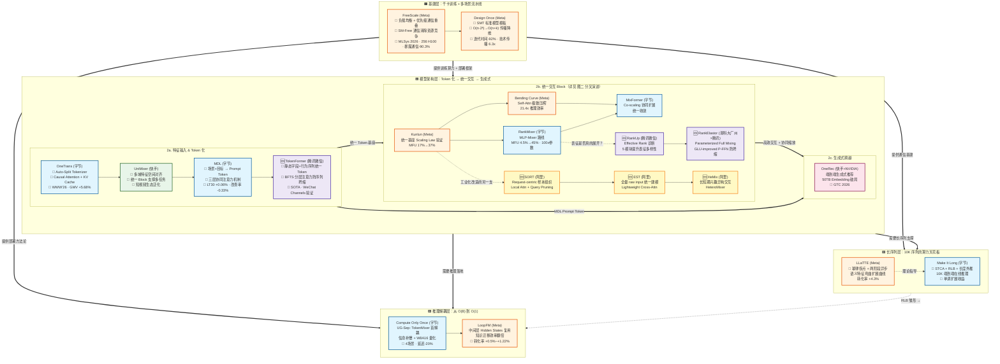
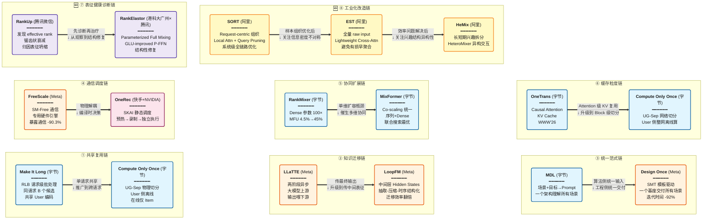

## 业界参考范围：2025-2026年22篇核心论文

基于 2025-2026 年工业界 22 篇核心论文的系统性技术分析。

> 本文在原 16 篇论文基础上，融合了另外 6 篇聚焦精排 Scaling 的论文（阿里 3 篇 + 腾讯微信及合作方 3 篇），补齐了"统一交互 Block 层"在阿里技术路线上的空白，以及"参数变大后表征是否真的展开"这一诊断维度。新增论文已标注 🆕。

1）底层基建与生态部署

- **Meta**：FreeScale: Distributed Training for Sequence Recommendation Models with Minimal Scaling Cost — [arXiv:2604.24073](https://arxiv.org/abs/2604.24073)
- **Meta**：Design Once, Deploy at Scale: Template-Driven ML Development for Large Model Ecosystems — [arXiv:2603.24963](https://arxiv.org/abs/2603.24963)

2） Token 化 & 模型架构演进

**Token 化**

- **字节**：OneTrans: Unified Feature Interaction and Sequence Modeling with One Transformer in Industrial Recommender — [arXiv:2510.26104](https://arxiv.org/abs/2510.26104)
- **快手**：UniMixer: A Unified Architecture for Scaling Laws in Recommendation Systems — [arXiv:2604.00590](https://arxiv.org/abs/2604.00590)
- **字节**：MDL: A Unified Multi-Distribution Learner in Large-scale Industrial Recommendation through Tokenization — [arXiv:2602.07520](https://arxiv.org/abs/2602.07520)
- 🆕 **腾讯微信**：TokenFormer: Unify the Multi-Field and Sequential Recommendation Worlds — [arXiv:2604.13737](https://arxiv.org/abs/2604.13737)（WeChat Channels）

 **统一交互 Block**

- **Meta**：Kunlun: Establishing Scaling Laws for Massive-Scale Recommendation Systems through Unified Architecture Design — [arXiv:2602.10016](https://arxiv.org/abs/2602.10016)
- **字节**：HyFormer: Revisiting the Roles of Sequence Modeling and Feature Interaction in CTR Prediction — [arXiv:2601.12681](https://arxiv.org/abs/2601.12681)
- **字节**：RankMixer: Scaling Up Ranking Models in Industrial Recommenders — [arXiv:2507.15551](https://arxiv.org/abs/2507.15551)
- **字节**：TokenMixer-Large: Scaling Up Large Ranking Models in Industrial Recommenders — [arXiv:2602.06563](https://arxiv.org/abs/2602.06563)
- **Meta**：Bending Curve (ULTRA-HSTU): Bending the Scaling Law Curve in Large-Scale Recommendation Systems — [arXiv:2602.16986](https://arxiv.org/abs/2602.16986)
- **字节**：MixFormer: Co-Scaling Up Dense and Sequence in Industrial Recommenders — [arXiv:2602.14110](https://arxiv.org/abs/2602.14110)（**KDD 2026**；抖音 + 抖音极速版）
- 🆕 **腾讯微信**：RankUp: Towards High-rank Representations for Large Scale Advertising Recommender Systems — [arXiv:2604.17878](https://arxiv.org/abs/2604.17878)（微信广告：视频号 / 公众号 / 朋友圈）
- 🆕 **腾讯 × 港科大（广州）**：RankElastor (Expand More, Shrink Less): Shaping Effective-Rank Dynamics for Dense Scaling in Recommendation — [arXiv:2605.23191](https://arxiv.org/abs/2605.23191)（**KDD 2026 Research Track**；一作为港科大（广州））
- 🆕 **阿里**：SORT: A Systematically Optimized Ranking Transformer for Industrial-scale Recommenders — [arXiv:2603.03988](https://arxiv.org/abs/2603.03988)（**CIKM 2026**；AliExpress 跨境电商）
- 🆕 **阿里**：EST: Towards Efficient Scaling Laws in Click-Through Rate Prediction via Unified Modeling — [arXiv:2602.10811](https://arxiv.org/abs/2602.10811)（**KDD 2026 ADS Track**；阿里妈妈淘宝展示广告）
- 🆕 **阿里**：HeMix (HeteroMixer): Query-Mixed Interest Extraction and Heterogeneous Interaction for Industrial Recommender Systems — [arXiv:2602.09387](https://arxiv.org/abs/2602.09387)（部署于**高德地图 AMAP**，LBS 本地生活场景，非电商）

 **生成式演进**

- **快手**：OneRec 训练实践 — [GTC 2026 训练报告](https://www.nvidia.cn/on-demand/session/gtc26-s81984/) （基于 NVIDIA HPC 打造端到端生成式推荐 OneRec 训练：面向工业级推荐大模型的"超算引擎"）

3）长序列多阶段压缩

- **字节**：Make It Long, Keep It Fast: End-to-End 10K Long User Behavior Sequence Modeling for Billion-Scale Douyin Recommendation — [arXiv:2511.06077](https://arxiv.org/abs/2511.06077)
- **Meta**：LLaTTE: Scaling Laws for Multi-Stage Sequence Modeling in Large-Scale Ads Recommendation — [arXiv:2601.20083](https://arxiv.org/abs/2601.20083)

4）在线推理与算力解耦

- **字节**：Compute Only Once: UG-Separation for Efficient Large Recommendation Models — [arXiv:2602.10455](https://arxiv.org/abs/2602.10455)
- **Meta**：LoopFM: Learning frOm HistOrical RePresentations of Foundation Model for Recommendation — [arXiv:2605.29280](https://arxiv.org/abs/2605.29280)


> **关于本文的实践视角**：本文的判断部分来自笔者在工业级广告推荐系统中做 Dense Scaling 的一线经验。出于信息披露规范，涉及具体配置、代码结构与未公开线上数据的内容已从本文移除，仅保留可从公开论文推导或已在公开文献中得到印证的结论。文中所有数字均来自上述公开论文。


---

## 前言：为什么推荐系统需要一场"Scaling 革命"

推荐系统正在经历一次根本性的范式迁移。过去十年，推荐模型的设计逻辑是"为 CPU 时代手工设计的特征交叉模块"（DCN 做显式交叉、DIN 做目标注意力、SIM 做长序列检索），这些碎片化架构在参数量和数据量持续增长时暴露出一个统一的问题：**不可扩展**。

与之对照，LLM 在过去五年证明了"统一架构 + 算力规模化 = 持续智能提升"的幂律法则。推荐系统是否也能走这条路？2025-2026 年工业界的回答是肯定的——但前提是先解决推荐场景独有的六个工程难题。

本文以 22 篇工业级论文为素材，从微观技术演进和宏观架构哲学两个层面，构建一套完整的认知体系。其中 16 篇构成主体的"六层演进体系"，另外 6 篇（阿里 SORT/EST/HeMix + 腾讯微信 RankUp/TokenFormer + 港科大（广州）与腾讯合作的 RankElastor）聚焦"统一交互 Block 层"内部，补充了阿里的工程化路线与"参数变大后表征是否真的健康展开"这一诊断视角——后者在本文中被独立提炼为第七条主线（表征健康），使原有的"六层演进体系"扩展为"六层 + 1 条正交诊断线"。

### 全文架构全景

```text
第一节：全景架构（图一 六层体系 · 图二 交互Block分叉+表征健康第三维 · 图三 八链进化树）← 22 篇论文的分类学与技术脉络（过去）
第二节：七条演进主线（六层对应的六条主线 + 主线7 表征健康）← 每一层"怎么演进的"（过去→现在）
第三节：七个统一主题（六个跨论文主题 + 主题7 表征健康体检线）← 论文间的深层规律（过去→现在）
第四节：可推断的突破方向（4.1~4.9 范式内 + 4.10 三个代际拐点）← 从机理间隙推演的下一步（未来）
```

从"论文分类与脉络 → 逐层演进主线 → 跨论文深层规律 → 突破方向"，形成了一个从过去到未来的完整认知闭环。

---

## 一、全景架构：六层演进，一场工业革命

### 图一：六层全景架构图



图一是六层全景，展现从"千卡基础设施"到"生成式推荐"的完整因果链，本次融合在"统一交互 Block"子层内新增了两条分支：**表征健康分支**（RankMixer → RankUp → RankElastor，追问"参数变大后表征是否真的展开"）与**阿里工程化分支**（Kunlun 验证可行性后，SORT/EST/HeMix 从另一套系统化路径把 Transformer 改造为工业 ranking backbone）：

1. **基建层**（FreeScale, Design Once）提供训练算力与多场景流水线保障——它是整个栈的物理地基，没有它千卡训不动、多场景管不了。
2. **模型架构层**内部三子层：Token 化层把一切变成统一 Token（新增 TokenFormer 补充"静态字段+行为序列统一 Token 时如何防序列坍缩"）→ 交互 Block 层高效完成特征交叉与序列交互（三条路线：MLP-Mixer vs Self-Attention 极致压榨 vs 阿里系统化工程改造，最终在 MixFormer 统一收敛，同时 RankUp/RankElastor 补上了"表征是否健康"这道体检）→ 生成式层完成终极跨越。
3. **长序列层**与**推理解耦层**分别解决"10K 序列怎么喂进去"和"大模型怎么部署"。两者通过 RLB（请求级批处理）建立技术血缘——Make It Long 的"B 个候选共享 User"思想直接催生了 Compute Only Once 的 UG-Sep，这一思想也与 SORT 的 request-centric 样本组织异曲同工。值得注意的是，MixFormer 所代表的"序列与特征 Co-Scaling"路线已在多家公司的生产环境落地，说明长序列层不再是纸面方案——工程上真正的难点已从"能不能跑万级序列"转移到"压缩后的信息损失如何度量"（详见 4.7）。

---

### 图二：交互 Block 层进化分叉 —— RankMixer 与 Bending Curve 的两条路线，及表征健康的第三维

```mermaid
graph LR
    classDef byte fill:#e1f5fe,stroke:#01579b,stroke-width:2px;
    classDef meta fill:#fff3e0,stroke:#e65100,stroke-width:2px;
    classDef converged fill:#f3e5f5,stroke:#7b1fa2,stroke-width:2px;
    classDef tencent fill:#ede7f6,stroke:#4527a0,stroke-width:2px;

    subgraph origin["起点：统一基座"]
        OT["OneTrans (字节)<br/>Full Self-Attention<br/>一切皆 Token 交互"]:::byte
        KL["Kunlun (Meta)<br/>验证 Scaling Law 成立<br/>MFU 17%→37%"]:::meta
        OT -->|"证明统一架构可行"| KL
    end

    subgraph split["分叉：两条路线"]
        subgraph path_a["路线A：抛弃 Attention"]
            HF["HyFormer (字节)<br/>发现：推荐特征无时序性<br/>非序列间 Full Attn 是冗余"]:::byte
            RM["RankMixer (字节)<br/>纯 MLP-Mixer<br/>O(N) · MFU 4.5%→45%"]:::byte
            TML["TokenMixer-Large (字节)<br/>Sparse-MoE 变体<br/>百亿参数 Scaling 实践"]:::byte
            HF -->|"非对称混合注意力"| RM
            RM -->|"MoE 扩容"| TML
        end

        subgraph path_b["路线B：坚持 Self-Attention 极致压榨"]
            BC["Bending Curve (Meta)<br/>ULTRA-HSTU<br/>SLA 半局部稀疏注意力<br/>5.3x训练 · 21.4x推理 · 百亿用户"]:::meta
        end
    end

    subgraph converge["收敛：多维协同"]
        MX["MixFormer (字节)<br/>Co-scaling 统一<br/>序列+Dense 协同扩展"]:::converged
    end

    subgraph rank_health["🆕 第三维：表征是否健康展开"]
        direction LR
        RU["RankUp (腾讯微信)<br/>发现 effective rank<br/>锯齿状衰减"]:::tencent
        RE["RankElastor (港科大广州×腾讯)<br/>归因 rigid mixing + P-FFN<br/>结构性修复 collapse"]:::tencent
        RU -->|"诊断问题"| RE
    end

    KL -->|"指出统一架构<br/>两条优化方向"| HF
    KL -->|"坚持 Self-Attn<br/>极致压榨"| BC
    TML -->|"单维扩容遇瓶颈"| MX
    BC -.->|"序列扩长经验<br/>喂给协同搜索"| MX

    RM -.->|"对比关系"| BC
    RM ==>|"参数扩了 100 倍<br/>表征真的展开了吗？"| RU
    MX -.->|"Co-scaling 也可能<br/>加剧 collapse"| RU
```



图二放大图一中交互 Block 层的内部演进。两条路线在 Kunlun 验证 Scaling Law 后分叉，最终在 MixFormer 处收敛；本次融合新增的 RankUp/RankElastor 不是第三条并列路线，而是对已有路线（尤其是路线A的 RankMixer 系）的**纵向体检**——它们追问的不是"要不要 Attention"，而是"MLP-Mixer 把参数放大 100 倍后，这些新增参数真的在做有效表达，还是在震荡中相互抵消"：

| 维度 | 路线A：MLP-Mixer | 路线B：Self-Attention 压榨 | 🆕 第三维：表征健康诊断 |
| - | - | - | - |
| **核心判断** | 推荐特征无时序依赖，不需要 Attention | Self-Attention 效果天花板更高 | 参数变大≠表征变强，需诊断 effective rank |
| **替换方案** | 纯 MLP（O(N) 线性复杂度） | SLA 稀疏注意力（O((K₁+K₂)·L)） | Parameterized Full Mixing + GLU-improved P-FFN |
| **效率衡量** | MFU 一次性拉到 45% | 5.3× 训练 / 21.4× 推理扩展效率（37% 为分叉前 Kunlun 打补丁式基线） | effective rank 层间轨迹（锯齿状衰减 → 期望平稳展开） |
| **参数量** | 100 倍（推理延迟不变） | 18 层 Self-Attn · 16K 序列 · 百亿用户 | 与 RankMixer 同规模，但诊断新增参数的"有效容量"而非总量 |
| **适用场景** | 特征交互 > 序列交互 | 序列足够长(10K+)，Self-Attn 优势显著 | 任何已完成 MLP-Mixer 扩容、准备继续 Scale 的阶段 |

HyFormer 是分叉前的关键节点——它首先发现"推荐特征无时序性、非序列间 Full Attention 是冗余"，这一洞察同时启发了 RankMixer（抛弃 Attention）和 Bending Curve（压榨 Attention）。而"固定 block-transpose permutation 这种非参数化混合是否限制了表达上限"这一追问，在 RankMixer 原论文中并未展开，是 RankUp/RankElastor 补上的关键一环。

---

### 图三：推荐大模型的进化树



**推荐的论文之间有一条"进化树"——A 论文的某个设计，后来被 B 论文提炼升级。**

它们背后是**具体论文之间的技术血缘**。理解这些继承链，就能看懂推荐大模型的"进化树"：

| 继承链 | 前驱论文（思想源头） | → | 后继论文（系统化升级） | 核心跃升 |
| - | - | - | - | - |
|   ①   |   Make It Long 的 **RLB**（一次请求里 B 个候选共享同一个 User 编码）   |   →   |   Compute Only Once 的 **UG-Sep**（把 User 侧计算彻底从在线剥离，不仅共享编码，还省掉整个 User 网络）   |   从"单请求内共享"推广到"跨请求 O(1)"   |
|   ②   |   LLaTTE 的**两阶段异步**（大模型上游异步算 → 输出喂给下游小模型）   |   →   |   LoopFM 的**中间层 Hidden States 复用**（不仅传最终输出，还传每一层的中间表征）   |   从传"最后一行"升级到传"整本笔记"   |
|   ③   |   MDL 的 **Prompt Token**（一个模型用 Prompt 区分场景和目标）   |   →   |   Design Once 的 **SMT**（一个基座模板用 Schema 配置派生所有场景的模型）   |   从"算法统一输入"到"工程统一交付"   |
|   ④   |   FreeScale 的 **SM-Free 通信**（通信 kernel 不用 GPU 的计算单元，用专用硬件）   |   →   |   OneRec 的 **SKAI 静态调度**（通信时序在预热阶段就定好，运行时不再动态协调）   |   从"通信与计算物理解耦"到"通信时序编译时决策"   |
|   ⑤   |   RankMixer 的**单维扩容**（Dense 参数 100 倍，但序列建模另做）   |   →   |   MixFormer 的 **Co-scaling**（序列长度和 Dense 参数在同一个网络里联合搜索最优）   |   从"各做各的"到"一起优化"   |
|   ⑥   |   OneTrans 的 **KV Cache**（Attention 级的 Key/Value 缓存复用）   |   →   |   UG-Sep 的**网络物理切分**（Block 级切分，User 侧整个网络离线算完再缓存）   |   从 "Attention 级复用"到"Block 级物理切分"   |
|   🆕 ⑦   |   RankUp 的**effective rank 诊断**（观察到 RankMixer 类结构层间表征坍塌）   |   →   |   RankElastor 的**结构性修复**（Parameterized Full Mixing + GLU-improved P-FFN，让表征"expand more, shrink less"）   |   从"发现问题"到"修复机制"   |
|   🆕 ⑧（认知递进·非血缘·第一步）   |   SORT 的**Request-centric 样本组织**（同请求多候选共享用户上下文计算，AliExpress）   |   ⇢   |   EST 的**信息密度不对称建模**（不早聚合，保留 token 级细粒度信息，阿里妈妈展示广告）   |   从"省算力"到"不因省算力丢信息"   |
|   🆕 ⑧（认知递进·非血缘·第二步）   |   EST 的**信息密度不对称建模**（不早聚合，保留 token 级细粒度信息，阿里妈妈展示广告）   |   ⇢   |   HeMix 的**异构兴趣结构拆分**（长短期兴趣、候选相关/无关兴趣分通道建模，高德 AMAP）   |   从"信息密度不对称"到"兴趣结构异构性"   |

以链①为例体会"继承"的含义：Make It Long 的 RLB 做的是"同请求内 User 编码只算一次、省 B-1 份冗余"；UG-Sep 顺着这个思路往上追问一层——**既然同请求的 B 个候选能共享，不同请求之间为什么不能？** 于是把 User 侧整网移到近线、在线只跑 Item 网络查缓存，把"一个请求内省 B-1 份"升级为"跨所有请求只算 1 次"。

所以继承不是 A 改 B 的代码，而是 **A 做对了某件事，B 把这件事推到极致**。链⑦的性质则与①～⑥不同：**①～⑥都在"效率/成本"维度上继承，⑦是第一条"效果/表达能力"维度的继承链**——这也是全文把表征健康单列为主线 7 的由来。

---

## 二、深入七条演进主线

**按架构层逐层深入，每一层主线讲清楚它做了什么，"解决什么瓶颈、论文之间怎么迭代"。本次融合新增主线 7（表征健康），与前六条主线正交。**

### 主线 1：Token 化 —— 从"特征拼接"到"大一统输入"

传统推荐模型的特征输入方式极其原始：稠密特征 concat 稀疏 Embedding，直接喂给下游网络。"哪类特征和哪类特征应该交互"完全由网络结构决定，架构碎片由此而生。

**OneTrans 的历史性突破**：首次将全部特征（用户、上下文、广告、长序列行为）**展平为统一 Token 序列**，输入到一个 Transformer 中。关键技术决策：

- **Auto-Split Tokenizer**：将所有非序列特征拼接，通过共享 MLP 再切分为多个 Token。对比 Group-wise Tokenizer（每组特征独立投影），Auto-Split 效果更好且 Token 数量可控。这个设计的深层意义是"**Token 不再绑定具体特征，表达更灵活**"——一个 Token 可以混合来自用户属性、上下文、Item 特征的信息。
- **Causal Attention + KV Cache**：借鉴 LLM 的因果注意力，使得前向算出的中间表征可被跨请求复用。这是把推荐推理从 O(N) 压到 O(1) 的第一步——**OneTrans 在提出统一架构的同时，也已经想好了怎么部署**。这是一等一的工程品味。
- **工业验证**：抖音在线 A/B，用户级 GMV +5.68%。论文已被 WWW 2026 接收。

**MDL 的范式跃迁**：如果说 OneTrans 是"把特征变成 Token"，MDL 就是"把业务概念变成 Token"。场景（抖音搜索 vs 抖音推荐 vs 抖音广告）和预估目标（点击 vs 点赞 vs 分享 vs 转化）不再作为独立的网络分支，而是转化为 Prompt Token 打入统一交互 Block。三个协同机制：

- **Feature Token Self-Attention**：所有特征 Token 在统一空间内自由交互。
- **Domain-Feature Attention**：场景/目标 Token 作为 Query，选择性激活相关特征——"搜索场景关注 query-item 匹配信号，推荐场景关注用户长期兴趣"这种差异不再需要不同网络结构，而是 Token 级注意力动态解决。
- **Domain-Fused Aggregation**：场景/目标信息在输出层联合聚合，而非独立塔。

**工业证据**：抖音搜索百级/日级用户在线部署，LT30（30天留存）+0.0626%，改查率（用户不满意换 query）-0.3267%。

**UniMixer 的差异化路径**：快手在同一时期走了类似但侧重点不同的路。UniMixer 更关注**多域特征在统一空间内的对齐**——通过统一的 Embedding 层和归一化策略，确保不同模态特征转换后在同一个超球空间内可比。本质上是在解决"短视频生态中多目标、多场景分发的泛化能力"。

**🆕 TokenFormer 的补充视角——统一 Token 化不能只做"拼接"**：OneTrans/MDL/UniMixer 解决的是"如何把异构特征拼成统一 Token 序列"，但腾讯 TokenFormer 指出一个前面三篇都未直接回答的问题：**静态多字段特征（低秩、稠密）和用户行为序列特征（高秩、稀疏时序）被硬塞进同一个 token stream 后，低秩的静态特征会把序列表征"拖低"，即 Sequential Collapse Propagation**。它给出的解法是分层注意力（BFTS：底层 full causal attention 做全局融合，高层 shrinking sliding attention 聚焦局部行为、抑制静态噪声传播）和非线性交互增强（NLIR：sigmoid gate 对 attention output 做 element-wise modulation，提升 representation rank）。这一发现补齐了 Token 化主线里的一个关键警示：**"统一 Token 化"是必要的第一步，但不同信息密度、不同秩的 Token 混合交互时需要显式的层次管理，否则统一本身会成为坍缩的源头**——这与后文主线 7（表征健康）形成呼应。

**一个值得注意的工程收敛现象**：广告场景的实践中，一种常见做法是把非序列特征用共享 MLP 统一切分为 Token，再以场景 Token 和任务 Token 作为 Prompt 注入统一交互 Block——这正是 OneTrans Auto-Split 与 MDL Prompt Token 两种理念的自然合流。更有意思的是它的**后续演化方向**：当序列长度从千级扩到万级后，把长序列 token 与非序列 token 混在同一个 stream 里反而成为负担，实践上倾向于将长序列拆出、走独立的多路序列通道（即 MixFormer 路线），非序列 token 侧则保持精简。这与 TokenFormer 从表征角度给出的警示（下段）指向同一个结论：**统一 Token 化有其适用边界，信息密度差异过大的 Token 不宜无差别混合**。

### 主线 2：统一交互 Block —— 从"一堆小算子"到"大 GEMM"

光有统一 Token 还不够——Token 之间怎么交互，决定了算力利用率。这一层的演进是最精彩的，因为它是**推荐系统与 GPU 硬件对齐**的核心战场。

**Kunlun：统一基座可行性的理论奠基**

Kunlun 的历史价值不在于发明新架构，而在于**第一次用大规模工业实验证明了"统一基座 + 扩展算力 = 可预测幂律提升"在推荐系统领域成立**。此前这被认为是 LLM 的特权——推荐系统特征是异构的、有 Embedding 表、有长序列，Scaling Law 不一定成立。Kunlun 用五种优化的叠加效果回答了这个根本问题：

- **低层优化（硬件对齐）**：GDPA（广义点积注意力）、HSP（层次化种子池化）、Sliding Window Attention——把 MFU 从 17% 提到 37%。解决了"算不动"的问题，把算力利用率翻倍，使得大规模实验在工程上成为可能。
- **高层创新（架构提效）**：CompSkip（计算跳跃，允许某些 Token 跳过某些层）、Event-level Personalization（事件粒度个性化）。解决了"算了白算"的问题，去除了推荐特征固有的大量冗余，使得网络加深加宽时，每一份新增的算力都在提取有效的信息熵。
- **核心结论**：扩展效率（每单位算力的质量提升）比 SOTA 方法翻倍。现已部署在 Meta Ads 主要模型。（当底层硬件极限被榨干，且高层架构不再做无效功时，推荐系统终于展现出和 LLM 一样的数学美感——**质量随计算量呈可预测的幂律提升）**。

**RankMixer：抛弃 Attention 的大胆时刻**

RankMixer 做出的关键判断是：**推荐输入中占大头的那些非序列特征（用户画像、上下文、广告属性）之间并没有 NLP 那样的顺序依赖，因此不需要 Self-Attention 提供的"按内容动态路由"能力**。既然不需要，就用纯 MLP-Mixer——两层 MLP 分别沿 Token 维度和 Channel 维度交叉，复杂度对 Token 数线性而非平方。（这个判断对非序列特征成立，但对行为序列是有代价的，下文"三个隐藏前提"会展开。）

最震撼的数字：**MFU 从 4.5% 跳到 45%**。100 倍参数量，推理延迟保持不变，全量上线后用户活跃天数 +0.3%、总使用时长 +1.08%。它同时支撑推荐和广告两个场景——证明纯 MLP-Mixer 在不同业务下有通用性。

这里的深层含义是：**GPU 是为大 GEMM 设计的，而旧推荐模型的碎片化小算子是"CPU 时代的遗毒"**——RankMixer 把它们全部替换成大 GEMM 后，Tensor Core 终于被喂饱了。

**🆕 RankUp：MFU 拉满之后，表征真的展开了吗？**

RankMixer 证明了"MFU 4.5%→45%"，但腾讯微信的 RankUp 提出一个原论文没有正面回答的问题：**100 倍参数量投进去，token representation 的有效维度（effective rank）是不是也跟着变大了？** RankUp 的观察结果是否定的——沿 RankMixer 类骨架逐层测量 effective rank，发现它呈现**damped oscillatory trajectory（阻尼振荡轨迹）**：mixing 层把秩拉高一点，紧接着的 P-FFN 又把秩压低，且振幅逐层衰减，深层可能退化到很低的有效维度。这意味着**参数量的账本和表征质量的账本是两本不同的账**——MFU 高只说明"算力没浪费"，不代表"每一份新增算力都换来了更丰富的表达"。

RankUp 的实验与线上验证均在**微信广告**场景（视频号 / 公众号 / 朋友圈，三处 GMV 分别 +3.41% / +4.81% / +2.12%）。RankUp 给出的应对不是换架构，而是在 Token 构造和输入侧做五处增量改造（Randomized Permutation Splitting 打散特征相关性、Multi-embedding 提升初始多样性、Global Token 提供全局视角、预训练 Embedding 交叉注入 FM 式先验、Task-Specific Token Decoupling 解耦多任务），本质是**在不改变 RankMixer 主干效率优势的前提下，从"输入端"提升表征的初始多样性和后续可展开性**。

**🆕 RankElastor：从"观察坍缩"到"结构性修复坍缩"**

RankElastor 把 RankUp 发现的现象进一步归因到机制层面：RankMixer 的 Multi-Head Token Mixing 本身是**无参数的（parameter-free）**——它把每个 Token 的 embedding 切成若干 head 后跨 Token 重排，等价于一次**内容无关的固定 block-transpose permutation**，混合方式完全由结构写死、不含任何可学习的混合权重——所有 Token 通过同一组权重均匀混合，无法根据内容动态决定交互强度；而标准的两层 GELU FFN 在输入本身已经低秩时，会进一步压缩 effective rank（rank contraction）。两者叠加，就是"锯齿状 collapse"的成因——**mixing 稍微展开，FFN 立刻压回去**。

修复方案对症下药：**Parameterized Full Mixing** 把固定 permutation 换成可学习的 full mixing matrix，让 mixing 本身有能力学习更细粒度的 token-feature 交互；**GLU-improved P-FFN** 用门控式 FFN 替换普通 GELU FFN，通过乘法交互分支抑制 rank contraction。目标是让表征"expand more, shrink less"。

这条链（RankMixer → RankUp → RankElastor）与主线 2 的主脉络（RankMixer/Kunlun/Bending Curve/MixFormer 追求 MFU 和硬件效率）构成一组**正交但同等重要的诊断维度**：主脉络问"算力有没有浪费"，这条链问"表达能力有没有浪费"。两者互不替代——一个架构完全可能 MFU 拉满、同时表征严重坍缩，此时线上 AUC 的天花板不是被算力卡住，而是被表征健康卡住。

**Bending Curve (ULTRA-HSTU)：坚持 Self-Attention 的另一条路**

与 RankMixer 形成对比，Meta 选择了坚持 Self-Attention 但极致压榨其效率。Bending Curve 的核心论点是：**在长序列推荐场景中，Self-Attention 的效果天花板比 Cross-Attention 和 MLP-Mixer 更高，问题只是算力**。

四管齐下：

- **SLA（半局部稀疏注意力）**：每个位置只attend 局部窗口内的 K₁ 个位置 + 全局挑选的 K₂ 个位置，复杂度 O((K₁+K₂)·L)。由于 K₁、K₂ 是与序列长度无关的常数，**这实质上是把 O(L²) 降到了对 L 线性**——这正是 Self-Attention 路线能在 16K 序列上活下来的根本原因。关键是全局窗口不可去掉——消融实验证明它对推荐系统至关重要。
- **输入序列重构**：Item Embedding 和 Action Embedding 直接相加（x = I + a）而非拼成两个 Token，使序列长度减半。由于 Self-Attention 计算量随长度呈平方增长，长度减半意味着**这部分计算量降为原先的 1/4**（注意这是 Attention 子模块的计算量下降，不等于端到端训练效率提升 4 倍）。负载均衡随机长度算法（LBSL）解决分布式"木桶效应"。
- **动态拓扑**：前 N₁ 层处理全序列，后 N₂ 层只看最近的高价值截断；异构行为拆分独立序列分别建模。
- **系统级压榨**：BF16 + FP8 矩阵乘 + INT4 Embedding 通信；SLA 定制算子基于 FlashAttention-V3；选择性激活重计算将单层显存 7GB→2.3GB。

工业结果：**5.3 倍训练扩展效率 + 21.4 倍推理扩展效率**（相对 vanilla HSTU 基线）。Meta 百亿级用户生产环境（18 层 Self-Attention，16K 序列，数百张 H100），消费与互动指标 4%~8% 增长。

**MixFormer：Co-scaling 的终局方案**

当 RankMixer 证明单维扩容可行、Bending Curve 证明 Self-Attention 可压榨后，下一步自然的问题就是：**序列长度和 Dense 参数量如何同时扩展？** 它们在共享网络内争抢计算预算，如果分开设计（RankMixer 做特征交叉 + STCA 做序列扩长）会导致"顾此失彼"。

MixFormer 的答案：**一个统一 Transformer 骨架同时做序列建模和特征交互**，在统一参数化下让序列变长和参数变粗协同搜索最优平衡点。提出 User-Item 解耦策略（把 User 侧长序列 Token 和 Item 侧特征 Token 在共享网络中高效交互），显著降低冗余计算。抖音和抖音极速版双场景在线验证，用户活跃天数和时长持续提升。

**🆕 阿里的第三条路：不是抛弃 Attention，也不是压榨 Attention，而是系统化改造 Attention**

字节和 Meta 的分叉在于"要不要 Attention"，而阿里 SORT/EST/HeMix 给出了第三种答案：**Attention 本身没问题，问题是没有针对工业 ranking 场景的稀疏特征、低标签密度、样本组织方式做系统性改造**。

> **一个必要的澄清**：这三篇虽同属阿里，但**分属三个互不相干的业务部门与场景**——SORT 来自 **AliExpress**（跨境电商），EST 来自**阿里妈妈展示广告 Rank**（淘宝展示广告），HeMix 来自**高德地图 AMAP**（LBS 本地生活）。因此下面呈现的"递进"是笔者按问题逻辑重排后的**认知递进**，而非同一团队的技术血缘继承，也不代表阿里内部存在一条统一规划的演进路线。三条独立路径在"保留 Attention 范式、改造喂给它的数据"这一点上殊途同归，这种跨部门的自发收敛本身反而更能说明该路径的普适性。

按问题逻辑，三篇构成如下递进：

- **SORT** 先解决"Transformer 能不能落地"——通过 request-centric 样本组织（同请求多候选共享 User 编码，与 Make It Long 的 RLB 思路一致但独立发现）、Local Attention + 逐层 Query Pruning（历史行为只关注局部窗口，候选层保留全局）、生成式预训练（next-item prediction 迁移稀疏 Embedding），以及 tokenization / MHA / FFN 三个模块各自的针对性改造，形成一套从样本组织贯穿到算子实现的系统性优化，把标准 Transformer 改造成可用的工业 ranking backbone。
- **EST** 在 SORT 解决了效率问题之后追问"效率提上来了，但是不是又把信息丢了"——很多方法为了效率对行为序列做 early aggregation（早聚合成固定向量），EST 指出这会形成 information bottleneck。它主张全量 raw input 统一建模，用 Lightweight Cross-Attention（把高密度非行为特征作为 Query 去读取低密度行为 Memory，复杂度降为近似线性）和 Content Sparse Attention（用内容相似度构建稀疏行为关系）在不早聚合的前提下控制计算量。
- **HeMix** 进一步指出"即使不早聚合，也不能把所有行为一锅炖"——长期兴趣和实时兴趣、候选相关兴趣和候选无关的稳定偏好，本质是不同的信息结构，需要用 Query-Mixed Interest Extraction（动态 Query + 固定 Query 分别提取候选相关/无关兴趣）和 HeteroMixer（子空间拆分+独立非线性交互）分别处理。

这条阿里链路与字节/Meta 的分叉路线**不是竞争关系，而是维度正交**：字节/Meta 回答"用 Attention 还是 Mixer"，阿里回答"如果用 Attention，怎么让它适配工业约束（样本组织、信息密度、异构兴趣）"——两个问题的答案可以同时成立。

**一个被低估的对比**：RankMixer（4.5%→45% MFU，100× 参数，1B Dense，字节 2025-2026）、Kunlun（17%→37% MFU，B200 GPU，Meta 2026）、Bending Curve（21.4× 推理效率，18 层 Self-Attention，Meta 2026）。三家公司在同一个时间窗口走向了**两种不同的硬件对齐策略**——字节选了 MLP-Mixer（极致 O(N)），Meta 选了 Self-Attention 极致压榨（SLA + 系统协同）。而阿里 SORT/EST/HeMix 代表的**第三种策略**——不改变基础算子范式，靠样本组织、信息密度管理、异构兴趣拆分把 Attention 本身改造得足够高效——说明"硬件对齐"不是只有"换算子"一条路，"改变数据怎么喂进算子"同样是一条有效路径。

但"序列长选 Bending Curve、特征重选 RankMixer"只是表层判据，真正的分水岭藏在三个隐藏前提里：

- **归纳偏置 vs 数据量的权衡**：MLP-Mixer 抛弃 Attention 等于抛弃"按内容动态路由"的归纳偏置，改用固定的位置相关混合权重。在字节级日活下数据足够多、能从数据里学回这点偏置；但在数据稀疏的冷启、长尾域、中小推荐系统中，MLP-Mixer 会明显弱于 Attention。**它其实是大数据特权下的结论，而非通用结论。**（这一判断也解释了 RankUp/RankElastor 为何有存在价值——一旦数据不足以"学回"归纳偏置，MLP-Mixer 的固定 permutation 天然更容易表征坍缩。）
- **序列顺序信息的定价**：HyFormer"非序列特征间无时序依赖"没错，但 RankMixer 把行为序列也压成无序 Token-Mixing 后，丢失的是序列内的顺序与时间间隔信息。Bending Curve 坚持 Self-Attn，本质是判断在 10K+ 长序列上顺序信息的价值压过了算力成本。**两条路线不是"场景偏好"，而是对"序列顺序信息值多少钱"的不同定价。**
- **各自真正的扩展性瓶颈**：MLP-Mixer 是 O(N)，但它的容量靠 per-token FFN 堆叠，一旦序列变长导致 Token 数 N 暴涨，参数量与显存会随之膨胀，长序列不是它的主场；Self-Attention 是 O(N²)，但有 SLA、FlashAttention 这套成熟的稀疏化与算子武器库可压，长序列恰是它的优势区。**所以路线选择本质是在问"瓶颈先撞在序列长度上，还是先撞在特征容量上"**——这也正是 MixFormer 必须把两者放进同一网络联合搜索（上文 Co-scaling）的根因。

**一条可观察的行业验证路径**：广告场景的工程实践为"瓶颈先撞特征容量"这条判断提供了侧面印证——在序列长度还停留在千级时，优先把 Dense 主干（Mixer）做大，其收益通常显著高于同期投入序列建模，这也解释了 RankMixer 路线为何能在多家公司快速复现。但这条判断有明确的**时间窗口**：一旦特征容量的收益开始边际递减，序列侧就会接棒成为主瓶颈，MixFormer 所代表的 Co-Scaling 正是对这一交接的回应。**这里留下的真正缺口在表征侧**：RankUp/RankElastor 的诊断提出了一个尚未被任何公开实践系统检验的问题——1B→5B 的 Co-Scaling 中，MLP-Mixer 骨架的 effective rank 是否在悄悄衰减？这是第四节（4.8）将要展开的核心追问。


### 主线 3：长序列多阶段压缩 —— 从"硬截断"到"近线压缩 + 在线轻量交互"

这是六条主线中最"推荐特有"的一条——LLM 的序列也是一个 Vanilla Transformer 从头到尾，但推荐系统的 10K+ 用户行为序列在工程上完全无法走这条路。

**LLaTTE：理论先行**

LLaTTE 的价值是先给出了**数学框架**再谈工程。三个核心发现：

- 推荐序列的有效长度与 Loss 呈**幂律关系**（类似 LLM），但存在明显的**拐点**——超过拐点后边际收益锐减。
- **语义特征弯曲扩展曲线**：语义特征（如用户画像、物品属性 Embedding）是扩展的前提——没有语义特征，扩展序列长度或加深网络几乎无收益。这个发现解释了为什么"先把 Token 化层做好"是 Block 层的基础。
- **两阶段异步架构**：上游用户模型（大容量、长上下文）异步计算，下游排序模型（轻量、低延迟）消费上游产出。

工业部署：Meta 最大的用户模型，Facebook Feed 和 Reels 转化率 +4.3%。

**Make It Long：工程极限**

字节的做法更"硬核"——直接在线端到端处理 10K 序列，而不是拆两阶段。三大工程创新：

- **STCA（堆叠目标-历史交叉注意力）**：关键创新是把 Self-Attention 的 O(N²) 降为 Cross-Attention 的 O(M×N)。注意这里用的是 Cross-Attention 而非 Self-Attention——目标 Item 作为 Query，历史行为作为 Key/Value，M 为 Query 侧的目标 Token 数、N 为历史序列长度。**这里的 M 要理解为"单次前向中参与 attend 的目标 Token 数"（量级在个位到十位），而非上游召回的候选总数**：若把 M 当作数百个候选，则 N=10K 时 M×N 与 N² 已是同量级、复杂度优势不复存在——这恰恰是 RLB（下一条）必须存在的原因，它把 B 个候选的 User 侧编码共享出来，使序列侧只算一遍。两个机制是配套的，单独看 STCA 会低估其成立条件。这与 Bending Curve 选择 Self-Attention 形成对照——两种路径各有取舍。
- **RLB（请求级批处理）**：核心洞察是**一次请求里的 B 个候选共享同一个 User**。将同请求的多候选聚合为一个 batch，User 侧编码共享，序列相关存储/通信/计算大幅降低。这就是后面 Compute Only Once 的雏形，也与阿里 SORT 的 request-centric 样本组织异曲同工。
- **长度外推训练（Length-Extrapolative Training）**：在较短窗口（如 1K-3K）上训练，在较长窗口（10K）上推理——无需额外训练成本即可扩展。这个 Trick 的有效性依赖于前面的 STCA 和 RLB 已经解决了底层算力。

核心结论：**随着扩展序列长度和模型容量，观察到可预测的单调收益**——这是 Scaling Law 在推荐序列建模上的第一次工业化确认。


### 主线 4：在线推理与算力解耦 —— 从"全量前向"到 O(1)

如果把前面三层比作"造了一台跑车"，这一层就是"让它能在城市道路上合法上路"。

**Compute Only Once (UG-Sep)：推荐大模型落地的唯一工程解**

这条主线的核心矛盾：大模型参数量上去后，每次请求把 User 侧和 Item 侧网络全跑一遍，在线 GPU 成本百倍膨胀，P99 延迟扛不住。

UG-Sep 的答案是**把 User 侧计算从在线剥离**：

- 将 TokenMixer 网络从中间物理切断。User 侧所有特征 Token 和底层 Block 层在近线计算完毕，输出稠密向量写入分布式缓存。
- 在线请求仅拉取候选 Item 的 Token，通过极轻量级 Cross-Attention 与缓存中的 User 向量交互。
- 信息补偿机制弥补掩码导致的信息损失。

关键创新：**这是 UG-Sep 首次被应用于 TokenMixer 架构（而非传统的 Transformer）**。TokenMixer 中 User 和 Item 特征在多层的 Token-Mixing 中深度纠缠，分离难度远大于 Transformer。论文为此设计了显式的掩码机制来保证 User 路输出的"纯净性"。

工业验证：抖音推荐、红果推荐、穿山甲广告、千川广告四个场景，延迟降低最高 20%，对用户体验和商业化指标无明显负面影响。W8A16 权重量化进一步缓解了因 User 侧计算剥离而暴露的显存带宽瓶颈。

**LoopFM：时间维度的表征复用**

这一篇与 UG-Sep 是互补关系。UG-Sep 解决的是"跨请求的 User 侧冗余"，LoopFM 解决的是"跨时间的知识迁移"。

核心思想：大 Foundation Model（FM）的中间层 Hidden States 不是一次性消费品，它们是**用户兴趣在不同时间点的快照**。LoopFM 不需要 FM 实时推理——而是把历史窗口产出的中间表征作为下游模型的输入特征。论文的实际做法是三阶段流水线：**extraction**（从 FM 各层抽取 hidden states）→ **compression**（压缩降维以控制存储与带宽）→ **structuring**（按 user ID 把压缩后的历史 embedding 聚合成时序序列，直接作为下游模型的输入特征）。注意它并未引入额外的门控融合模块，历史表征是以「一路结构化输入特征」的身份进入下游模型的。

工业效果惊人：知识迁移效率（FM 的增量有多少被下游模型吸收）**比传统 Knowledge Distillation 翻倍**。两次独立上线分别带来 +1.03% 和 +1.22% 的转化提升。

这里有一个被低估的关联：LoopFM 的"历史 Hidden States 作为下游输入"与 LLaTTE 的"上游异步大模型输出喂给下游排序"本质上是一条思路——**用异步/离线方式把大模型的知识转移到小模型**。只是 LoopFM 更激进：不仅传最终输出，还传中间层表征。


### 主线 5：底层基建 —— 从"手工作坊"到"工业流水线"

这一层在论文列表里只有两篇，但它们是整个六层架构的"隐形地基"。没有它们，千卡训不动、多场景管不了，前面的所有架构都只是 PPT。

**FreeScale：千卡训练的通信破局（MLSys 2026）**

长序列（10K+）叠加百亿/千亿 Dense 参数后，分布式训练面临三个难题：

- **掉队者（Straggler）**：用户序列长度天然不均衡（有的用户 10K 行为，有的 200），数据并行时长序列 GPU 拖慢全集群。
- **通信阻塞**：Embedding 相关的 All-to-All 通信与传统 Dense AllReduce 同时触发，互相争抢带宽。
- **GPU 资源竞争**：通信与计算重叠时，通信 kernel 和计算 kernel 争抢 SM 资源。

FreeScale 的三连击：精细负载均衡（消除掉队者）、优先级嵌入通信重叠（将关键的 Embedding 通信优先排队，与计算流水线重叠）、SM-Free 通信（通信 kernel 不使用 SM，通过专用硬件引擎完成，彻底消除 SM 竞争）。

工业验证：**256 张 H100 GPU 上，暴露通信（exposed communication）相比 vanilla TorchRec 基线降低 90.3%**。这里的口径需要特别说明：论文正文（Figure 1 附近）的原话是相对 vanilla TorchRec 的**暴露通信降幅**，而不是「训练过程的绝对气泡率从 90.3% 降到 0」。换句话说，它证明的是「未经优化的基线里，绝大部分通信开销都是可以被重叠掉的」，而基线本身究竟浪费了总时长的百分之几，论文并未给出绝对值——因此不能据此反推「千卡训练有一半时间 GPU 在空转」。同时被 MLSys 2026 接收，是最顶级的系统会议。

**Design Once：多场景的工业流水线破局**

大厂内部有数百个推荐场景（信息流、短视频、广告、搜索等）。一个"灵光一闪"的模型改进（比如升级 Bending Curve 的 SLA 算子），如果每个场景都要独立实现、测试、调参、上线——传播速度是 O(n·2^k)。

Design Once 提出的 SMT（标准模型模板）框架把这个问题从 O(n·2^k) 降到 O(n+k)：

- 统一定义大模型基座架构（包含统一交互 Block、训练 Infra、推理引擎）。
- 各场景仅通过配置 Schema（定义特征域、序列类型、预估目标）和 Prompt Token（注入场景语义）快速派生。
- 基座层由平台团队集中维护与 Scaling，场景层只关注业务定义。

四个全球开发周期的实证：平均交叉熵改善 0.63%、单模型迭代工程时间减少 92%、技术传播速度提升 6.3 倍。

**与 MDL 的闭环**：MDL 解决"模型如何理解不同场景"，Design Once 解决"工程如何高效交付不同场景"。两者结合，推荐系统从"手工调参的作坊模式"进入"标准化工业大生产"。


### 主线 6：生成式演进 —— 从"判别式打分"到"LLM 范式自回归生成"

这是六条主线中的"终极关卡"——前面五层都是为这一层铺路。

**OneRec（GTC 2026）：推荐系统的"超算引擎"**

OneRec 不同于前面的架构论文——它是一份 NVIDIA GTC 2026 的工程实践报告，讲述快手如何与 NVIDIA 合作把端到端生成式推荐模型"训出来"。它的价值在于**展示了前面五层都成熟后，推荐系统会发生什么质变**。

OneRec 面临的核心工程挑战：

- **50TB 级稀疏 Embedding**：生成式推荐模型的 Embedding 表规模远超判别式，传统 CPU 查表 + PCIe 传输方案彻底失效。
- **Attention 算力灾难**：Self-Attention 和 Cross-Attention 同时出现，计算与访存深度耦合，MFU 极低。
- **通信冲突**：Embedding All-to-All、Dense AllReduce、ID All-to-All 并发执行，传统动态协调方案延迟不可接受。

四大工程突破：

**① cuDF 基 UGMMU（统一 GPU 显存管理单元）**：

- 多表异构维度下的 Kernel Fusion——Warp 级协同执行消除掉队者，无 Block 级同步。
- 运行时显存碎片整理（Runtime Compaction）——这是 GPU 显存管理从未被真正解决过的问题，UGMMU 把它系统化处理了。

**② TLFU-P GPU 缓存策略**：

- 核心洞察：传统 LRU/LFU 无法处理在线短视频推荐中的突发访问模式——一个爆款视频 Embedding 被瞬间大量请求查询，但它可能几分钟前才入库。
- TLFU-P 用时间感知权重 + 保护窗口机制联合建模长短期热度，并使用预取流水线（Protection Window 确保预取数据不会被提前淘汰）将 Embedding 传输延迟隐藏在计算中。

**③ FA2 Cross-Attention 定制优化**：

- 核心修改：将 CUDA Block 的启动方向从 K/V 维度改为 Q 维度——当 Q 足够小时（≤16），一个 Q Tile 对应足够多的 K Tile，计算与 G2S 拷贝可重叠。

**④ 静态通信调度（SKAI）**：

- 替代传统 Launcher 动态协调方案（哪个通信先发、哪个后发由 Launcher 实时调度，大量同步开销）。
- 用预热阶段稳定通信时序 → 录制阶段记录 NCCL 算子执行顺序 → 执行阶段各 Worker 独立按预录序列执行。
- 本质是"把运行时决策变为编译时决策"。

**产业意义**：OneRec 不是一个孤立事件。它是整个六层演进逻辑的自然终点——Token 化层（MDL）统一了输入，交互 Block 层（MixFormer）统一了架构，基建层（FreeScale/Design Once）提供了训练保障，OneRec 才能走到"一个生成式基座通吃所有推荐场景"。

---

### 🆕 主线 7：表征健康 —— 从"能不能变大"到"变大后是否真的有效"

这条主线是本次融合新增的第七条演进线，与主线 2 深度耦合，但足够独立成为一条主线——因为它回答的问题和前六条主线的性质不同：**前六条主线基本都在回答"如何用更少的算力/更高的硬件利用率做更大的模型"，而这条主线回答的是"当模型确实变大了，参数是否真的换来了表达能力"。**

**问题的产生**：RankMixer 拿到的是一场纯粹的"硬件利用率"胜利（MFU 4.5%→45%、参数 ×100、延迟不变），但它的 token mixing 是内容无关的固定 permutation。RankUp 沿这类骨架逐层测 effective rank，看到的是**阻尼振荡**式衰减；RankElastor 进一步把根因归到 mixing 固化 + FFN 压秩，并给出 Parameterized Full Mixing 与 GLU-improved P-FFN 两处结构性修复。**以上机制、根因与修复方案的完整论述见主线 2，本节不重复，只回答一个问题：它为什么值得从主线 2 里拎出来单独成线。**

**为什么这条主线值得独立于主线 2**：

1. **它跨越了主线 2 内部的所有路线**——不只针对 RankMixer 的 MLP-Mixer，MixFormer 的 Co-scaling、甚至 Kunlun/Bending Curve 的 Self-Attention 变体理论上都可能存在各自的表征健康问题（RankUp/RankElastor 目前的实验聚焦在 RankMixer 类结构，但诊断框架本身是通用的）。
2. **它提出了一套新的度量体系**——effective rank、representation collapse、spectral robustness。这些指标不出现在 MFU/Roofline 的分析框架里，构成对第三节主题 1（从 Memory-Bound 到 Compute-Bound）那条硬件效率主线的必要补充（两条轴如何互补，见主题 7）。
3. **它标志着行业认知的阶段跃迁**——与主题 2（Scaling Law 的前提）形成直接接口：主题 2 原本只讨论了"统一架构前提"和"数据前提"两层风险，纳入表征健康后应视为三层前提——**架构前提（碎片化不可扩展）+ 数据前提（反馈回路/语义特征）+ 表征前提（扩容是否伴随坍缩）**。目前的工业实践（无论 RankMixer 类纯 Dense 路线还是 MixFormer 类 Co-Scaling 路线）基本都只验证了前两层，第三层（Dense Scaling 是否伴随 effective rank 衰减）是一个尚未在公开实践中被系统检验的缺口，详见 4.8。

---

## 三、跨论文的深层认知：七个统一主题

主题穿透所有层，提炼跨论文的共同规律，**告诉你"为什么所有层都在做同一件事的不同版本"**。比如 MFU 这个主题同时出现在 Kunlun（交互 Block）、OneRec（生成式引擎）中，但表现形态不同——前者靠架构替换拉升 MFU，后者靠 FA2 重构拉升 MFU。读主题就像抽丝——把七根线捻成一股绳，看到它们共享的底层逻辑。本次融合新增了主题 7（表征健康），并把主题 5 的三方对比扩展为四方。

### 主题 1：从 Memory-Bound 到 Compute-Bound —— 一切优化的根因

统观全部论文，MFU（模型 FLOPs 利用率）是出现频率最高的硬指标：

| 论文 | MFU 变化 | 手段 |
| - | - | - |
| RankMixer | 4.5% → 45% | 碎片小算子→大 GEMM |
| Kunlun | 17% → 37% | GDPA + HSP + Sliding Window |
| OneRec | 极低 → 显著提升 | FA2 重构 + UGMMU |

这不是巧合。推荐模型过去的主流架构是"大量 Embedding 查表（访存）+ 小矩阵特征交叉（算力闲置）"——TCO 花了 GPU 的钱，但做的是 CPU 级别的运算。所有架构演进的深层动力都是一个：**把核心计算变成足够大的 GEMM，让 GPU 的 Tensor Core 被喂满**。

**更锋利地说，这场革命的本质是一道成本算术题，而非纯粹的效果竞赛。** 用 Roofline 模型看：MFU 4.5% 不代表"模型差"，而是模型死死贴在内存带宽墙上（memory-bound），买了 H100 的算力却只用到它的显存带宽，95.5% 的 Tensor Core 在空转。由此可推出 RankMixer"100 倍参数、延迟不变"的真相——它不是魔法，而是把本就闲置的算力变现：新增的 FLOPs 恰好落进原来的空闲窗口里。

这也圈定了这条路的天花板：当 MFU 被拉到 45%~50%、模型从 memory-bound 跨过相变点变为 compute-bound 后，再加参数延迟就会线性上涨，"免费午餐"结束。Compute Only Once 中 UG-Sep 之后"部分组件转为 memory-bound、需引入 W8A16"正是这个相变点的反向证据——**每一篇论文本质都在做 Roofline 上的瓶颈搬运（在 memory-bound 与 compute-bound 之间来回腾挪），而不是单纯"把模型变大"。**

**但 MFU 拉满不是终点，只是必要条件**——主题 7 会指出，MFU 只衡量硬件是否被喂饱，不衡量参数是否被有效利用。RankMixer 把 MFU 拉到 45% 的同一批参数，效果层面（effective rank）是否被同样喂饱，是完全独立的另一个问题。

### 主题 2：统一架构的可扩展性 —— Scaling Law 的前提

Kunlun 用了五种优化才让 MFU 从 17% 提到 37%，而 RankMixer 简单地"抛弃 Attention、全用 MLP-Mixer"就直接把 MFU 从 4.5% 拉到 45%。为什么？因为 **RankMixer 的架构本身就是为 GPU 设计的大 GEMM 结构**，而 Kunlun 是在旧架构上打补丁。

这里有更深层的方法论：**碎片化的架构天然不可扩展——不是模块本身有问题，而是碎片化阻止了 GPU 面对大 GEMM 时的天然优势。统一架构不是审美选择，是物理约束。**

但统一架构只是 Scaling Law 的**架构前提**，还有一个被乐观叙事掩盖的**数据前提**必须警惕：**推荐的 Scaling Law 比 LLM 脆弱得多。** LLM 幂律成立的前提是数据近似无限且独立同分布（整个互联网文本），而推荐数据不满足这一点——推荐模型决定曝光、曝光决定训练数据，这是一个严重的反馈回路（distribution shift / 幸存者偏差）。闭环里画出的幂律曲线，可能只是模型在自我强化的窄分布上拟合得越来越好，而非真实泛化提升；LLaTTE 观察到的"拐点"很可能不只是边际收益递减，而是撞到了反馈回路制造的信息天花板——序列再长，新增的也都是同质化回路数据。

**一个反直觉的工程现象**：在特征体系持续迭代的推荐系统里，把训练数据的时间窗口拉长（如从 2 年扩到 3 年）常常**不带来收益甚至为负**。原因不是数据量不够，而是老样本的特征覆盖面已不匹配当前模型——特征口径变了、ID 空间漂移了，旧样本出现事实上的"数据腐化"。这与 LLaTTE 的结论高度一致：Scale 的前提是语义特征质量足够，否则更多数据不带来更多信息，反而引入噪声。**这意味着推荐系统存在一个"数据时间窗甜点"，且它的位置由特征迭代速度决定，而非由存储成本决定。**

> **一个需要辨析的边界**：上述"反馈回路→序列再长也是同质化数据"的判断，限制的是**同质化数据的边际收益**，而不等于"序列建模本身没有价值"。两类实践现象恰好构成正反对照——一方面，拉长样本时间窗（喂更多同分布老数据）确实撞到天花板，印证了**数据侧**的边际枯竭；另一方面，MixFormer 类工作把序列从千级扩到万级仍能取得真实增量，说明**序列侧的容量**在广告等场景尚未触顶。也就是说，「假幂律」的风险真实存在，但它首先卡在"供给更多同质样本"这条轴上，而非"把单条样本的序列信息吃干榨净"这条轴上。

指标层面也存在可比性陷阱：本文各篇罗列的增益（GMV +5.68%、转化 +4.3%、LT30 +0.0626%）量级差异巨大却被并列，且 A/B 实验的置信区间、流量规模、与大盘其他实验的相互干扰多未披露。这些数字是"Scaling 在特定场景生效"的证据，不应被读成"Scaling 必然有效"——大量无收益甚至负收益的 Scaling 尝试不会写成论文。因此一个更稳健的结论是：**Scaling 的真正前提是数据质量与语义特征（LLaTTE 已自证"无语义特征则扩长几乎无收益"）和打破反馈回路的探索机制，而不是算力本身。**

**🆕 第三层前提——表征前提**：RankUp/RankElastor 补上了架构前提和数据前提都未覆盖的第三层风险——**即使架构统一、数据质量达标，扩容过程本身也可能因 mixing 机制的固化而制造表征坍缩**。这不是"数据不够"或"架构碎片化"，而是"架构统一之后，统一的方式本身有没有给表征留出足够展开的自由度"。三层前提叠加起来，才是 Scaling Law 在推荐系统里真正稳健成立所需要的完整条件。

### 主题 3：近线计算 —— 推荐系统独有的"时间套利"

LLaTTE 的两阶段异步架构、Make It Long 的流式近线压缩、Compute Only Once 的 User 侧离线缓存、LoopFM 的历史 Hidden States 复用——这些技术共享同一个模式：**把"可以提前算的"放到近线/离线，在线只做"必须实时算的"**。

这是推荐系统独有的工程优化维度：LLM 的每个 token 生成都依赖前序结果，无法"提前算"；但推荐系统的一次请求里，User 状态在几百个候选之间是不变的，这个冗余就是优化空间。

但近线计算不是免费的算力套利，它至少欠下三笔被回避的债。**一是训练-推理一致性债（train-serving skew）**：User 侧在近线算、缓存数分钟，而训练时通常端到端实时前向，缓存表征相对实时表征"过期"了——UG-Sep 的"信息补偿"和 LoopFM 的"把历史表征压缩后作为显式时序输入"本质都是在还这笔债，而非凭空增益。**二是时效性债**：User 整网离线缓存意味着用户当前 session 的即时点击无法立刻反映到 User 表征（除非触发近线重算），这对大促、突发热点等强时效场景是真实损害，抖音"指标无明显负面"成立的前提是其行为高度平稳。**三是缓存一致性的工程复杂度**：50TB Embedding 之上再叠加 User 表征缓存的版本管理与写放大，正是 OneRec 的 UGMMU / TLFU-P 真正要解决的隐藏战场。

一句话概括：**近线计算是用"一致性精度"和"工程复杂度"去换"在线算力"的交易——在行为平稳的大场景划算，在强时效 / 小数据场景可能亏本。**

### 主题 4：Co-Design —— 算法与工程的协同设计

Bending Curve 用 FA3 定制 SLA 算子 + INT4 Embedding 通信 + 选择性激活重计算，这不是"先设计算法再让工程优化"——而是算法设计时就知道 SLA 会基于 FA3、INT4 会压缩 Embedding 通信。同样的，OneRec 的 UGMMU 和 TLFU-P 也是算法-工程同时考虑的产物。阿里 SORT 的"样本组织+局部注意力+生成式预训练+训练系统优化"全链路联合设计是 Co-Design 的另一个典型样本——它不是先定好模型结构再优化系统，而是从样本怎么组织这一步开始就把系统约束考虑进去。

这跟传统"算法写公式、工程做实现"的开发范式根本不同——在 Scaling 时代，**不懂硬件的算法设计和不懂算法的工程优化都注定失败**。

### 主题 5：字节 vs Meta vs 快手 vs 阿里 —— 四条不同的技术路径（+ 腾讯的复用-修复路径）

将论文按公司归类后，呈现出鲜明的差异化：

- **字节**（OneTrans → MDL → HyFormer → RankMixer → TokenMixer-Large → MixFormer → Make It Long → Compute Only Once）：**全链路端到端**。从 Token 化到推理部署全部自研，激进拥抱 MLP-Mixer 线性算子，追求极致性价比——100 倍参数零成本增长就是这条路的终极产物。
- **Meta**（Kunlun → Bending Curve → LLaTTE → LoopFM → FreeScale → Design Once）：**基础研究 + 系统基建**。更看重理论完备性和可复现性（MLSys 2026、WWW 2026 都中了），坚持 Self-Attention 的效果天花板，同时投入大量资源做底层通信和开发框架。
- **快手**（UniMixer → OneRec）：**大统一 + 生成式跳跃**。直接瞄准终端——一步跨越到生成式范式，而不仅仅是 Scaling 现有判别式模型。
- 🆕 **阿里**（SORT / EST / HeMix，分属 AliExpress、阿里妈妈展示广告、高德 AMAP 三个部门）：**系统化工程改造，不押注单一算子路线**。不像字节激进抛弃 Attention、也不像 Meta 押注 Self-Attention 天花板，阿里选择保留 Transformer/Attention 的基础范式，但从样本组织、信息密度不对称、异构兴趣结构三个维度做系统性、可解释的工程改造，风格更偏向"稳健迭代"而非"押注单一技术赌局"。需注意这三篇并非同一团队的连续演进，而是三个独立场景下的自发收敛——这反而说明该路径在阿里体系内具有跨业务的普适性。

四条路走向同一个终点——这恰恰说明**推荐系统向大模型进化不是某个公司的偏好，而是产业的必然趋势**。而 RankUp/RankElastor 所代表的第五种姿态未被列为独立路径，是因为它并不自研新骨架，而是**复用领先者已验证的骨架、转而追问其被忽略的薄弱环节**（在 RankMixer 基座上做表征体检与修复）——这本身印证了一种新的公司间关系：**后来者不必重新发明骨架，"复用骨架 + 在其薄弱环节做深"是一条更精益的路径**（详见下表末行）。

| 公司 | 核心技术路线 | 关键论文数 | 代表成果 | 适用场景特征 | 策略特征 |
| - | - | - | - | - | - |
| **字节** | MLP-Mixer 全链路 + Co-Scaling | 8 | RankMixer（100×参数零成本增长） | 极致性价比、延迟敏感 | 激进抛弃 Attention，押注线性算子 |
| **Meta** | Self-Attention + 系统基建 | 6 | Kunlun（MFU 17%→37%） | 理论完备性、可复现性 | 坚持效果天花板，重底层通信 |
| **快手** | 生成式范式跳跃 | 2 | OneRec（生成式推荐引擎） | 终端形态、一步到位 | 跨越判别式，直奔生成式 |
| **阿里** | Transformer 基座 + 系统化工程改造 | 3 | SORT（Request-centric 样本组织） | 稳健迭代、可解释 | 不押注单一算子，多维度改造 |
| **腾讯（微信）** | 复用领先者骨架，在薄弱环节做深 | 3（其中 RankElastor 为港科大（广州）一作、腾讯合作） | RankUp/RankElastor（effective rank 诊断与修复） | 后来者精益路径 + 产学合作 | 不重新发明骨架，转而追问"骨架放大后表征是否健康"这一被忽略的问题 |

### 主题 6：从"特征工程"到"Token 工程" —— 认知范式的根本转换

旧推荐系统架构师的核心技能是"什么样的特征交叉结构最有效"——DCN 做显式交叉、DIN 做目标注意力、SIM 做长序列检索。每来一个新特征或新目标，就要设计新网络模块。

新范式的核心技能是"什么样的 Token 序列输入统一架构最有效"。**OneTrans 证明了特征可以 Token 化，MDL 证明了场景和目标可以 Token 化，MixFormer 证明了序列和特征可以在同一个 Token 序列里交互。** 🆕 TokenFormer 进一步证明了"统一 Token 化"不是终点而是新起点——不同信息密度的 Token 混合后，还需要额外的层次化交互机制（BFTS/NLIR）来保证统一不等于坍缩。

这个转换的深层意义：**当一切变成 Token，模型架构就可以不再变化——所有的场景差异、目标差异、特征差异都通过 Token 序列的构成和 Prompt 指令来表达。** 这正是 LLM "一个架构通吃所有任务"在推荐领域的映射。

### 🆕 主题 7：表征健康 —— MFU 之外的第二条体检线

本次融合新增的主题，源自 RankUp/RankElastor 两篇论文，但其影响力贯穿全文——它提出了一个此前六个主题都未触及的诊断维度：**effective rank（有效秩）**。

**核心论断**：MFU 衡量"GPU 有没有被喂饱"，effective rank 衡量"参数有没有被喂饱"。两者是两条独立的轴，一个架构可以 MFU 很高、effective rank 很低（RankMixer 类固定 permutation mixing 的风险），也可以理论上 MFU 一般、effective rank 很高（Self-Attention 类结构因动态路由天然不容易坍缩，但要付出更高的算力代价）。

**与其他主题的交叉**：

- 与主题 1（MFU）、主题 2（Scaling Law 前提）：分别构成"体检的第二条线"与"前提的第三层"，见上文。
- 与主题 6（Token 工程）：TokenFormer 的 Sequential Collapse Propagation 本质上是"跨 Token 类型"的表征坍缩，RankUp/RankElastor 的坍缩是"同 Token 类型、跨层"的表征坍缩——两者是同一现象在不同轴上的表现，共同说明**统一架构越大越统一，就越需要显式的"表征健康"管理机制**，不能假设堆叠层数或参数量会自动带来更丰富的表达。

**工程启示**：任何团队在做 Dense Scaling（无论 1B→5B 还是任意规模跃迁）时，除了监控 AUC/MFU 这两个传统指标，应该把 effective rank 或类似的表征多样性指标纳入常规的模型体检清单——这是本文给所有正在做 Dense Scaling 的团队提出的一个具体、可操作的建议，详见 4.8 与 4.9。

**🆕 冷启动与长尾的表征维度**：冷启动 Item/新用户因交互历史稀疏，Embedding 训练不充分，effective rank 天然偏低——**这类坍缩的归因不是"架构问题"而是"训练信号不足"**，即使骨架本身健康也会出现，且 Dense Scaling 会放大而非缓解（参数空间越大，充分展开所需的信号越多）。它与主题 2 的"老样本特征覆盖度不匹配"正好构成镜像（一个是老数据退化、一个是新数据不足），两者都印证 effective rank 作为统一诊断指标的价值。**可操作建议**：在表征健康体检中按头部/腰部/尾部 Item 分频段统计 effective rank 分布。

---

## 四、可推断的突破方向

> 以下方向来自 22 篇论文的机理间隙，以及笔者在工业级 Dense Scaling 实践中观察到的工程张力的交叉推断。它们不在任何一篇论文的正文中，但可以从已建立的理论框架中推演出来。

本节分两个层级。**4.1~4.8 是"范式内"的突破方向**——它们让当前"判别式 Dense Scaling"这条路走得更远（其中 4.3/4.4/4.7.1 今天即可落地，4.1/4.5/4.7.2 短期内可启动实验，4.2/4.6/4.8 作为中长期储备）。**4.9 是上述方向的优先级总览表**，提供落地节奏的全局视图。**而 4.10 是三个"代际性"拐点**——它们不优化当前范式，而是回答一个更高层的问题：当 Dense Scaling 的红利吃尽、全文主线 6 指向的生成式范式接管时，竞争的维度本身会发生什么质变。前者是"把这艘船修得更快"，后者是"换一艘船"。

---

### 4.1 下一个范式拐点：从"喂满算力"到"喂满信息"

当前所有进展的红利来自供给侧——扩 Token 维度喂满 Tensor Core、压缩序列降低计算量、统一架构消除碎片算子。当 MFU 普遍逼近 50%~60%、算力红利吃尽后，AUC 的下一个增量来源必然从"算力供给"切回"信息供给"。这是主题 2 中"假幂律"风险的正面回答：竞争的分水岭将变成**单位样本携带的信息量（数据的"算术强度"）**。

**三个可推断的具体方向**：

- **探索性曝光打破反馈回路**：推荐系统的数据受曝光偏差和反馈回路污染（主题 2），主动引入"反事实样本"（被当前策略低估但可能有潜在价值的候选）是对抗窄分布拟合的刚需，而非加更多同分布数据。
- **语义特征提升信息密度**：LLaTTE 已证明"无语义特征则扩长无收益"。语义特征不仅"多一个特征多一份收益"，更关键的是让同品类 Token 在语义空间天然相邻，Token-Mixing 的参数梯度可以跨同品类广告共享——等效于用特征工程换参数效率。
- **数据选择纳入 Co-Design**：基于主题 2 的"数据时间窗甜点"现象，在训练 pipeline 中对每个 batch 的样本做"信息新鲜度评分"（feature entropy + 采集时间戳），只选 top-k% 进入训练，把被动接受的甜点变成主动的数据选择策略。

> 一句话：下一篇该写的不是"Bigger Dense"，而是"Denser Data"。

---

### 4.2 推荐特有的架构能力：特征新鲜度感知

推荐特征有半衰期——LLM 的 token 是永恒的（"the cat sat on the mat"在 2019 和 2026 语义完全相同），但推荐场景中 ID 映射变更、统计口径迭代、行为含义随策略变化而老化。这个现象在本文多处被交叉验证：LLaTTE 论证"语义特征是 Scaling 前提"（主线 3）、拉长样本时间窗时旧特征覆盖率不匹配导致收益消失（主题 2）、近线计算中缓存表征会过期（主题 3 的"一致性债"）。LLM 的 Scaling 不需要操心特征半衰期——这是推荐系统独有的结构性问题，且只在 Data Scaling 到年级别时才暴露。

**可推断的架构方案**：在 Token 化阶段为每个特征附加一个"新鲜度 embedding"——由特征类型（ID vs 统计 vs 序列）、特征口径迭代频率、样本采集时间戳等元信息编码，与内容 embedding 拼接或相乘后送入统一交互 Block。效果是模型自身学会"某些旧数据的某些维度已不可信"，在旧样本和新样本之间自适应加权，而非依赖外挂的时间衰减规则。这可以视为在现有 Token 分类体系（Sparse / Dense / Sequence / Prompt 等）之上叠加的一个新维度——"时间维度的 Token"。

---

### 4.3 方法论：瓶颈依赖图谱替代优先级排序

工业实践中瓶颈被解决的先后顺序揭示了一个深层规律：每个瓶颈只有在它的"父瓶颈"被清掉之后才会成为真正的约束。在父瓶颈解除之前对它做优化是浪费——因为你根本看不到它的真实量级。

这个规律的完整表示：

```text
特征交叉容量不足（Memory-Bound, MFU < 15%）
  └→ [解决: 扩 Token 维度, MLP-Mixer 大 GEMM]        ← 业界已普遍解决
      └→ 解锁: 单卡显存墙可见
          └→ [解决: PyTorch 混合并行]                ← 业界已普遍解决
              └→ 解锁: 通信瓶颈真实量级
                  └→ [解决: 高性能集合通信库 + 稀疏查表聚合]      ← 业界已普遍解决
                      └→ 解锁: 推理 O(B) 真实量级
                          └→ [解决: UG 分离]          ← 业界已普遍解决
                              └→ 解锁: Ad 侧算子级效率
                                  └→ [解决: AOT + FP16 + MMA]   ← 业界已普遍解决
                                      └→ 解锁: 序列瓶颈真实量级
                                          └→ [解决: 序列压缩 + Self-Attention（MixFormer 类工作以分段 stride 压缩 + 全序列 Self-Attn 扩至万级，属统计级压缩而非语义级压缩）]
                                              └→ 解锁: 语义级压缩一致性真实量级 ← 🔴 业界普遍仍未闭合
```

图中前五级已在多家公司的公开实践中被系统性解决，第六级（序列瓶颈）由 MixFormer 类工作以统计级压缩推进，而最末一级（语义级压缩的一致性）**尚无公开工作给出闭环方案**——这正是 4.7 把它列为突破方向的依据。

**操作化价值**：在每次架构迭代中，先画出当前瓶颈依赖图，只投资"父瓶颈已解除"的子瓶颈。这能系统性避免常见误区——1B 时操心 MoE（单卡显存还没用完）、序列压缩的一致性还没闭环就急于叠加压缩后的 Self-Attention（一致性债未还）等。瓶颈依赖图谱本身不是一个技术动作，而是保证所有技术动作不浪费在错误阶段的方法论。

---

### 4.4 新指标：GEMM 统一度——架构可 Scale 性的量化准绳

定义一个新指标：**GEMM 统一度 = Dense GEMM FLOPs / 总 FLOPs**。

| 架构 | GEMM 统一度估算 | MFU |
| - | - | - |
|  旧推荐模型（小矩阵+大量查表）   |  ~20%   |  ~10%   |
|  1B 级 MLP-Mixer 骨架（RankMixer 路线）   |  ~70%+   |  ~45%   |
|  Kunlun（full Transformer）   |  ~50%（Attention 不是纯 GEMM）   |  37%   |
|  Bending Curve SLA   |  ~40%（稀疏窗口打散 GEMM）   |  —   |

（注：表中「1B 级 MLP-Mixer 骨架」指纯 Dense 路线的统一度；MixFormer 类 Co-Scaling 架构在其上叠加了少量 Self/Cross Attention 参数——Attention 不是纯 GEMM，会使统一度轻微下降，但主干仍是 Mixer Block，整体仍维持高 GEMM 统一度的结构性质。）

这个指标的工程价值：两个架构候选的 AUC 可能相近，但 GEMM 统一度差 30 个百分点意味着一个能在 10B 维持 MFU 40%+，另一个到 2B 就塌成 15%。这不是衡量"模型好不好"，而是衡量**"模型能 Scale 多大"**。每次架构评审应将其作为必看指标。

**硬件对齐维度的分层筛选**：工程实践中，Token 维度这类关键超参往往是靠人工试几组数定下来的，缺少方法论支撑。这一步可以升级——第一层先筛掉硬件不友好的维度（不对齐 8/16、不能整除 SM/Tensor Core 拓扑），第二层在剩下的十个左右候选上做离散消融，第三层用 Arch-Aware Scaling Law 拟合并外推预测。不做连续空间搜索（AUC 曲线不可微），但把"瞎试"变成"分层筛选+外推"。

---

### 4.5 理论的下一步：Dense 与 Sparse 遵循不同的 Scaling 规律

当前 Scaling Law（包括 CAdam 等优化器工作所借鉴的 Chinchilla）是对整个模型拟一条曲线。但从工业实践的若干分散细节看——优化器需对 Dense/Sparse 分别处理、多轮训练时 Dense 参数可继承而 Sparse 参数需重初始化、数据时间窗甜点的存在——**Dense 参数学的是可跨样本复用的泛化模式，Sparse 参数绑定特定 ID 分布，二者物理性质根本不同。**

**推断的两条独立曲线**：

- **Dense 侧**：遵循类 LLM 的"参数×数据"幂律，继续往 10B/100B 推
- **Sparse 侧**：遵循"ID 覆盖度×样本新鲜度"规律——如主题 2 所述，训练时间窗存在甜点、越过之后老样本反而退化，说明 Sparse 的 Scaling 往往早已饱和。饱和的根因不是数据量，而是**特征空间容量**：工程上常见的两类动作——裁掉长尾极稀疏特征、以及为省参数服务器存储而更换优化器（放弃逐特征保存过多状态量）——其实都在说同一件事，加更多 Sparse 参数只是加更多"从未被充分激活过的维度"

**推论：Sparse 侧的终局不是 Scaling Up 而是 Selective Shrinking**——有选择地压缩稀疏参数空间，只保留对 Dense 主干有信息增量的那部分 ID 维度。在 1B→5B Co-Scaling 中，Dense 预算加满，Sparse 预算不跟，转向"新鲜度加权 + ID 生命周期管理"。

---

### 4.6 工程储备：gather-GEMM 融合——MFU 突破 60% 的最可能路径

当 Dense GEMM 的 MFU 从 10% 级拉到 55% 以上后，瓶颈会"搬家"回 Embedding 查表——gather 的算术强度 ≈ 0（纯粹的随机显存访问），而其他算子的算术强度都在升高（见 4.4 GEMM 统一度分析）。Roofline 模型预测这是 MFU 下一个被卡住的位置。

**可推断的技术路径——双缓冲 staging**：将 gather 的输出先写入 shared memory 的 tile buffer，当 buffer 填满一个 Tile（128-bit 对齐的 16×16 块）后喂给 Tensor Core，下一个 Tile 在后台异步 gather。本质是把随机访存从"阻塞 GEMM 流水"变成"异步预取+流水掩盖"，在"先 gather 再算"的范式上人为注入算术强度，等效于跳过一次显存往返。

当前大家还在 Dense 侧有红利可吃（MFU 刚过 50%），gather 作为下一个瓶颈还未成为行业共识。但从 Roofline 和 GEMM 统一度分析看，这是 MFU 突破 60% 的必经之路——当非 GEMM 的 FLOPs 占比从 30% 压到更低时，剩下的每一份"不 GEMM 的计算"都会成为显存带宽的瓶颈。

**补充视角——绝对训练成本与能耗**：本文聚焦 MFU 和推理效率，但 Scaling 的另一面是绝对资源消耗。以一个 1B 级 Dense 推荐模型的量级估算，数十卡规模集群上数天的冷启训练约消耗数千 GPU-时，按主流训练卡 ~500W 功耗计，单次冷启电耗已达千 kWh 量级——这还只是 1B。当向 5B/10B 扩展时，绝对训练成本将非线性增长（参数 ×5 但通信和收敛步数也可能增长），年化训练成本可能从"可忽略的实验开销"变为"需要单独预算审批的基础设施投入"。MFU 每提升 10 个百分点，直接等价于训练成本和碳排同比例下降——这也是为什么 MFU 不只是工程指标，更是成本和 ESG 指标。

---

### 4.7 序列压缩的工程闭环：两条升级路径

> **概念区分**：全文涉及两种性质不同的「序列压缩」。一种是 MixFormer 类工作已采用的分段 stride 压缩——时间感知的 window-mean 聚合、固定稀疏，是无语义的浅层压缩；另一种是本节讨论的 QFormer + 语义聚类压缩——语义级、可学习、面向下游排序信号，是更深层的「压缩一致性闭环」。**业界当前普遍停在前者，后者仍是公开的未闭合方向**，这也是本节把它列为突破方向的原因。

基于前述机理推断，序列压缩（指语义级 QFormer 压缩）在"如何压"和"压到多少"两个维度上各有升级路径。

#### 4.7.1 压缩比的定量依据：Roofline 反推

当前业界实践普遍将长序列定性压缩为"百级"Token，但压缩比不应凭经验拍定，而应由硬件 Roofline 模型反推。

压缩后序列上的 Self-Attention（即压缩得到的 L 个 Token 之间做自注意力）算力 ∝ L²·d。其算术强度需分两种实现口径讨论（这一区分很关键，因为两者的量纲完全不同）：

- **非融合实现**（L×L 注意力矩阵落显存）：QK^T 阶段计算量 ~2L²d、访存量 ~2L²（fp16 写回），算术强度 ≈ **d**。取 d=256 则为 256 FLOP/Byte，是主流训练卡 compute-bound 临界线（约 35~40 FLOP/Byte）的约 6~7×。
- **融合实现**（FlashAttention 类，L×L 不落显存）：访存只有 Q/K/V 的 ~3·2Ld 字节，算术强度 ≈ **O(L)** 量级，与 d 基本无关——序列越长反而越 compute-bound。

**结论对两种口径同向成立**：只要压缩后 L 不塌到极小（如 L≥64），Self-Attention 都稳稳落在 compute-bound 区，不必担心"压缩过头退回 memory-bound"。**但要注意**：MixFormer 类实践与 Bending Curve（主线 2）用的都是 FlashAttention 融合算子，因此工程上应以第二种口径为准——此时"算术强度 ≈ d"这个直觉是失效的，压缩比的真正约束不在 Attention 本身。

真正需要 Roofline 反推的靶心是**压缩 Encoder 的每层 GEMM**（QFormer / Causal Linear Transformer）。Encoder 的 GEMM 矩阵通常小于主干 MLP-Mixer——如果压缩得太激进，Encoder 自身就会成为新的 memory-bound 热点，压缩本身的计算开销反而大于它省下的序列建模开销。令压缩后 L 满足 `Encoder 每层 GEMM 算术强度 ≥ 硬件 compute-bound 临界值（主流训练卡约 35~40 FLOP/Byte）`，反解出 L 下界，作为"百级"的精确替代。

#### 4.7.2 压缩方式的升级：序列蒸馏压缩

当前序列压缩（QFormer + 语义聚类 + Causal Linear Transformer）是无监督压缩——学的是"重建原始序列"，与下游排序任务存在信息结构不匹配。这是 Bending Curve 和 LLaTTE 提到的"压缩一致性债"的根因。

**升级方向——用下游排序 Loss 替代无监督重建 Loss 训练压缩函数**：

- 上游：完整长序列过一个大型序列 Encoder（可离线运行，规模可比在线主干更大，不受延迟约束）
- 压缩函数：不是无监督聚类，而是用排序任务的梯度反向传播学习——哪些序列片段对 pCTR/pCVR 有信息增量就保留，没有的就丢弃
- 效果：同样压缩到百级 Token，每个 Token 的信息密度远高于无监督压缩，且训练阶段已学会"在线场景最需要什么信息"，从根本上消解训练-推理一致性债

这比 LoopFM 更进一步——LoopFM 缓存中间层、压缩后作为输入特征，压缩本身是无学习目标的降维；这里是**把压缩本身变成可学习的蒸馏过程**。LoopFM 的 FM 本身就是 Teacher、不需要压缩，但推荐场景中 Teacher 离线跑、Student 在线跑，带宽瓶颈迫使必须做压缩，而这个压缩还没被当作蒸馏问题来对待。

---

### 4.8 1B→5B Co-Scaling 必要预研：rank collapse 防御

优化器侧与学习率侧的训练稳定性在工程上已有成熟解法，但当 Dense 从 1B 向 5B Co-Scaling 时，Token-Mixing MLP 的权重矩阵参数量快速增长，可能出现 **rank collapse**——不同 Token 的表征收敛到同几个主成分上，权重矩阵低秩化导致模型容量被严重浪费。

LLM 通过 Pre-LayerNorm + 残差连接 + 初始化技巧来防 rank collapse，但推荐模型的 Token 数量远少于 LLM（几千 vs 几十万），rank collapse 的风险更高。建议在 Co-Scaling 启动前预研三项防御措施：

- **Token 级多样性正则化**：在训练 Loss 中加入不同 Token 表征的 pairwise cosine similarity 惩罚项，强制拉大 token 表征间的角度距离
- **权重矩阵谱范数约束**：限制 Token-Mixing 权重矩阵的条件数，防止特征值退化到少数几个主成分
- **初始化策略适配**：为短 Token 序列 + 大 Dense 参数的场景定制初始化方案，而非搬运 LLM 的默认配置

> 🆕 **交叉引用**：rank collapse 不是"5B 才会出现"的远期风险——RankUp/RankElastor 已在 RankMixer 类骨架的**当前规模**上实测到 effective rank 衰减并给出修复组件（详见主线 2、主题 7）。本节的三条通用防御思路与论文级已验证方案是互补关系：工程落地时应优先复用 RankUp/RankElastor 的具体模块，再视效果决定是否需要更通用的正则化手段。

---

### 4.9 全局优先级

| 优先级 | 方向 | 定位 | 启动条件 |
| - | - | - | - |
|  🔴 P0   |  4.3 瓶颈依赖图谱   |  方法论   |  今天就能画，零成本   |
|  🔴 P0   |  4.4 GEMM 统一度+硬件对齐分层筛选   |  评审指标   |  今天就能加 profiling   |
|  🔴 P0   |  4.7.1 Roofline 反推压缩比   |  补强当前方案硬伤   |  今天就能算   |
|  🆕 🔴 P0   |  effective rank 曲线体检（见主题 7 工程启示）   |  风险诊断   |  今天就能在现有 checkpoint 上跑一次前向分析，零训练成本   |
|  🟡 P1   |  4.1 Denser Data（数据选择策略）   |  战略方向   |  可立刻启动实验   |
|  🟡 P1   |  4.5 分参数族 Scaling Law   |  指导 Sparse 侧策略   |  可立刻在设计文档中落地   |
|  🟡 P1   |  4.7.2 序列蒸馏压缩   |  升级序列压缩方式   |  需离线实验验证   |
|  🟢 P2   |  4.2 特征半衰期感知   |  架构能力   |  中期架构升级   |
|  🟢 P2   |  4.6 gather-GEMM 融合   |  工程攻坚   |  MFU 撞墙后启动   |
|  🟢 P2 → 🟡 P1（若体检发现坍缩）   |  4.8 rank collapse 防御   |  风险防御   |  原定"5B 实验启动前预研"；🆕 若 effective rank 体检发现 1B 阶段已存在坍缩，应提前至"立即启动"   |

---

### 4.10 三个代际性拐点：当"喂满 GPU"成为旧问题之后

> 4.1~4.8 都在优化当前范式——它们默认"判别式排序模型 + 把 GPU 喂满"这条路是对的，只是想走得更远。但全文主线 6（OneRec）、主题 5（快手的生成式跳跃）、主题 6（特征工程→Token 工程）已经共同指向一个事实：**当前这场 Scaling 革命本身只是一个过渡态**。真正的代际拐点不在"把判别式模型做得更大"，而在判别式范式被生成式范式整体替换时，三个底层假设的崩塌与重建。以下三条洞见的时间尺度是"下一代"，而非"下一个迭代"。

#### 拐点一：从"为每次请求算一遍"到"模型即推荐结果"——推理范式的湮灭

当前所有推理优化（UG 分离 O(B)→O(1)、FP16、AOT、gather-GEMM 融合）都在优化同一件事：**给定 B 个候选，如何更快地为每个候选打分**。这背后是一个从未被质疑的假设——**推荐是一个"打分-排序"问题**，候选集由上游召回给定，模型的职责是评分。

但生成式范式（OneRec）从根本上取消了这个假设：**生成式模型不对候选打分，它直接自回归地"生成"推荐结果的 Token 序列**。这意味着"召回-粗排-精排-重排"这条沿用了十五年的级联漏斗，在生成式终局里会塌缩成一次序列生成。其代际意义在于：

- **当前所有推理优化的根问题（O(B) 的候选打分）在新范式里根本不存在**——没有 B 个候选要逐个打分，只有一条自回归生成路径。4.6 的 gather-GEMM 融合、UG 分离这些"压榨候选打分效率"的工程攻坚，在生成式范式里会变成历史名词，正如 CNN 时代的"卷积核优化"在 Transformer 时代失去意义。
- **新范式的瓶颈是 KV Cache 与自回归解码延迟**——这恰好是 LLM 推理已经深耕的领域（投机解码、PagedAttention、连续批处理）。推断：**推荐系统的下一代推理引擎不会从推荐工程演化而来，而会从 LLM 推理引擎（vLLM/TensorRT-LLM 类）移植而来**。各家自研的"为判别式排序定制的推理引擎"都会面临被 LLM 通用推理栈吞并的代际风险。

这条洞见的颠覆性在于：**今天投入产出比最高的推理优化，可能是下一代被淘汰得最彻底的资产。** 真正有代际价值的工程储备，是提前把推理基建向 LLM 自回归解码栈对齐，而非继续深耕候选打分的 O(B) 优化。

#### 拐点二：从"模型学习数据分布"到"模型定义数据分布"——反馈回路从 Bug 变成 Feature

主题 2 把反馈回路定性为推荐 Scaling Law 的"原罪"——模型决定曝光、曝光决定训练数据，导致幂律可能是窄分布上的自我强化（假幂律）。4.1 给出的应对是"探索性曝光打破回路"，本质是把反馈回路当作要对抗的 Bug。

但站在代际尺度上，这个判断可能正好反了。**当推荐模型从判别式跃迁到生成式、且规模逼近真正的基座模型量级时，反馈回路会从"污染源"变成"对齐杠杆"**——这正是 LLM 用 RLHF 走过的路：LLM 也面临"模型生成的数据反过来训练模型"的回路，但 LLM 没有试图消灭它，而是用 RLHF/DPO 把这个回路改造成"按人类偏好定向塑造分布"的工具。代际推断：

- **生成式推荐的下一步必然是 RecRLHF**——用线上真实反馈（转化、留存、长期 LT）作为 Reward，对生成式基座做偏好对齐，**主动地、定向地塑造数据分布**，而不是被动地拟合或消极地对抗它。反馈回路不再是要清洗的噪声，而是要驾驭的方向盘。
- 这带来一个全文其他部分尚未触及的全新风险维度——**推荐系统的"价值对齐"问题**：当模型有能力定义而非仅仅预测用户看到什么时，优化短期转化的 Reward 会把分布推向信息茧房与成瘾性内容。判别式时代这是产品策略问题，生成式时代这会变成**写进 Loss 函数的技术问题**。谁先把"长期价值/生态健康"建模进 Reward，谁就掌握下一代推荐的定义权。

代际意义：**判别式范式下，数据分布是模型的"输入约束"；生成式范式下，数据分布是模型的"输出后果"。** 这是从"认识世界"到"改变世界"的角色反转，是比任何 MFU 优化都更根本的范式断层。

#### 拐点三：从"每个场景训一个模型"到"一个基座 + 轻量适配"——推荐界的 Foundation Model 时刻

主题 6 指出认知范式正从"特征工程"转向"Token 工程"，主题 5 指出三条技术路线殊途同归。把这两条沿时间轴外推，会撞到一个推荐领域尚未真正发生、但机理上不可避免的代际事件：**推荐系统的 Foundation Model 时刻**。

当一切（特征、场景、目标、序列）都被 Token 化、统一架构可以无差别吞下任意 Token 序列后，"为信息流场景训一个 pCTR 模型、为另一个广告位训一个 pCVR 模型"这种**按场景/目标割裂训练**的范式就失去了存在理由。其代际推断：

- **训练范式从"N 个场景 N 个模型"坍缩为"1 个基座 + N 个轻量适配"**——一个在全公司全场景数据上预训练的生成式推荐基座，下游场景只需极小的 Prompt/LoRA 式适配。这与 LLM 从"每个 NLP 任务训一个 BERT"到"一个 GPT + In-Context Learning"的坍缩完全同构。MDL 的"场景/目标 Token 化"，以及业界普遍采用的 Task Token 注入做法，已经是这个方向的胚胎，但还没人敢声明"不再为单场景训模型"。
- **它会重写整个组织与成本结构**：判别式时代各业务线各养一支算法团队、各调一套模型；基座时代变成"中心团队维护基座 + 业务线做轻量适配"。这不只是技术问题，更是**算力预算从"分散在 N 个场景"集中到"一个基座预训练"的资源再分配**——主题 2 讨论的"数据时间窗甜点"在基座范式下要重新定义，因为基座吃的是全场景、跨业务的数据，其甜点结构与单场景完全不同。
- **最深的代际信号是"涌现"**：LLM 的 Scaling 在某个规模点涌现出 In-Context Learning 等未被显式训练的能力。推荐基座是否会在足够规模下涌现出"零样本适配新场景""跨场景迁移用户兴趣"的能力，是判别式 Scaling Law（平滑幂律）无法预测的——**如果涌现成立，那么本文反复强调的"喂满 GPU 拿线性收益"会被一个非线性的能力阶跃取代，这才是真正的代际分水岭。**

代际意义：**判别式 Scaling 追求的是"同一个任务上指标更高"（量变），Foundation Model 追求的是"用一个基座解决从未训练过的任务"（质变）。** 推荐领域至今的所有 Scaling——包括本文 22 篇论文在内——仍停留在量变区间；谁先触发推荐基座的能力涌现，谁就定义了下一个十年。值得一提的是，主题 7 讨论的冷启动与长尾表征问题，在 Foundation Model 范式下可能获得结构性缓解——基座模型的跨场景迁移能力天然为新场景/低频特征提供了预训练表征，冷启动从"无数据可学"变为"有跨场景知识可迁移"，这与 LLM 零样本能力的形成机制同构。

#### 三个拐点的统一判断

| 代际拐点 | 旧范式的核心假设 | 假设崩塌后的新问题 | 可借鉴的成熟参照系 |
| - | - | - | - |
|  拐点一：推理范式湮灭   |  推荐 = 给 B 个候选打分（O(B)）   |  推荐 = 自回归生成结果序列   |  LLM 推理栈（vLLM / 投机解码）   |
|  拐点二：回路从 Bug 变 Feature   |  反馈回路是要对抗的污染源   |  反馈回路是要驾驭的对齐杠杆 + 价值对齐风险   |  RLHF / DPO   |
|  拐点三：Foundation Model 时刻   |  每个场景训一个模型   |  一个基座 + 轻量适配，可能涌现新能力   |  GPT 预训练 + In-Context Learning   |

三者指向同一个底层判断：**当前这场以"MFU/GEMM/Roofline"为关键词的 Scaling 革命，本质是推荐系统补上"硬件用对了"这一课——它是必要的、但是过渡性的。** 真正的代际跃迁是范式本身的更替：判别式打分 → 生成式生成、被动拟合分布 → 主动塑造分布、场景割裂训练 → 统一基座涌现。**4.1~4.8 决定你这一代模型能跑多快，4.10 决定你有没有上对下一艘船。** 在为 1B→5B→10B 的 Dense Scaling 投入工程资源的同时，至少应有一支力量提前在生成式基座、RecRLHF、推理栈对齐 LLM 这三个代际方向上下注——因为前者的红利有明确的 Roofline 天花板，而后者的天花板还没有人看到。

---

## 附录：术语对照表

> 按主题分五组。首次阅读可跳过，遇到不熟悉的缩写再回查。

### 架构与算子

| 缩写/术语 | 全称 | 含义 |
| - | - | - |
| MLP-Mixer | MLP-Mixer | 用纯 MLP 替代 Attention 的骨架：交替做 token-mixing（跨 Token 混合）与 channel-mixing（跨维度混合）。本文说它"线性"，指的是**不存在 Attention 那种随序列长度平方增长的两两打分**，混合权重是固定学出来的参数而非由内容动态计算；代价是失去内容自适应的路由能力。RankMixer 一系的基础范式 |
| token mixing | Token Mixing | MLP-Mixer 中"让不同 Token 交换信息"的那一步。与 Attention 的区别是混合权重**与内容无关**（不随输入动态变化） |
| block-transpose permutation | Block-Transpose Permutation | RankMixer 实现 token-mixing 的具体方式：把 Token 矩阵分块转置重排，等价于一次固定模式的"洗牌"。高效但模式不可学习，是 RankUp 指出的表征坍缩根因 |
| P-FFN | Per-Token FFN | 逐 Token 前馈网络，RankMixer 的核心组件（每个 Token 走独立参数的 FFN） |
| GELU / GLU | Gaussian Error Linear Unit / Gated Linear Unit | 两类激活结构。GLU 引入门控**乘法**分支，比 GELU 更能抑制 rank contraction，是 RankElastor 的修复手段之一 |
| SLA | Semi-Local Attention | 半局部稀疏注意力，Bending Curve 提出的高效注意力变体 |
| STCA | Stacked Target-History Cross-Attention | 堆叠目标-历史交叉注意力，Make It Long 的核心算子：目标 Item 作 Query、历史行为作 K/V，把 O(N²) 降为 O(M×N) |
| QFormer | Querying Transformer | 用一组可学习 Query 把长序列"问"成固定条数摘要向量的压缩模块，属**语义级**压缩（对比分段 stride 聚合那类统计级压缩） |
| stride | Stride | 滑动步长。序列压缩里指"每多少个行为聚合为一个 Token"——stride 越大压缩越狠、细节丢失越多 |
| MoE | Mixture of Experts | 混合专家模型，稀疏激活的参数扩展方案 |
| Co-Scaling | Co-Scaling | 序列长度与 Dense 参数在同一网络内联合搜索最优 |
| Prompt Token / Task Token | Prompt / Task Token | 注入"当前是哪个场景/哪个预估目标"的语义 Token，使一个模型可服务多场景多目标（MDL 提出） |
| BFTS | Bottom-Full-Top-Sliding | TokenFormer 的分层注意力机制：底层用 full causal attention 做全局融合，高层改用窗口逐层递减的 sliding attention 聚焦局部行为，抑制低秩静态特征向序列表征传播噪声 |
| NLIR | Non-Linear Interaction Representation | 非线性交互表征：对 attention output 施加 sigmoid gate 做 element-wise 乘性调制（单边非线性变换），用于提升 representation rank，是 TokenFormer 防坍缩的第二个组件 |
| DCN / DIN / SIM | Deep&Cross Network / Deep Interest Network / Search-based Interest Model | 大模型之前的三代经典推荐结构，分别代表显式特征交叉、目标注意力、长序列检索。本文用作"旧范式"参照 |

### 表征健康

| 缩写/术语 | 全称 | 含义 |
| - | - | - |
| effective rank | Effective Rank | 有效秩，衡量表征矩阵的信息丰富度，低 effective rank 意味表征坍缩 |
| rank contraction | Rank Contraction | 秩收缩：某一层把输入表征压到更低的有效维度。标准 FFN 在输入已低秩时会加剧这一现象 |
| representation collapse | Representation Collapse | 表征坍缩：参数虽扩大，但表征实际退化到远低于名义维度的低秩子空间——"参数变多但表达没变强" |
| spectral robustness | Spectral Robustness | 谱鲁棒性：表征奇异值分布的稳定程度，RankUp/RankElastor 的度量指标之一 |

### 推理与部署

| 缩写/术语 | 全称 | 含义 |
| - | - | - |
| UG-Sep | User-Group Separation | User/Group 分离，Compute Only Once 的核心架构（User 侧离线缓存） |
| RLB | Request-Level Batching | 请求级批处理：一次请求内 B 个候选共享同一份 User 侧编码，省掉 B-1 份冗余计算 |
| KV Cache | Key-Value Cache | 缓存 Attention 的 K/V 以避免重复计算。判别式里用于跨候选复用，生成式里是自回归解码的主要显存瓶颈 |
| PagedAttention | Paged Attention | 以分页方式管理 KV Cache 显存的技术（vLLM 提出），本文用作"LLM 推理栈可移植资产"的例子 |
| AOT | Ahead-Of-Time | 提前编译：在服务启动前完成 kernel 编译与算子选择，避免运行时编译开销，是推荐推理引擎的常见优化 |
| FP16 / INT4 / W8A16 | 半精度 / 4-bit 整型 / 8-bit 权重+16-bit 激活 | 三种数值精度方案。位宽越低越省显存带宽，但需处理精度损失 |
| train-serving skew | Train-Serving Skew | 训练-推理不一致：训练时实时前向、线上用数分钟前的缓存表征，两者分布错位 |

### 训练与系统

| 缩写/术语 | 全称 | 含义 |
| - | - | - |
| MFU | Model FLOPs Utilization | 模型 FLOPs 利用率，衡量 GPU Tensor Core 被喂满的程度 |
| GEMM | General Matrix Multiply | 通用矩阵乘法，GPU 上高效计算的基本单元 |
| Roofline | Roofline Model | 硬件性能模型，用算术强度（FLOP/Byte）判断算子是 compute-bound 还是 memory-bound |
| MMA | Matrix Multiply-Accumulate | 矩阵乘加指令，GPU Tensor Core 的基础计算单元 |
| SM | Streaming Multiprocessor | GPU 的流式多处理器（计算单元）。通信 kernel 若占用 SM 就会与计算争抢资源，故有 FreeScale 的 SM-Free 设计 |
| FA2/FA3 | FlashAttention 2/3 | 高效注意力计算 kernel |
| All-to-All / AllReduce | — | 两类集合通信原语：All-to-All 用于 Embedding 分片交换，AllReduce 用于 Dense 梯度同步。二者并发会争抢带宽 |
| Straggler | Straggler | 掉队者：数据并行中因序列长度不均导致个别 GPU 拖慢整个集群同步 |
| CAdam | Cautious Adam | 谨慎 Adam：仅在梯度方向与动量方向一致时更新，抑制"过冲"，同时可省去部分动量存储 |
| TLFU-P | Time-aware LFU-P | 时间感知 LRU/LFU 混合缓存策略，OneRec 的推理缓存管理 |
| UGMMU | Unified GPU Memory Management Unit | 统一 GPU 显存管理单元，OneRec 的显存管理组件 |
| SKAI | Static Kernel Allocation & Invocation | 静态 Kernel 分配与调用，OneRec 的通信时序调度 |
| SMT | Schema-driven Model Template | Schema 驱动的模型模板，Design Once 的多场景交付方案 |
| Knowledge Distillation | Knowledge Distillation | 知识蒸馏：用大模型输出监督小模型。LoopFM 的"中间层表征复用"是其效率更高的替代路径 |

### 范式与业务指标

| 缩写/术语 | 全称 | 含义 |
| - | - | - |
| RLHF / RecRLHF | Reinforcement Learning from Human Feedback | 基于反馈的强化学习对齐。RecRLHF 指用线上真实反馈（转化/留存/LT）对生成式推荐基座做偏好对齐 |
| LoRA | Low-Rank Adaptation | 低秩适配，轻量级模型微调方法 |
| In-Context Learning | In-Context Learning | 上下文学习：不更新参数、仅靠提示即适配新任务。本文用作"推荐基座能否涌现"的类比参照 |
| AUC | Area Under Curve | 排序能力离线指标。本文常用 pp（百分点）表示其绝对变化 |
| GMV | Gross Merchandise Volume | 商品交易总额，广告/电商核心业务指标 |
| pCTR / pCVR | predicted Click-Through / Conversion Rate | 预估点击率 / 预估转化率，广告排序的两个主要预估目标 |
